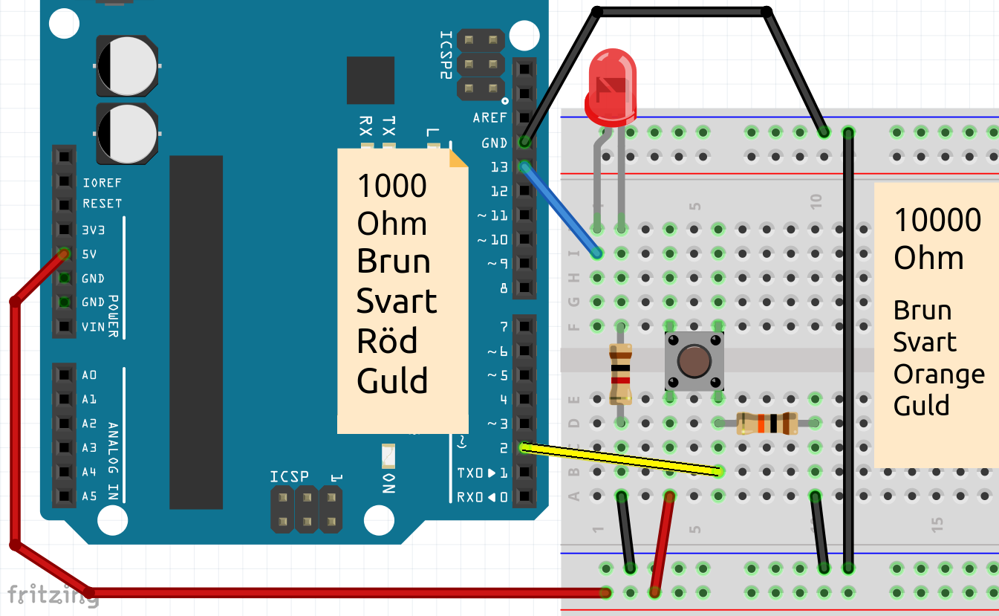
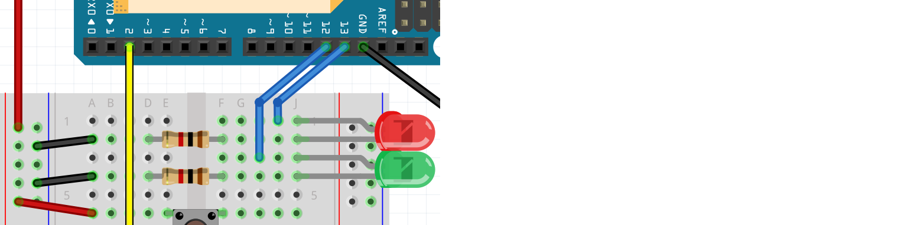

# Lektion 4: Knappflipp

I den här lektionen kommer vi att lära oss hur man använder en variabel.

 | Lektionen kallas 'knappflipp' eftersom du programmerar med en så kallad flip-flop
:-------------:|:----------------------------------------:

\pagebreak

## 4.1. Knappflipp: Intro

Vi börjar med denna krets:



 | Hej, jag känner igen den här kretsen!
:-------------:|:----------------------------------------:

\pagebreak

Och vi använder den här koden:

```c++
const int led_stift = 13;
const int knapp_stift = 2;

void setup()
{
  pinMode(led_stift, OUTPUT);
  pinMode(knapp_stift, INPUT);
}

void loop()
{
  if (digitalRead(knapp_stift) == HIGH)
  {
    digitalWrite(led_stift, HIGH);
  }
  else
  {
    digitalWrite(led_stift, LOW);
  }
}
```

 | Hej, jag känner igen den här koden!
:-------------:|:----------------------------------------:

\pagebreak

## 4.2. Knappflipp: Uppgift 1, tänd lampan

Överst i koden, ovanför `setup`, lägg till:

```c++
boolean ar_pa = false;
```

I början av `loop`, använd ett `if` för att se om knappen är
nedtryckt. Om så är fallet, ställ in `ar_pa` till `true`:

```c++
if (/* knappen är nedtryckt */)
{
  ar_pa = true;
}
```

Efter det första `if` i `loop`, använd ett andra `if` för att se om `ar_pa`
är lika med `true`. Om ja, slå på LEDen. Om inte, stäng av LEDen.

```c++
if (ar_pa == true)
{
  // slå på LEDen
}
else
{
  // stäng av LEDen
}
```

Vad ser du?

\pagebreak

## 4.3. Knappflipp: Lösning


```c++
// ...
boolean ar_pa = false;

// ...

void loop()
{
  if (digitalRead(knapp_stift) == HIGH)
  {
    ar_pa = true;
  }

  if (ar_pa == true)
  {
    digitalWrite(led_stift, HIGH);
  }
  else
  {
    digitalWrite(led_stift, LOW);
  }
}
```

När du trycker på knappen lyser LEDen för alltid.

\pagebreak

## 4.4. Knappflipp: Uppgift 2, låt lampan vara fortsatt tänd eller släckt

Vi ska nu programmera att:

- När du trycker på knappen tänds LEDen och förblir tänd
- När du sedan trycker på knappen igen kommer LEDen att släckas och förbli släckt
- När du sedan trycker på knappen igen kommer LEDen att tändas och förbli tänd
- Och så vidare

Justera `if` som kontrollerar om knappen trycks ned:

```c++
if (digitalRead(knapp_stift) == HIGH)
{
  if (ar_pa == true)
  {
    ar_pa = false;
  }
  else
  {
    ar_pa = true;
  }
}
```

Ladda upp koden. Vad ser du? Om du ser något konstigt så stämmer det!

 | Vad ser du?| | Om du ser något konstigt så stämmer det!
:-------------:|:----------------:|:-------------:|:----------------------------------------:

\pagebreak

## 4.5. Knappflipp: Lösning 2

```c++
// ...

void loop()
{
  if (digitalRead(knapp_stift) == HIGH)
  {
    if (ar_pa == true)
    {
      ar_pa = false;
    }
    else
    {
      ar_pa = true;
    }
  }

  // ...

}
```

 | När du trycker på knappen dimrar LEDen. När du släpper knappen kommer LEDen antingen att vara tänd eller släckt för alltid
:-------------:|:----------------------------------------:

 | Detta beror på att Arduino snabbt och ofta tänder och släcker ljuset
:-------------:|:----------------------------------------:

\pagebreak

## 4.6. Knappflipp: Finjustering av knappfunktionen, uppgift 2

Låt oss finjustera knappen:
När knappen trycks ned, låt Arduino vänta 200 millisekunder innan den kör igång loopen igen.

\pagebreak

## 4.7. Knappflipp: Finjustering av knappfunktionen, lösning

När knappen trycks ned, lägg till en `delay(200);`-regel inuti `if`.
Detta kan göras före eller efter `if`-satserna med `ar_pa`.

```c++
// ...

void loop()
{
  if (digitalRead(knapp_stift) == HIGH)
  {
    // ... [if (ar_pa == true) ...]

    delay(200);

    // ... [if (ar_pa == true) ...]
  }

  // ...

}
```

\pagebreak

## 4.8. Knappflipp: Uppgift 3, styr två LEDar

Vi kommer att ansluta en andra LED. Du kan byta LED genom att trycka på knappen
mellan LEDarna.

- Anslut en andra grön LED till stift 12
- I koden, ändra längst upp:

```c++
// led_stift är bortkopplat
const int led_stift_rod = /* stift numret */;
const int led_stift_gron = /* stift numret */;
// ... [knapp_stift ändras inte]
// ar_pa är bortkopplat
int vilken_led_pa = 1;
```

- Se till att de två LEDarna och knappen hittas i koden, i `setup`.
- I koden, i `loop`, ändra funktionen på knappen:

```c++
if (/* knappen är nedtryckt */)
{
  vilken_led_pa = vilken_led_pa + 1;
  if (vilken_led_pa == 3)
  {
    vilken_led_pa = 1;
  }

  // ... [vänta 200 millisekunder]
}
```

- I koden, i `loop`, reagerar nu på 'vilken_led_pa':

```c++
if (vilken_led_pa == 1)
{
  // Tänder röda LEDen, släcker gröna LEDen
}
if (vilken_led_pa == 2)
{
  // Släcker röda LEDen, tänder gröna LEDen,
}
```

\pagebreak

## 4.9. Knappflipp: Styr två LEDar, lösning



\pagebreak

```c++
const int led_stift_rod = 13;
const int led_stift_gron = 12;
const int knapp_stift = 2;
int vilken_led_pa = 1;

void setup()
{
  pinMode(led_stift_rod, OUTPUT);
  pinMode(led_stift_gron, OUTPUT);
  pinMode(knapp_stift, INPUT);
}

void loop()
{
  if (/* knappen är nedtryckt */)
  {
    vilken_led_pa = vilken_led_pa + 1;
    if (vilken_led_pa == 3)
    {
      vilken_led_pa = 1;
    }

    // ... [vänta 200 millisecond]
  }

  if (vilken_led_pa == 1)
  {
    digitalWrite(led_stift_rod, HIGH);
    digitalWrite(led_stift_gron, LOW);
  }
  if (vilken_led_pa == 2)
  {
    digitalWrite(led_stift_rod, LOW);
    digitalWrite(led_stift_gron, HIGH);
  }
}
```

## 4.10. Knappflipp: avsluta uppgift

Vi kommer att ansluta en tredje LED. Du kan byta genom att trycka på knappen
från första, till andra, till tredje LED.

