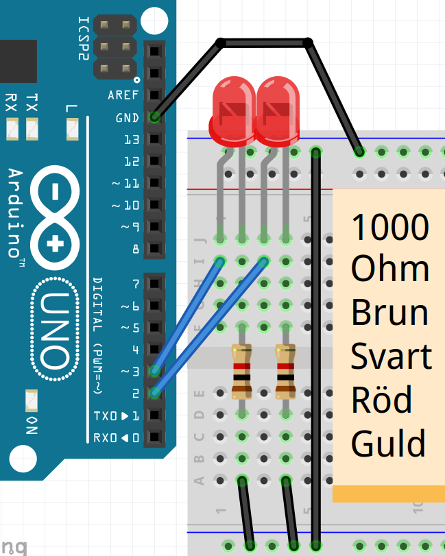

# Lekgtion 5: Blink 4

I dessa läs använder vi 4 lysdioder och funktioner

## 5.1 Uppgift

 * Gör en koppling med 2 LEDs, varje LED skulle ha en egen motstånd från 1000 Ohm
 * Slut den 1:e LED på stift 2
 * Slut den 2:e LED på stift 3
 * Ladda upp denna kod:

```c++
const int stift_led_1 = 2;
const int stift_led_2 = 3;
const int vantetid = 1000;

void setup()
{
  pinMode(stift_led_1, OUTPUT);
  pinMode(stift_led_2, OUTPUT);
}

void loop()
{
  digitalWrite(stift_led_1, HIGH);
  digitalWrite(stift_led_2, LOW);
  delay(vantetid);
  digitalWrite(stift_led_1, LOW);
  digitalWrite(stift_led_2, HIGH);
  delay(vantetid);
}
```

\pagebreak

## 5.2 Lösning



\pagebreak

## 5.3 `vanta_lite`, uppgift

Vi skriver vår första funktion!

 * Lägg till en kod tå, ovan `loop`:

```c++
void vanta_lite()
{
  delay(vantetid);
}
```

 * I `loop`, ersätt två gånger `delay(vantetid);` genom `vanta_lite();`

\pagebreak

## 5.4 `vanta_lite`, lösning

```c++
// ...

void setup()
{
  // ...
}

void vanta_lite()
{
  delay(vantetid);
}

void loop()
{
  // ... [ljuser bara LED 1]
  vanta_lite();
  // ... [ljuser bara LED 1]
  vanta_lite();
}
```

\pagebreak

## 5.5 `ljuser_bara_led_1`, uppgift

 * Skriv en funktion, `ljuser_bara_led_1`,
   för att säkerställa att enbart LED 1 märket (ofta:
   LED 2 måste ut)
 * Använd `ljuser_bara_led_1` i `loop`

\pagebreak

## 5.6 `ljuser_bara_led_1`, lösning

```c++
void ljuser_bara_led_1()
{
  digitalWrite(stift_led_1, HIGH);
  digitalWrite(stift_led_2, LOW);
}

void loop()
{
  ljuser_bara_led_1();
  // ...
}
```

## 5.7 `ljuser_bara_led_2`, uppgift

 * Skriv en funktion, `ljuser_bara_led_2`,
   för att säkerställa att enbart LED 2 märket (ofta:
   LED 1 måste ut)
 * Använd `ljuser_bara_led_2` i `loop`

\pagebreak

## 5.8 `ljuser_bara_led_2`, lösning

```c++
void ljuser_bara_led_2()
{
  digitalWrite(stift_led_1, LOW);
  digitalWrite(stift_led_2, HIGH);
}

void loop()
{
  // ...
  ljuser_bara_led_2();
}
```

## 5.9 `ljuser_bara_led_3`, uppgift

 * Bygg upp en tredje LED-lampa på stift 4
 * Gör en ny variabel `stift_led_3` för denna LED
 * Skriv en funktion, `ljuser_bara_led_3`,
   för att säkerställa att enbart LED 3 ljuser (pa annan sätt:
   lysdioder 1 och 2 måste vara avstängad)
 * Använd `ljuser_bara_led_3` i `loop`
 * I `loop`, låt först enbart LED 1 lysa, vänta lite,
   låt bara LED 2 lysa, vänta lite,
   låt bara LED 3 lysa, vänta lite

\pagebreak

## 5.10 `ljuser_bara_led_3`, lösning

```c++
// ...
const int stift_led_3 = 4;

void setup()
{
  // ...
  pinMode(stift_led_3, OUTPUT);
}

void ljuser_bara_led_1()
{
  // ...
  digitalWrite(stift_led_3, LOW);
}

void ljuser_bara_led_2()
{
  // ...
  digitalWrite(stift_led_3, LOW);
}

void ljuser_bara_led_3()
{
  digitalWrite(stift_led_1, LOW);
  digitalWrite(stift_led_2, LOW);
  digitalWrite(stift_led_3, HIGH);
}

void loop()
{
  // ...
  ljuser_bara_led_3();
  vanta_lite();
}
```

\pagebreak


## 5.11 slutuppgift

 * Slut en fyra LEDje till, på stift 5
 * Gör en ny variabel `stift_led_4` för denna LED
 * Skriv en funktion, `ljuser_bara_led_4`,
   för att säkerställa att enbart LED 4 märket (på annat sätt:
   Lysdioder 1 och 2 och 3 måste vara ut)
 * Använd `ljuser_bara_led_4` i `loop`
 * I `loop`, gör ett Nightrider-mönster: 
   lamporna måste gå i 1-2-3-4-3-2. 
   Det måste alltid finnas exakt ett ljus som brinner.

