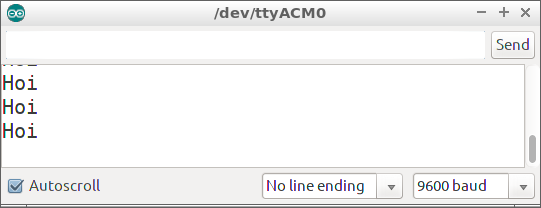
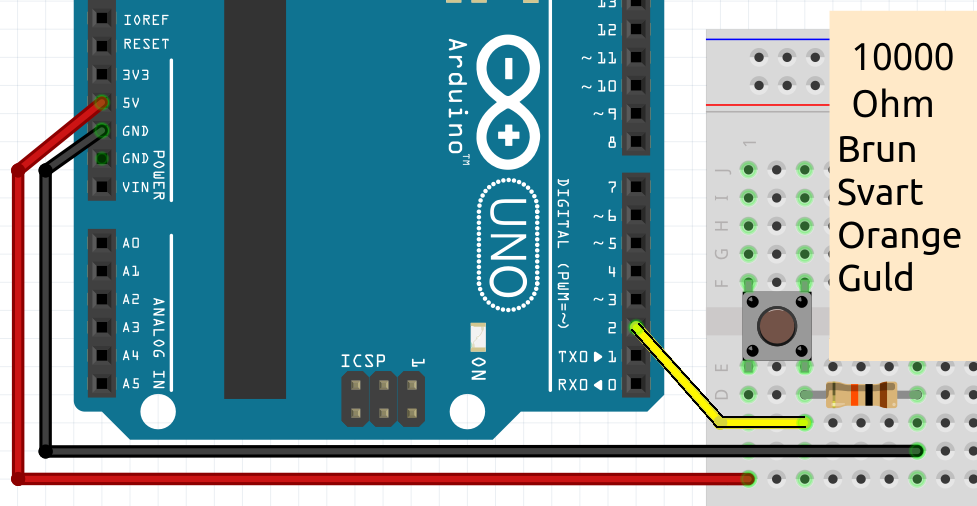

# Lektion 6: Laddningsknapp

I den här lektionen kommer vi att använda en knapp,
lysdioder och en funktion som returnerar ett värde.

## 6.1 Laddningsknapp: uppgift 1

- Du behöver inte ansluta någonting!
- Ladda upp denna kod:

```c++
const int vantetid = 1000;

void setup()
{
  Serial.begin(9600);
}

void loop()
{
  Serial.println("Hej");
  delay(vantetid);
}
```

- Efter uppladdning, klicka på "Serial Monitor"


Vad ser du?

\pagebreak

## 6.2 Laddningsknapp: Lösning 1

Du ser Arduino säga "Hej"!



## 6.3 Ladda knapp: `vanta_lite` och `visar_knapp_varde`, uppgift

- Skriv en funktion `vanta_lite`: i denna funktion väntar Arduino
   "väntetid" millisekunder
- Skriv en funktion `visar_knapp_varde`: i denna funktion säger
   Arduino (fortfarande) "Hej"
- Använd `visar_knapp_varde` och sedan `vanta_lite` i `loop`

\pagebreak

## 6.4 Laddningsknapp: `vanta_lite` och `visar_knapp_varde`, lösning

```c++
// ...

void setup()
{
  // ...
}

void visar_knapp_varde()
{
  Serial.println("Hej");
}


void vanta_lite()
{
  delay(vantetid);
}

void loop()
{
  visar_knapp_varde();
  vanta_lite();
}
```

\pagebreak

## 6.5 Laddningsknapp: Knapp, Uppgift

- Anslut en knapp till stift 2
- Skapa variabel `knapp_stift`
- I `setup`, säg med `pinMode` att `knapp_stift` är en `INPUT`
- Ersätt `visar_knapp_varde` med denna kod:

```c++
void visar_knapp_varde()
{
  if (digitalRead(knapp_stift) == HIGH)
  {
    Serial.println("Knappen ar druckit");
  }
}
```

\pagebreak

## 6.6 Laddningsknapp: Knapp, lösning



\pagebreak

```c++
// ...
const int knapp_stift = 2;

void setup()
{
  // ...
  pinMode(knapp_stift, INPUT);
}

void setup()
{
  // ...
}

void visar_knapp_varde()
{
  if (digitalRead(knapp_stift) == HIGH)
  {
    Serial.println("Knappen ar druckit");
  }
}

void loop()
{
  // ...
}
```

\pagebreak

## 6.7 Laddningsknapp: släppknapp, uppgift

- I `visar_knapp_varde`, om knappen inte är nedtryckt, visa
   Arduino säg sedan "Knappen ar inte druckit"
- Ändra `vantetid` till 100 millisekunder

\pagebreak

## 6.8 Laddningsknapp: släppknapp, lösning

```c++
const int vantetid = 100;
// ... [variabel knapp_stift]

// ...

void visar_knapp_varde()
{
  if (/* knappen är druckit */)
  {
    // ... [berättar knappen är druckit]
  }
  else
  {
    Serial.println("Knappen ar inte druckit");
  }
}
```

\pagebreak

## 6.9 Ladda knapp: `lastning,` uppgift

- Skapa en variabel `lastning`. Detta är ett heltal som kan ändras,
   med initialt värde noll
- Skapa en ny funktion, `visar_lastning_display`. I denna funktion,
   värdet på `lastning` som skickas till den seriella monitorn.
   Du programmerar detta med:

```
Serial.println(lastning);
```

- Använd `visar_knapp_varde', sedan`visar_lastning' och sedan `vanta_lite` i `loop`

\pagebreak

## 6.10 Ladda knapp: `lastning`, lösning

```c++
// ...
int lastning = 0;

void visar_lastning()
{
  Serial.println(lastning);
}

void loop()
{
  // ...
  visar_lastning();
  // ...
}
```

\pagebreak

## 6.11 Uppladdningsknapp: `reagera_pa_knappen`, uppgift

- Skapa en ny funktion, `reagera_pa_knappen`.
   I `reagera_pa_knappen`: om knappen trycks ned,
   blir `lastning` 1 till. Du programmerar detta med:

```
lastning = lastning + 1;
```

- Använd `reagera_pa_knapp` mellan `visar_knapp_varde` och `visar_lastning`
   i `loop`

\pagebreak

## 6.12 Lösning

```c++
void reagera_pa_knappen()
{
  if (digitalRead(knapp_stift) == HIGH)
  {
    lastning = lastning + 1;
  }
}

void loop()
{
  // ...
  reagera_pa_knappen();
  // ...
}
```

\pagebreak

## 6.13: Slutuppgift

- I `reagera_pa_knappen`: om knappen släpps blir `lastning` noll igen
- Anslut en LED till stift 13
- LEDen tänds endast när `lastning` är mer än tio. Använd detta `if`-sats:

```c++
if (lastning > 10)
{
  // ...
}
```

