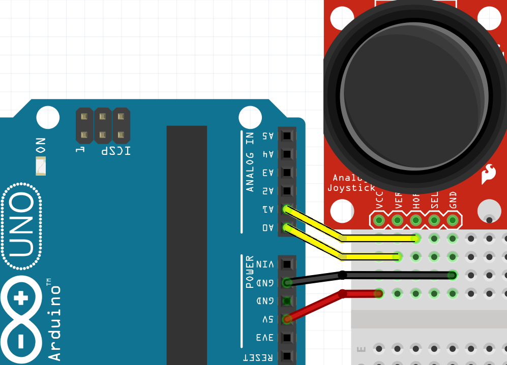
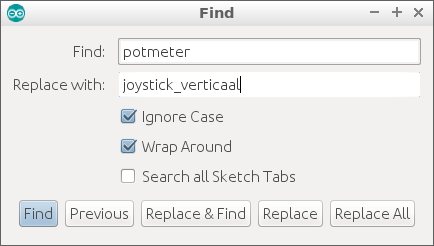

# Lektion 7: Potentiometer och joystick

I den här lektionen kommer vi att använda en potentiometer,
en joystick och en funktion som returnerar ett värde.

## 7.1 Potentiometer: anslut, uppgift

Anslut en potentiometer. Gör följande anslutningar:

Potentiometer | Arduino
--------------|--------
Vänster ben   | 5V
Mellanben     | A0
Höger ben     | GND

\pagebreak

## 7.2 Potentiometer: anslut, lösning


\pagebreak

## 7.3 Potentiometer: start, uppgift

- I `setup` startar den seriella monitorn vid 9600 baud
- Skapa en variabel `vantetid` med ett värde på 100
- Skapa en funktion `vanta_lite` som programmerar 'väntetid' i millisekunder
   sen väntan
- Skapa en funktion `visar_potmeter`, som tar ordet `potentiometer` till
   seriella monitorkontroller
- I `loop`, använd `visar_potmeter` och `vanta_lite`

\pagebreak

## 7.4 Potentiometer: uppstart, lösning

```c++
const int vantatid = 100; //milliseconden

void setup()
{
  Serial.begin(9600);
}

void visar_potmeter()
{
  Serial.print("potmeter");
}

void vanta_lite()
{
  delay(vantatid);
}

void loop()
{
  visar_potmeter();
  vanta_lite();
}
```

\pagebreak

## 7.5 Potentiometer: läs, uppgift

- Skapa en variabel `potmeter_stift` med värdet `A0`.
- I `setup`, ställ in `pinMode` för `potmeter_stift` till `INPUT`.
- Lägg till denna funktion:

```
int lasa_potmeter()
{
  return analogRead(potmeter_stift);
}
```

- I `visar_potmeter` ersätt texten `"potentiometer"` med `lasa_potmeter()`
- Ladda upp programmet och vrid potentiometern. Vilka siffror kommer ut?

\pagebreak

## 7.6 Potentiometer: avläsning, lösning

```
const int potmeter_stift = A0;
//...

void setup()
{
  // ...
  pinMode(potmeter_stift, INPUT);
}

int lasa_potmeter()
{
  return analogRead(potmeter_stift);
}

void visar_potmeter()
{
  Serial.print(lasa_potmeter());
}
```

Siffrorna som kommer från `lasa_potmeter` är mellan noll och 1024.

\pagebreak

## 7.7 Potentiometer: styrning, uppgift

- Anslut en LED till stift 11
- Skapa en variabel 'led_stift' med rätt värde
- I "setup", ställ in "pinMode" för "led_stift" till "OUTPUT".
- I `visar_potmeter` lägg till denna rad:

```c++
analogWrite(led_stift, lasa_potmeter());
```

- Ladda upp och vrid potentiometern. Vad ser du?

\pagebreak

## 7.8 Potentiometer: styrning, lösning

```c++
// ...
const int led_stift = 11;

void setup()
{
  // ...
  pinMode(led_stift, OUTPUT);
}

void visar_potmeter()
{
  // ...
  analogWrite(led_stift, lasa_potmeter());
}
```

Om du vrider på potentiometern ser du att LEDen lyser fyra gånger
sätter på.

\pagebreak

## 7.9 Potentiometer: bra styrning, uppgift

- Ändra följande kod...

```c++
analogWrite(led_stift, lasa_potmeter());
```

... till detta:

```c++
analogWrite(led_stift, lasa_potmeter() / 4);
```

- Vad ser du?
- Vad tror du att `/` betyder? Tips: var ser du sådana här ränder?
   i matte?

\pagebreak

## 7.10 Potentiometer: bra styrning, lösning

- Du kan se att LEDen nu går från av till tänd när du slår på
   potentiometern vrider sig
- `/` betyder "delat med". Detta är samma indelningslinje som med
   bråk och procent!

\pagebreak

## 7.11 Potentiometer: anslut joystick, uppgift

- Byt ut potentiometern mot en joystick. Gör följande anslutningar:

Joystick | Arduino
---------|--------
VCC      | 5V
V        | A0
H        | A1
GND      | GND

- Om du har anslutit denna rätt kan du nu styra LEDen med joysticken

\pagebreak

## 7.11 Potentiometer: anslut joystick, lösning



\pagebreak

## 7.12 Potentiometer: läs joystick, uppgift

I koden ersätter du texten `potentiometer` med `joystick_vertical`.
För att göra detta, använd 'Find' (CTRL-F eller 'Edit | Find') och
använd 'Replace All' ("Ersätt alla").



\pagebreak

## 7.12 Potentiometer: läs joystick, lösning

```c++
const int vertikal_joystick_stift = A0;
// ...

void setup()
{
  pinMode(vertikal_joystick_stift, INPUT);
  // ...
}

int lasa_joystick_vertikalt()
{
  return analogRead(vertikal_joystick_stift);
}

void visar_joystick_vertikalt()
{
  Serial.print(lasa_joystick_vertikalt());
  analogWrite(led_stift, lasa_joystick_vertikalt() / 4);
}

void loop()
{
  visar_joystick_vertikalt();
  // ...
}
```

\pagebreak

## 7.12 Potentiometer: slutuppgift

- Anslut en andra LED
- Denna andra LED ska reagera som den första LEDen, men som
   joysticken flyttas horisontellt

