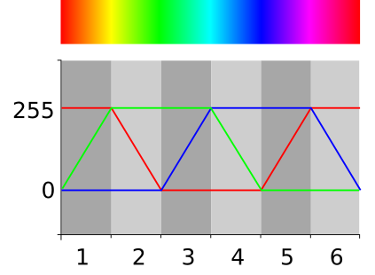
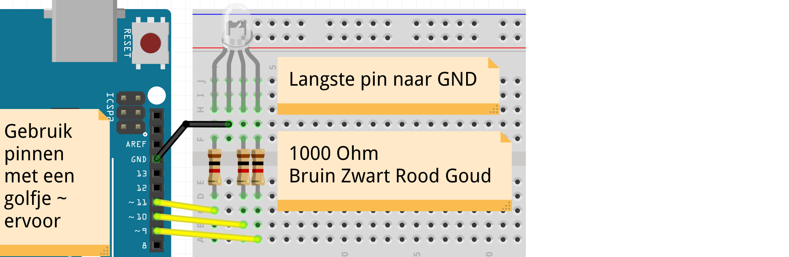
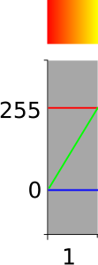
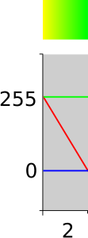

# 9: RGB

Ibland tänker du "Kan det här göras smartare?". 
En `for`-loop är ett sätt att göra något smartare!

## 9.1 Regnbåge

I den här lektionen ska vi programmera en regnbåge!

Så här fungerar en regnbåge:



 | Gult ljus är rött och grönt ljus tillsammans.
:-------------:|:----------------------------------------: 

\pagebreak

## 9.2 Uppgift 1

Anslut diagrammet nedan:



Använd denna kod:

```c++
const int stift_rod = 9;
const int stift_gron = 10;
const int stift_bla = 11;

void setup()
{
  pinMode(stift_rod, OUTPUT);
  pinMode(stift_gron, OUTPUT);
  pinMode(stift_bla, OUTPUT);
}

void loop()
{
  digitalWrite(stift_rod, HIGH);
  digitalWrite(stift_gron, HIGH);
  digitalWrite(stift_bla, HIGH);
}
```

Siffrorna bakom `stift_red`, `stift_green` och `stift_blue` är fel. 
Se till att dessa är rätt siffror.
Hur? Koppla loss två ledningar och se vilken färg lysdioden får.

## 9.3 Lösning 1

Ha, det kan du ta reda på själv :-).

\pagebreak

## 9.4 För loop

Vi börjar med denna kod:

```c++
// ...

void setup()
{
  // ...
}

void loop()
{
  for (int i=0; i<256; ++i)
  {
    analogWrite(stift_rod, i);
    analogWrite(stift_gron, 0);
    analogWrite(stift_bla, 255);
    delay(30);
  }
}
```

 | 
:-------------:|:----------------------------------------: 
`for (int i=0; i<256; ++i) { }`|'Bästa dator, låt ett tal `i` sträcka sig från 0 till 256 i steg om 1'
`analogWrite(9, 255)`|'Bästa dator, slå på stift 9 fullt ut.'
`analogWrite(9, 127)`|'Bästa dator, slå på stift 9 till hälften.'
`analogWrite(9, 0)`|'Bästa dator, stäng av stift 9.'
`analogWrite(9, i)`|'Bästa dator, låt stift 9 gå långsamt (måste ligga inom for-slingan ovan).'

 | Räknar till tre: '1, 2'. Räknar till tre: '1, 2, 3'
:-------------:|:----------------------------------------: 

\pagebreak

## 9.5 Övning 2



Titta på den första delen av regnboken, figur 'Första delen av regnbågen'.
Den röda linjen är där vid 255, den gröna linjen är långsam
från 0 till 255 och den blå linjen är noll.

Justera koden så att ljuset går från rött till gult (rött och grönt).

 | 
:-------------:|:----------------------------------------: 
`for (int i=0; i<256; ++i) { }`|'Bästa dator, låt ett tal `i` sträcka sig från 0 till 256 i steg om 1'
`analogWrite(9, 255)`|'Bästa dator, slå på stift 9 fullt ut.'
`analogWrite(9, 0)`|'Bästa dator, stäng av stift 9.'
`analogWrite(9, i)`|'Bästa dator, låt stift 9 gå långsamt (måste ligga inom for-slingan ovan).'

\pagebreak

## 9.6 Lösning 2

```c++
// ...

void setup()
{
  // ...
}

void loop()
{
  for (int i=0; i<256; ++i)
  {
    analogWrite(stift_rod, 255);
    analogWrite(stift_gron, i);
    analogWrite(stift_bla, 0);
    delay(30);
  }
}
```

\pagebreak

## 9.7 Uppgift 3



Titta på den andra delen av regnboken, figur "Andra delen av regnbågen".
Den röda linjen går från 255 till 0, den gröna linjen är 255
och den blå linjen är noll.

Justera koden så att ljuset går från rött till gult (rött och grönt).

Tips: lägg till denna kod:

```c++
  for (int i=0; i<256; ++i)
  {
    analogWrite(stift_rod, 255 - i);
    analogWrite(stift_gron, 255);
    analogWrite(stift_bla, 0);
    delay(30);
  }
``` 

 | 
:-------------:|:----------------------------------------: 
`for (int i=0; i<256; ++i) { }`|'Bästa dator, låt ett tal `i` sträcka sig från 0 till 256 i steg om 1'
`analogWrite(9, 255)`|'Bästa dator, slå på stift 9 fullt ut.'
`analogWrite(9, 0)`|'Bästa dator, stäng av stift 9.'
`analogWrite(9, 255 - i)`|'Bästa dator, låt stift 9 gå ut långsamt (måste vara inom for-slingan ovan).'

\pagebreak

## 9.8 Lösning 3

```c++
// ...

void setup()
{
  // ...
}

void loop()
{
  // ...
  for (int i=0; i<256; ++i)
  {
    analogWrite(stift_rod, 255 - i);
    analogWrite(stift_gron, 255);
    analogWrite(stift_bla, 0);
    delay(30);
  }
}
```

## 9.9 Slutuppgift

Avsluta nu regnbågen.


