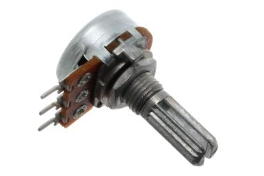
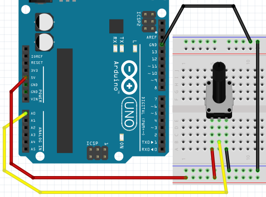
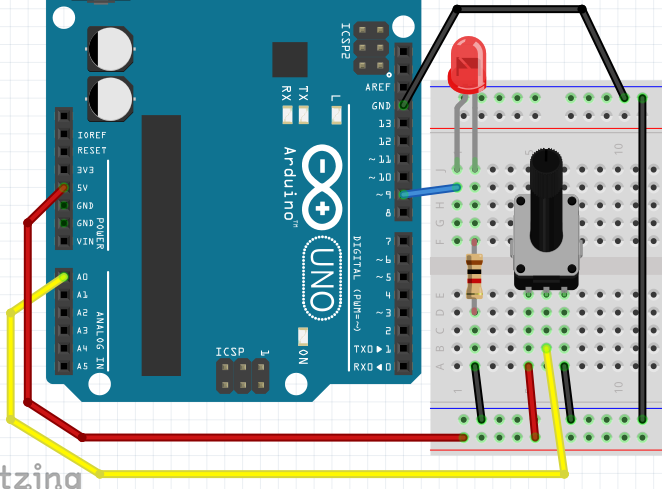

# 10. Potentiometer

Med en potentiometer kan du skicka en spänning till Arduino.
Du kan använda denna som till exempel en volymratt.



I den här lektionen kommer du att lära dig:

- Vad en potentiometer är
- Hur man använder en potentiometer

## 10.1 Anslut

Först ansluter vi bara en Arduino:



Jag tycker att det här borde fungera :-)

## 10.2 Kod: avläs potentiometer med seriell monitor

Vi mäter potentiometerns position med denna kod:

```c++
void setup() 
{
  pinMode(A0, INPUT);
  Serial.begin(9600);
}

void loop()
{
  Serial.println(analogRead(A0));
  delay(100);
}
```

Detta är vad koden gör:

- Två saker händer i "setup"-funktionen
    * `pinMode(A0, INPUT)`: stiftet `A0` är ett stift som läser, en ingång
    * `Serial.begin(9600)`: den seriella monitorn skickar 9600 bitar ('nollor och ettor') per sekund
- Två saker händer i 'loop'-funktionen
    * `Serial.println(analogRead(A0))`: läs stift `A0` och skriv det till seriell monitor
    * `delay(100)`: vänta hundra millisekunder

## 10.3 Uppgifter

 1. Ladda upp programmet. I Arduino IDE, klicka på "Serial Monitor" uppe till höger. Vad ser du?
 2. Vrid potentiometern hela vägen åt vänster (moturs). Vilket värde ser du på den seriella monitorn?
 3. Vrid potentiometern hela vägen åt höger (medurs). Vilket värde ser du på den seriella monitorn?

## 10.4 Lösningar

 1. Du ser ett tal från noll till 1024, beroende på potentiometerns position
 2. Du ser siffran noll
 3. Du ser numret 1023

## 10.5 Anslutningspotentiometer med LED

Nu ansluter vi även en LED:



OBS:

- resistorn på lysdioden är tusen ohm (brun-svart-röd-guld)
- LED-lampan måste vara på ett stift med PWM ('a wave')

## Svara på potentiometern

Nu ska vi få lysdioden att reagera på potentiometern:

```c++
void setup() 
{
  pinMode(A0, INPUT);
  pinMode(9, OUTPUT);
}

void loop()
{
  analogWrite(9, analogRead(A0) / 8);
  delay(100);
}
```

Detta är vad koden gör

- Tre saker händer i "setup"-funktionen:
    * `pinMode(A0, INPUT)`: stiftet `A0` är ett stift som läser, en ingång
    * `pinMode(9, OUTPUT)`: stift `9` är ett stift där ström kommer ut, en utgång
- Två saker händer i "loop"-funktionen:
    * `analogWrite(9, analogRead(A0) / 8)`: sätt en spänning på stift 9
     `analogRead(A0) / 8`. `analogRead(A0) / 8` betyder: läs värdet från A0
     dividerat med åtta ('/' är en divisionsstapel).
    * `delay(100)`: vänta hundra millisekunder

## 10.6 Uppdrag

- Vad händer om du ändrar divisionsnumret?
- Vilket är det bästa värdet av talet för division/

## 10.7 Lösningar

 1. Med en högre siffra går ljuset mindre och mindre snabbt i fullt läge.
    Om siffran är lägre än fyra kommer ljuset att reagera konstigt: ljuset kommer först att gå snabbare,
    sedan av och högre igen osv
 2. Bästa siffran är fyra. Eftersom från `analogRead` kommer som mest 1023, medan med `analogWrite`
    kan skriva högst 255. 1023 dividerat med 4 är 255 resterande 3. Ardiono gör 255 av det

## 10.8 Slutuppgift

- Anslut fyra lysdioder: en röd, gul, grön och blå
- Om potentiometern är ända till vänster ska ingen lysdiod lysa.
- När potentiometern vrids mer åt höger tänds den gröna lysdioden
- Om potentiometern vrids ännu mer åt höger, tänds den gula lysdioden
- Om potentiometern vrids ännu mer åt höger, tänds den röda lysdioden
- Den blå lysdioden lyser långsamt när du svänger mer åt höger

