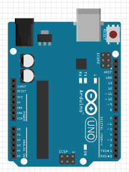
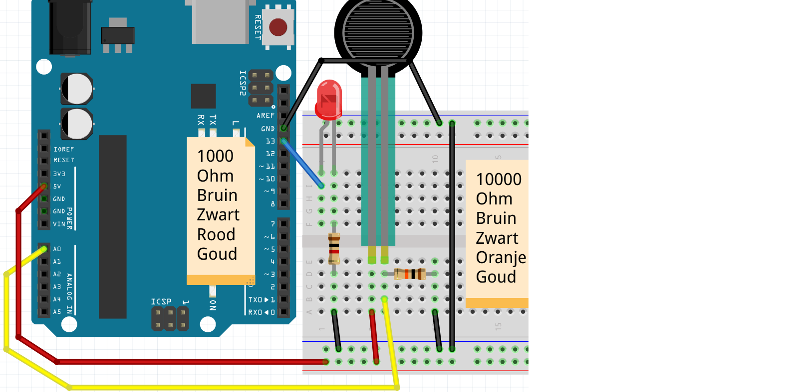

# 4. FSR

## Seriell monitor

 | Seriell monitor: platsen där du kan få Arduino att prata genom en seriell port
:-------------:|:----------------------------------------:

Den seriella monitorn låter oss få Arduino att prata.
Eller mer exakt: att denna text skickas till den seriella monitorn.
Den seriella monitorn visar denna text på din dator.

### Anslut endast Arduino

Först ansluter vi bara en Arduino:



Jag tycker att det här borde fungera :-)

 | Den seriella bildskärmen går via USB-kabeln mellan Arduino till dator
:-------------:|:----------------------------------------:

\pagebreak

### Kod: Serial Monitor

```c++
void setup() 
{
  Serial.begin(9600);
}

void loop()
{
  Serial.println("Hallo");
  delay(1000);
}
```

 | 
:-------------:|:----------------------------------------:
`Serial.begin(9600);`     |'Bästa dator, låt Arduino prata med 9600 bitar per sekund'
`Serial.print("Hej");`    |'Bästa dator, låt Arduino säga ordet 'Hej''
`Serial.println("Hej");`  |'Bästa dator, låt Arduino säga ordet 'Hej' och starta en ny rad'

### Kommandon 1


 1. Ladda upp programmet. I Arduino IDE, klicka på "Serial Monitor" uppe till höger. Vad ser du?
 2. Kan du ändra texten till "Hej Richel" (eller ditt eget namn?)
 3. Ändra `Serial.println` till `Serial.print`. Vad ser du?
 4. Ändra texten `Serial.begin(9600)` till `Serial.begin(4800)`. Vad ser du? Varför?

\pagebreak

### Svar 1

 1. Den seriella monitorn visar en extra rad varje sekund, med texten "Hej"
 2. Ändra raden `Serial.println("Hello");` till `Serial.println("Hello Ledge");`
 3. Orden kommer en efter en, istället för en efter en
 4. Nu visar den seriella monitorn oläsbar text. Detta beror på att Arduino är långsammare att texta
      skicka till din dator (4800), sedan läser din dator texten (9600)

\pagebreak

## Ansluter FSR utan LED

 | FSR betyder "Force Sensitive Resistance"
:-------------:|:----------------------------------------:

Först ansluter vi bara en FSR:


 | Om det inte finns någon FSR, använd en LDR
:-------------:|:----------------------------------------:

\pagebreak

## Kod: läs FSR med seriell monitor

Med denna kod mäter vi värdet på FSR:

```c++
void setup() 
{
  pinMode(A0, INPUT);
  Serial.begin(9600);
}

void loop()
{
  Serial.println(analogRead(A0));
  delay(100);
}
```

 | 
:------------------------------:|:----------------------------------------:
`Serial.println(analogRead(A0))`|'Bästa dator, visa värdet på stiftet `A0` på den seriella monitorn'

## Kommandon 2

 1. Ladda upp programmet. I Arduino IDE, klicka på "Serial Monitor" uppe till höger. Vad ser du?
 2. Tryck på FSR med fingrarna (eller, med en LDR: håll fingret över LDR)
    medan du tittar på den seriella monitorn. Vad ser du?
 3. Ändra `Serial.println` till `Serial.print`. Vad ser du?
 4. Ändra texten `Serial.begin(9600)` till `Serial.begin(4800)`. Vad ser du? Varför?
 5. Ta bort kabeln till `A0`. Ja, ta bort kabeln mellan `A0` och LDR.
    Titta på den seriella monitorn. Vad ser du?

 | Motståndet mellan A0 och LDR kallas ett 'Pull Down'-motstånd
:-------------:|:----------------------------------------:


\pagebreak

## Lösningar 2

 1. Du kommer att se ett tal från noll till 1024, beroende på värdet på FSR
 2. Du ändrar siffrorna
 3. Alla nummer kommer efter varandra
 4. Nu visar den seriella monitorn oläsbar text. Detta beror på att Arduino är långsammare att texta
    skicka till din dator (4800), sedan läser din dator texten (9600)
 5. Nu kommer du att se siffran ändras slumpmässigt. Detta kallas en flytande ingång

 | Ett 'Pull Down'-motstånd förhindrar en flytande ingång
:-------------:|:----------------------------------------:

## Ansluter FSR med LED, på/av

 | "Kraftkänsligt motstånd" betyder "Kraftberoende motstånd"
:-------------:|:----------------------------------------:

Nu ansluter vi även en LED:



\pagebreak

### Svara på FSR, på/av

Nu ska vi få lysdioden att reagera på lysdioden:

```c++
void setup() 
{
  pinMode(A0, INPUT);
  pinMode(13, OUTPUT);
}

void loop()
{
  if (analogRead(A0) < 512)
  {
    digitalWrite(13, HIGH);
  }
  else
  {
    digitalWrite(13, LOW);
  }
  delay(100);
}
```

 | 
:-------------:|:----------------------------------------:
`if (analogRead(A0) < 512) {}`|'Bästa dator, om A0 läser mindre än 2,5 volt, sätt det inom parentes.

### Uppdrag 3

 1. Vad händer om du ökar `512`? Vad händer om du sänker `512`?
 2. Se till att den seriella monitorn också mäter och visar "A0". Vilket nummer mäter FSR?
    i fred?
 3. Se till att den seriella monitorn visar ordet "ON" när lysdioden tänds, och att
    ordet "OFF" när lysdioden är avstängd

\pagebreak

### Lösningar 3

 1. Om `512` ändras till en siffra som är för hög, kommer lampan alltid att lysa oavsett hur hårt/mjukt du trycker.
    Om `512` ändras till ett för högt nummer kommer lampan alltid att vara släckt, oavsett hur hårt/mjukt du trycker
 2. För detta använd koden från föregående kommando: lägg till i `setup`-funktionen `Serial.begin(9600);`,
    i `loop`-funktionen lägg till `Serial.println(analogRead(A0));`. Värdet du kommer att se är
    beroende på motstånd, FSR och situation
 3. Detta kan göras genom att sätta `Serial.println("ON");` i den första delen av `if`-satsen.
    Sätt `Serial.println("OFF");` i den andra delen av `if`-satsen.

```c++
void setup() 
{
  pinMode(A0, INPUT);
  pinMode(13, OUTPUT);
  Serial.begin(9600);
}

void loop()
{
  Serial.println(analogRead(A0));
  if (analogRead(A0) < 512)
  {
    digitalWrite(13, HIGH);
    Serial.println("AAN");
  }
  else
  {
    digitalWrite(13, LOW);
    Serial.println("UIT");
  }
  delay(100);
}
```

\pagebreak

### Svara på FSR, Dim

Nu ska vi få lysdioden att reagera på lysdioden. Denna gång *dimper* lysdioden.

```c++
void setup() 
{
  pinMode(A0, INPUT);
  pinMode( 9, OUTPUT);
  Serial.begin(9600);
}

void loop()
{
  const int fsr_waarde = analogRead(A0);
  Serial.print("FSR: ");
  Serial.println(fsr_waarde);
  const int led_waarde = map(fsr_waarde, 0, 1023, 0, 255);
  Serial.print("LED: ");
  Serial.println(led_waarde);
  analogWrite(led_waarde, 9);
  delay(100);
}
```

 | 
:-------------:|:----------------------------------------:
`analogWrite( 0, 9)`|'Bästa dator, stäng av stift 9'
`analogWrite(128, 9)`|'Bästa dator, vrid stift 9 till halvfullt'
`analogWrite(255, 9)`|'Bästa dator, slå på stift 9 fullt ut'
`map(analogRead(A0),0,1023,0,255)` |'Bästa dator, läs spänningen för `A0`. Detta är ett värde från 0 till 1023. Konvertera det avlästa värdet mellan 0 och 255.'.

### Uppdrag 4

 1. Lysdioden är på ett annat stift. Titta i koden och anslut lysdioden till rätt stift
 2. Vilka stift kan vi använda för att dämpa en lysdiod?

\pagebreak

### Lösningar 4

 1. Lysdioden måste nu kopplas till stift 9
 2. Alla stift med en våg (`~`) före numret. Dessa är 3, 5, 6, 9, 10, 11.

### Uppgift 5

Anslut två lysdioder till stift 12 och 13. När FSR är i vila ska ingen lysdiod lysa. Om du trycker försiktigt på FSR,
en LED tänds. Om du trycker hårt på FSR, två.

 | Tips: använd två `if`-satser
:-------------:|:----------------------------------------:

\pagebreak

### Lösning 5

Siffrorna i "if"-satsen måste vara korrekt inställda.

```c++
void setup() 
{
  pinMode(A0, INPUT);
  pinMode(12, OUTPUT);
  pinMode(13, OUTPUT);
  Serial.begin(9600);
}

void loop()
{
  Serial.println(analogRead(A0));
  if (analogRead(A0) < 256)
  {
    digitalWrite(13, HIGH);
  }
  if (analogRead(A0) < 512)
  {
    digitalWrite(12, HIGH);
  }
  delay(100);
}
```

### Uppgift 6

Du kan också få en LED att reagera på en FSR genom att bleka/dimma den

 1. Vilket kommando gjorde du det med igen?
 2. Är det möjligt med vilken stift som helst? Om inte, med vilket ja/nej?
 3. Vilket är det högsta värdet som du kan tända en LED med?
 4. Vilket är det högsta värdet FSR kan mäta?
 5. Antag att du vill tända en lysdiod beroende på ett FSR-värde. Hur kunde du göra detta?
 6. Hur får man kod att göra en division?
 7. Slå på lysdioden beroende på FSR-värdet

\pagebreak

### Lösningar 6

 1. Du kan tona en lysdiod med `analogWrite`, till exempel `analogWrite(11, 255);`
 2. Du kan bara dimma en lysdiod med PWM-stift. Det här är stiften med en våg
   (`~`) bredvid deras nummer. På Arduino Uno är dessa stift 3, 5, 6, 9, 10 och 11
 3. Med `analogWrite` kan du ge upp till 255, till exempel `analogWrite(11, 255);`
 4. Med `analogRead` kan du mäta upp till 1023
 5. Du läser ett värde, dividerar det med fyra (1024 dividerat med 256 är fyra) och låter lysdioden lysa så
 6. Med divisionsfältet, `/`.
 7. Se nedan. Glöm inte att sätta en lysdiod på stift 11

```c++
void setup() 
{
  pinMode(A0, INPUT);
  pinMode(11, OUTPUT);
  Serial.begin(9600);
}

void loop()
{
  analogWrite(11, analogRead(A0) / 4);
  delay(100);
}
```

 | 
:-------------:|:----------------------------------------:
`analogWrite(11, analogRead(A0) / 4)`|'Bästa dator, dämpa stift 11 till värdet av stift A0 (diva detta med fyra)'

\pagebreak

## Einorder

* Anslut fyra lysdioder: en vit, en röd, en gul och en grön
* När FSR är i vila ska ingen lysdiod lysa.
* När du trycker lätt på FSR tänds den gröna lysdioden
* Om du trycker hårdare på FSR kommer de gröna och gula lysdioderna att tändas
* När du trycker hårt på FSR tänds de gröna, gula och röda lysdioderna
* Den vita lysdioden lyser starkare och mjukare beroende på FSR

Om du inte har en vit LED, använd en annan färg.


