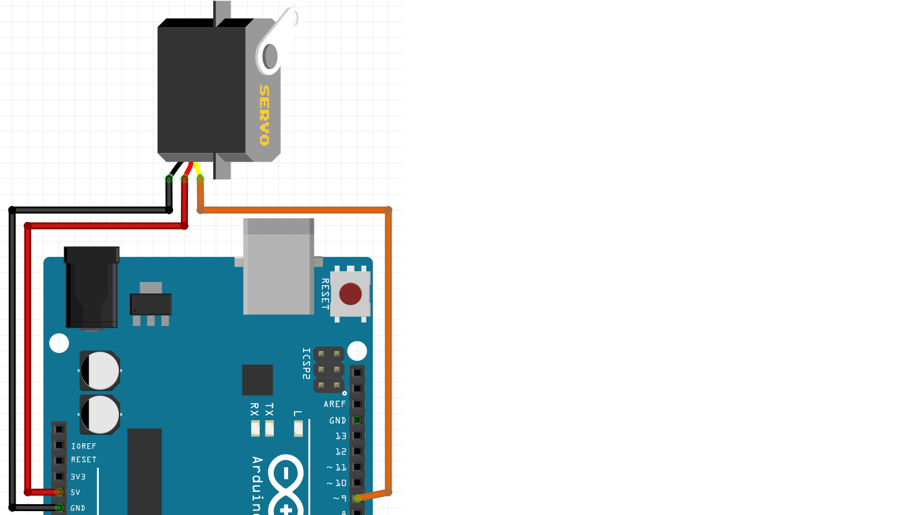

# 13. Servo med seriell monitor

En servo är en motor som man kan sätta i en viss vinkel.

 | Servon används ofta i robotar
:-------------:|:----------------------------------------: 

## 13.1 Anslut

Bilden visar hur man ansluter en servo:



 | De flesta servon kan inte rotera
:-------------:|:----------------------------------------: 

\pagebreak

## 13.2 Kod

Använd denna kod:

```c++
#include <Servo.h>

Servo min_servo;

void setup()
{
  Serial.begin(9600);
  min_servo.attach(9);
}

void loop()
{
  if (Serial.available())
  {
    const int vard = Serial.parseInt();
    Serial.print("Jag satter servon pa ");
    Serial.println(vard);
    min_servo.write(vard);
    delay(1000);
  }
}
```

 | 
:-------------:|:----------------------------------------: 
`Servo min_servo;` |'Kära dator, kom ihåg en Servo som heter `min_servo`'.
`min_servo.attach(9);` |'Bästa dator, `min_servo` är på stift 9'.
`if (Serial.available()) {}` |'Bästa dator, skrevs något in i den seriella monitorn? Om så är fallet, sätt det inom parentes.
`Serial.parseInt()` |'Bästa dator, läs numret (inte ordet) som skrevs'.
`const int vard` |'Bästa dator, kom ihåg ett heltal som heter `vard`, som bara bör läsas'
`min_servo.write(vard);` |'Bästa dator, ställ servo i en vinkel på `vard` grader'.

\pagebreak

## 13.3 Skicka nummer till Arduino

När du har lagt koden på Arduino kan du använda `Serial Monitor`
skicka nummer till Arduino. Du kan se detta på bilden


 | På så sätt kan du prata med Arduino
:-------------:|:----------------------------------------: 

## 13.4 Uppgift 1

  1. Bestäm det lägsta och högsta numret för en servomotor.
  2. Beräkna skillnaden mellan lägsta och högsta siffran

\pagebreak

## 13.5 Lösning 1

  1. Ha, det kan du ta reda på själv :-)
  2. Detta är någonstans mellan 80-150 grader, beroende på din servomotor

## 13.6 Slutuppgift

Styr en servomotor perfekt med den seriella monitorn.
Använd det lägsta och högsta värdet som du har hittat med din servomotor.
