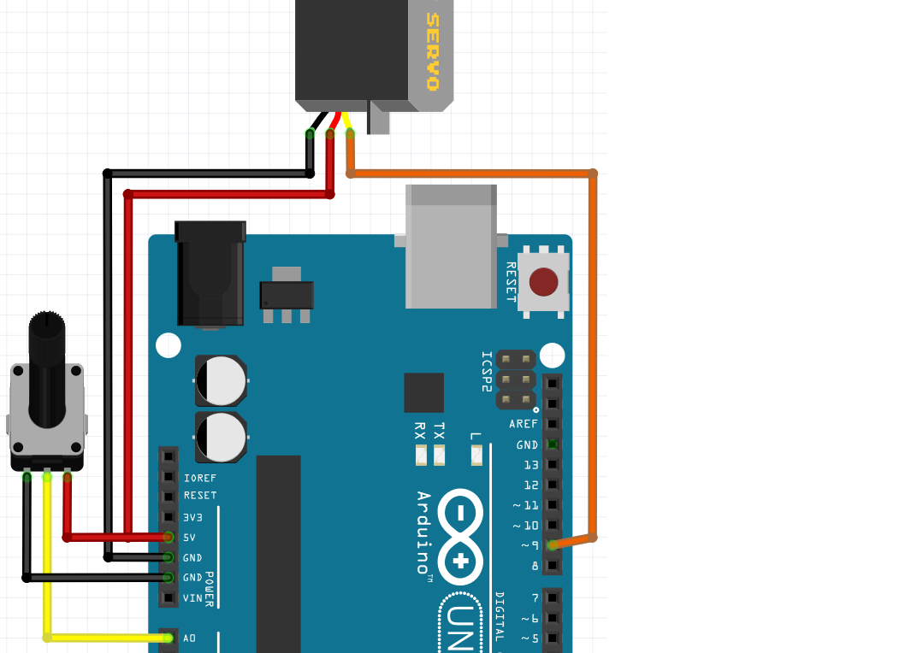

# 14. Servomotor med potentiometer

## 14.1 Uppgift

Anslut en potentiometer.
Mittstiftet ska gå till `A0`.
Se figur 'Servomotor och potentiometer'



\pagebreak

Använd denna kod:

```c++
#include <Servo.h>

Servo min_servo;

void setup()
{
  Serial.begin(9600);
  min_servo.attach(9);
  pinMode(A0, INPUT);
}

void loop()
{
  min_servo.write(
    map(analogRead(A0),0,1024,45,135)
  );
  delay(100);
}
```

 | 
:--------------------------------:|:----------------------------------------:
`map(analogRead(A0),0,1024,45,135)` |'Kära dator, läs spänningen för `A0`. Detta är ett värde från 0 till 1024. Konvertera det avlästa värdet mellan 45 och 135.'.


## 14.2 Slutuppgift

Styr en servomotor perfekt med en potentiometer.
Använd det lägsta och högsta värdet som du har hittat med din servomotor.

