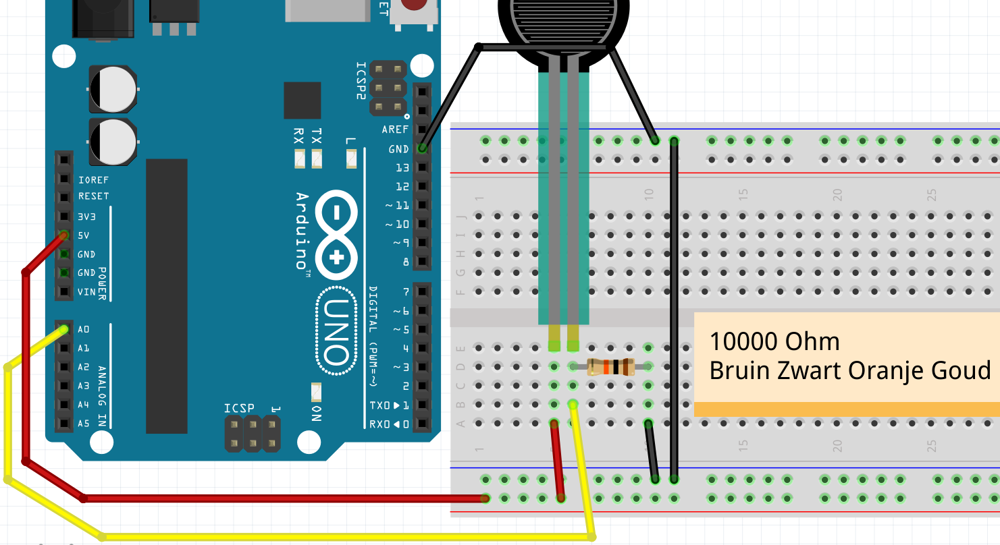
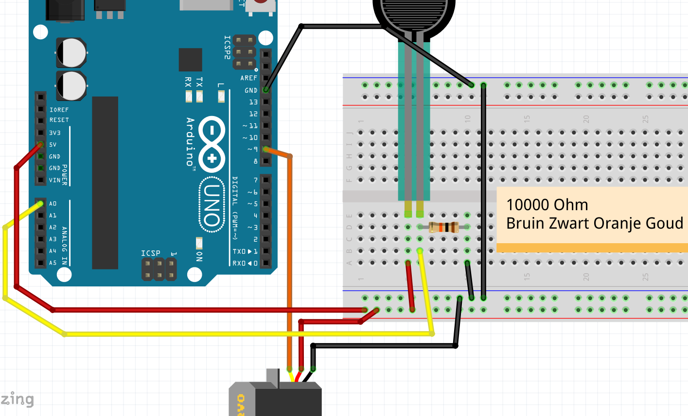

# 15. FSR med servo

I den här lektionen kommer vi att styra en servo med en FSR.

## 15.1 Ansluter FSR utan servo

Först ansluter vi bara en FSR:



> FSR

 | Finns det ingen FSR? använd sedan en LDR
:-------------:|:----------------------------------------:

\pagebreak

## 15.2 Kod: läs FSR med seriell monitor

Med denna kod mäter vi värdet på FSR:

```c++
void setup() 
{
  pinMode(A0, INPUT);
  Serial.begin(9600);
}

void loop()
{
  Serial.println(analogRead(A0));
  delay(100);
}
```

 | Har du glömt vad det här gör? Se lektion `9. LDR`
:-------------:|:----------------------------------------:

## 15.3 Kommandon 1

 1. Ladda upp programmet. I Arduino IDE, klicka på "Serial Monitor" uppe till höger. Vad ser du?
 2. Tryck på FSR med fingrarna (eller, med en LDR: håll fingret över LDR)
      medan du tittar på den seriella monitorn. Vad ser du?
 3. Ändra `Serial.println` till `Serial.print`. Vad ser du?
 4. Ändra texten `Serial.begin(9600)` till `Serial.begin(4800)`. Vad ser du? Varför?
 5. Ta bort kabeln till `A0`. Ja, ta bort kabeln mellan `A0` och LDR.
      Titta på den seriella monitorn. Vad ser du?

\pagebreak

## 15.4 Lösningar 1

 1. Du kommer att se ett tal från noll till 1024, beroende på värdet på FSR
 2. Du ändrar siffrorna
 3. Alla nummer kommer efter varandra
 4. Nu visar den seriella monitorn oläsbar text. Detta beror på att Arduino är långsammare att texta
      skicka till din dator (4800), sedan läser din dator texten (9600)
 5. Nu kommer du att se siffran ändras slumpmässigt. Detta kallas en flytande ingång

## 15.5 Ansluter FSR med servo

Nu kopplar vi även in en servo. Om du vill fuska: se figuren 'Ansluter FSR med servo'.



> Anslut FSR med servo

\pagebreak

### 15.6 Svar till FSR

Nu ska vi få servo att svara på FSR:

Använd denna kod:

```c++
#include <Servo.h>

Servo mijn_servo;

void setup() 
{
  Serial.begin(9600);
  mijn_servo.attach(9);
  pinMode(A0, INPUT);
}

void loop()
{
  mijn_servo.write(
    map(analogRead(A0),0,1024,45,135)
  );
  delay(100);
}
```

 | Har du glömt vad det här gör? Se lektion `4. Fler servomotorer`
:-------------:|:----------------------------------------:

### 15.7 Slutuppgift

Se till att servo svarar perfekt på FSR.
Du måste själv räkna ut lägsta och högsta värde.
