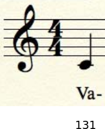

# Lektion 17: Enkel melodi

I den här lektionen ska vi göra en enkel melodi, som är Fader Jakob!
På Nederländsk häter den låt 'Vader Jacob'.


> 'Vader Jacob' var en hit 1975 av det holländska bandet H2OR

\pagebreak

## Lektion 17: Enkel melodi: Uppgift 1

Anslut figuren 'Ansluta en högtalare'.


> Ansluta en högtalare

Sätt den här koden på din Arduino:

```c++
const int speaker_pin = 8;

void setup()
{
  tone(speaker_pin, 131, 250); // Va
  delay(300);
}

void loop()
{

}
```

Vad hör du?

\pagebreak

## Lektion 17: Enkel melodi: Lösning 1

Du hör den första tonen av fader Jakob!

I figuren 'Fader Jacobs första ton' ser du den första tonen som noter.
Under noten finns texten, därunder tonhöjden i Hertz.



> Fader Jacobs första ton

 | 131 Hertz är tonhöjden för tonen C.
:-------------:|:----------------------------------------:

 | 
:-------------:|:----------------------------------------:
`tone(..., 131, ...);`| (sjunger) do!

\pagebreak

## Lektion 17: Enkel melodi: Uppgift 2

Den första tonen av Vader Jacob har en tonhöjd på 131 Hertz.
Den andra tonen av Vader Jacob har en tonhöjd på 147 Hertz.
Programmera de två första tonerna av Vader Jacob.


> De två första tonerna av Vader Jacob


> Nej, låten handlar inte om honom

\pagebreak

## Lektion 17: Enkel melodi: Lösning 2

```c++
const int speaker_pin = 8;

void setup()
{
  tone(speaker_pin, 131, 250); // Va
  delay(300);
  tone(speaker_pin, 147, 250); // der
  delay(300);
}

void loop()
{

}
```

 | 147 Hertz är tonhöjden för tonen D.
:-------------:|:----------------------------------------:

 | 
:-------------:|:----------------------------------------:
`tone(..., 147, ...);`| (sjunger) re!

\pagebreak

## Lektion 17: Enkel melodi: Uppgift 3

Den tredje tonen av Vader Jacob har en tonhöjd på 165 Hertz.
Programmera de tre första tonerna av Fader Jakob.


> De tre första tonerna av Fader Jacob


> En riktig Groninger avslutar de flesta meningar med 'ja'

\pagebreak

## Lektion 17: Enkel melodi: Lösning 3

```c++
const int speaker_pin = 8;

void setup()
{
  tone(speaker_pin, 131, 250); // Va
  delay(300);
  tone(speaker_pin, 147, 250); // der
  delay(300);
  tone(speaker_pin, 165, 250); // Ja
  delay(300);
}

void loop()
{

}
```

 | 165 Hertz är tonhöjden för noten E.
:-------------:|:----------------------------------------:

 | 
:-------------:|:----------------------------------------:
`tone(..., 165, ...);`| (sjunger) mi!

\pagebreak

## Lektion 17: Enkel melodi: Uppgift 4

Den fjärde tonen av Vader Jacob har samma tonhöjd som den första.
Programmera den fjärde tonen av Fader Jakob.


> De första fyra tonerna av Vader Jacob


> Jacob Black kan förvandlas till en varg

\pagebreak

## Lösning 4

```c++
const int speaker_pin = 8;

void setup()
{
  tone(speaker_pin, 131, 250); // Va
  delay(300);
  tone(speaker_pin, 147, 250); // der
  delay(300);
  tone(speaker_pin, 165, 250); // Ja
  delay(300);
  tone(speaker_pin, 131, 250); // cob
  delay(300);
}

void loop()
{

}
```

 | 
:-------------:|:----------------------------------------:
`tone(..., 147, ...);`| (sjunger) re!

\pagebreak

## Lektion 17: Enkel melodi: Uppgift 5

De femte, sjätte, sjunde och åttonde noterna är desamma som de fyra första. Programmera detta.


> De första åtta tonerna av Vader Jacob


> Tvillingar är typ av återkommande ensamvargar

\pagebreak

## Lektion 17: Enkel melodi: Lösning 5

```c++
const int speaker_pin = 8;

void setup()
{
  tone(speaker_pin, 131, 250); // Va
  delay(300);
  tone(speaker_pin, 147, 250); // der
  delay(300);
  tone(speaker_pin, 165, 250); // Ja
  delay(300);
  tone(speaker_pin, 131, 250); // cob
  delay(300);
  tone(speaker_pin, 131, 250); // Va
  delay(300);
  tone(speaker_pin, 147, 250); // der
  delay(300);
  tone(speaker_pin, 165, 250); // Ja
  delay(300);
  tone(speaker_pin, 131, 250); // cob
  delay(300);
}

void loop()
{

}
```

 | Du kan också lägga upprepningen i en 'för'-loop!
:-------------:|:----------------------------------------:

 | 
:-------------:|:----------------------------------------:
`för (int i = 0; i < 2; ++i) { ... }`| "Gör vad som står i hängslen två gånger"

\pagebreak

## Lektion 17: Enkel melodi: Uppgift 6

Nu kommer två gånger 'Sover du fortfarande'. 'Sov' samma höjd som 'Ja', 'du' är 175 Hertz, 'fortfarande' är 196 Hertz.
Fram till nu varade alla anteckningar i 250 millisekunder.
Den tredje tonen, "ännu", bör vara i 500 millisekunder.


> Sover du fortfarande


> Vissa människor har blivit mycket kända för att sova

\pagebreak

## Lektion 17: Enkel melodi: Lösning 6

Koden läser nu `//...`. Det betyder att den gamla koden måste finnas kvar.

```c++
const int speaker_pin = 8;

void setup()
{
  //...
  tone(speaker_pin, 165, 250); // Slaapt
  delay(300);
  tone(speaker_pin, 175, 250); // gij
  delay(300);
  tone(speaker_pin, 196, 500); // nog
  delay(500);
  tone(speaker_pin, 165, 250); // Slaapt
  delay(300);
  tone(speaker_pin, 175, 250); // gij
  delay(300);
  tone(speaker_pin, 196, 500); // nog
  delay(500);
}

void loop()
{

}
```

 | Du kan också lägga upprepningen i en 'för'-loop!
:-------------:|:----------------------------------------:

\pagebreak

## Lektion 17: Enkel melodi: Uppgift 7

Nu kommer två gånger "Alla klockor ringer".
Platserna visas i figuren 'Alla klockor ringer'.
De toner som är sammanfogade ('Alla klockor') är var och en 125 millisekunder långa.


> Alla klockor ringer


> Du kan också bli berömd genom att ringa klockor

\pagebreak

## Lektion 17: Enkel melodi: Lösning 7

```c++
const int speaker_pin = 8;

void setup()
{
  //...
  tone(speaker_pin, 131, 125); // Al
  delay(125);
  tone(speaker_pin, 147, 125); // le
  delay(125);
  tone(speaker_pin, 165, 125); // klok
  delay(125);
  tone(speaker_pin, 131, 125); // ken
  delay(125);
  tone(speaker_pin, 131, 250); // lui
  delay(300);
  tone(speaker_pin, 147, 250); // den
  delay(300);
}

void loop()
{

}
```

 | (sjunger) Fader Jakob, Fader Jakob! (men inte särskilt bra)
:-------------:|:----------------------------------------:

\pagebreak

## Lektion 17: Enkel melodi: Slutuppgift

Komplettera låten Fader Jacob. Se figur 'Fader Jacob noter' hur de sista tonerna ska vara.


> Fader Jacob noter


> Frekvenser
