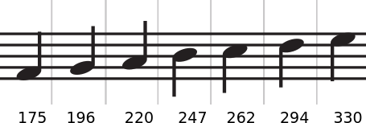
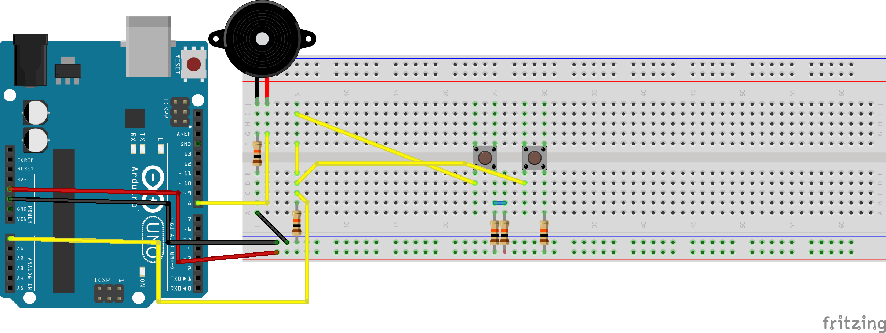
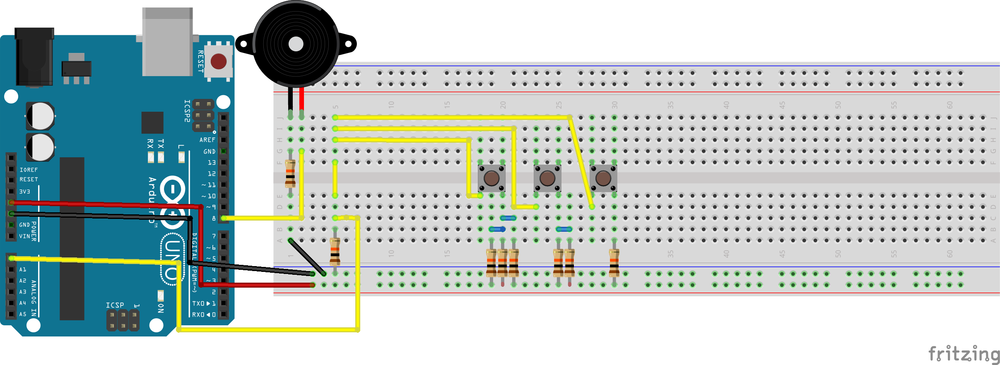
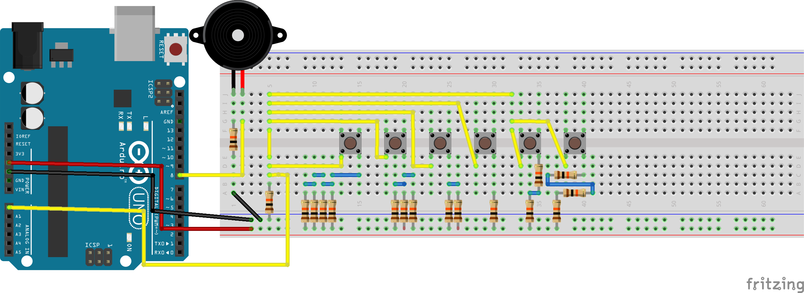

# Lektion 19: 1-Pin-7-Parallell Resistors-Piano

I den här lektionen ska vi göra ett enkelt piano som använder 1 stift och 7 parallella motstånd.

Vi bygger pianot steg för steg och testar varje steg för sig.

Vi har redan sett hur man läser knapparna i lektionshäfte 2, sidan 16.
Vi har redan sett uppspelningen av ett ljud i lektionshäfte 3, sidan 17.

 | Vi börjar med mittentangenten med frekvens 247. Sedan lägger vi till 3 tangenter till vänster. Sedan lägger vi till 3 nycklar till höger. Frekvenserna finns på den här bilden,
:-------------:|:----------------------------------------: 


> I lektion 231763256 kommer vi att göra ett piano med parallella universum!

\pagebreak

## Lektion 19: 1-Pin-7-Parallel Resistors-Piano: Anslutningsuppgift 1

Anslut den första knappen enligt bilden. Sätt knappen i mitten av din brödbräda!


> Lösning 1

 | 'Pull Down'-motståndet ser till att stift 2 är anslutet till GND när knappen inte trycks in
:-------------:|:----------------------------------------: 

\pagebreak

## Lektion 19: 1-Pin-7-Parallell Resistors-Piano: Kommando 1-kod

Sätt den här koden på din Arduino:

```c++
const int speaker_pin = 8;
const int piano_pin = A0;

void setup()
{
  pinMode(speaker_pin, OUTPUT);
  pinMode(piano_pin, INPUT);
  Serial.begin(9600);
}

void loop()
{
  Serial.println(analogRead(piano_pin));
  if (analogRead(piano_pin) > 510)
  {
    tone(speaker_pin, 247);
    delay(250);
    noTone(speaker_pin);
    delay(250);
  }
}
```

 | '>' betyder 'större än'. Värdet `A0` är aldrig exakt en siffra. I seriemonitorn läser vi av siffran som motsvarar knappen och testar sedan efter en siffra som ligger strax under det.
:-------------:|:----------------------------------------: 

Får du ett ljud när du trycker på knappen? Sedan kan du gå vidare till uppgift 2.

\pagebreak

## Lektion 19: 1-Pin-7-Parallell Resistors-Piano: Uppgift 2

Anslut en andra knapp **till vänster** om den första, med två motstånd framför sig som är parallella [alltså 5k], se bild.

 | Två 10k motstånd parallellt ger ett 5k motstånd.
:-------------:|:----------------------------------------: 

 | Två 10k motstånd i serie ger ett 20k motstånd.
:-------------:|:----------------------------------------: 



> Kretsen för uppgift 2

 | Använd den seriella monitorn för att fastställa värdet på den nya knappen.
:-------------:|:----------------------------------------: 

 | Det nya värdet är högre än värdet på den andra knappen. Den nya if-satsen bör komma överst.
:-------------:|:----------------------------------------: 

 | Vilken frekvens får den nya knappen?
:-------------:|:----------------------------------------: 

Använd denna kod:

 | Är det nödvändigt att ange hela koden igen?
:-------------:|:----------------------------------------: 

```c++
const int speaker_pin = 8;
const int piano_pin = A0;

void setup()
{
  pinMode(speaker_pin, OUTPUT);
  pinMode(piano_pin, INPUT);
  Serial.begin(9600);
}

void loop()
{
  const int sensorValue = analogRead(piano_pin);
  Serial.println(sensorValue);
  if (sensorValue > 680)
  {
    tone(speaker_pin, 220);
    delay(250);
    noTone(speaker_pin);
    delay(250);
  }
  else if (sensorValue > 510)
  {
    tone(speaker_pin, 247);
    delay(250);
    noTone(speaker_pin);
    delay(250);
  }
}
```

\pagebreak

## Lektion 19: 1-Pin-7-Parallell Resistors-Piano: Uppgift 3

Bygg nu en tredje nyckel, till vänster om den föregående.

Använd nu 3 parallella motstånd.

 | Använd den seriella monitorn för att fastställa värdet på den nya knappen.
:-------------:|:----------------------------------------: 

 | Vilken frekvens får den nya knappen?
:-------------:|:----------------------------------------: 

\pagebreak

## Lektion 19: 1-Pin-7-Parallell Resistors-Piano: Lösning 3



> Lösning 3

```c++
const int speaker_pin = 8;
const int piano_pin = A0;

void setup()
{
  pinMode(speaker_pin, OUTPUT);
  pinMode(piano_pin, INPUT);
  Serial.begin(9600);
}

void loop()
{
  const int sensorValue = analogRead(piano_pin);
  Serial.println(sensorValue);
  if (sensorValue > 820)
  {
    tone(speaker_pin, 196);
    delay(250);
    noTone(speaker_pin);
    delay(250);
  }
  else if (sensorValue > 680)
  {
    tone(speaker_pin, 220);
    delay(250);
    noTone(speaker_pin);
    delay(250);
  }
  else if (sensorValue > 510)
  {
    tone(speaker_pin, 247);
    delay(250);
    noTone(speaker_pin);
    delay(250);
  }
}
```

\pagebreak

## Lektion 19: 1-Pin-7-Parallell Resistors-Piano: Uppgift 4

Bygg nu en fjärde nyckel, till vänster om den föregående.

Använd nu 4 parallella motstånd.

 | Använd den seriella monitorn för att fastställa värdet på den nya knappen.
:-------------:|:----------------------------------------: 

 | Vilken frekvens får den nya knappen?
:-------------:|:----------------------------------------: 

\pagebreak

## Lektion 19: 1-Pin-7-Parallell Resistors-Piano: Lösning 4


> Lösning 4

```c++
const int speaker_pin = 8;
const int piano_pin = A0;

void setup()
{
  pinMode(speaker_pin, OUTPUT);
  pinMode(piano_pin, INPUT);
  Serial.begin(9600);
}

void loop()
{
  //... vorige code hier
  else if (sensorValue > 510)
  {
    tone(speaker_pin, 247);
    delay(250);
    noTone(speaker_pin);
    delay(250);
  }
}
```

\pagebreak

## Lektion 19: 1-Pin-7-Parallell Resistors-Piano: Uppgift 5

Bygg nu den 5:e tangenten till höger om de föregående tangenterna. Använd nu inte parallella motstånd, utan 2 motstånd på 10k Ohm kopplade i serie.

 | Använd den seriella monitorn för att fastställa värdet på den nya knappen.
:-------------:|:----------------------------------------: 

 | Vilken frekvens får den nya knappen?
:-------------:|:----------------------------------------: 

Kretsen kommer att se ut så här.


> Krets för uppgift 5

\pagebreak

## Lektion 19: 1-Pin-7-Parallell Resistors-Piano: Lösning 5

```c++
const int speaker_pin = 8;
const int piano_pin = A0;

void setup()
{
  pinMode(speaker_pin, OUTPUT);
  pinMode(piano_pin, INPUT);
  Serial.begin(9600);
}

void loop()
{
  //... vorige code hier
  else if (sensorValue > 310)
  {
    tone(speaker_pin, 262);
    delay(250);
    noTone(speaker_pin);
    delay(250);
  }
}
```


> Nu kan alla medlemmar i det framgångsrika pojkbandet 5ive spela en knapp på ditt piano!

\pagebreak

## Lektion 19: 1-Pin-7-Parallell Resistors-Piano: Uppgift 6

Bygg nu den 6:e tangenten till höger om de föregående tangenterna. Använd inte heller parallella motstånd utan 3 10k Ohm seriekopplade motstånd.

 | Använd den seriella monitorn för att fastställa värdet på den nya knappen.
:-------------:|:----------------------------------------: 

 | Vilken frekvens får den nya knappen?
:-------------:|:----------------------------------------: 

Kretsen kommer att se ut så här.



> Kretsen för uppgift 6

\pagebreak

## Lektion 19: 1-Pin-7-Parallell Resistors-Piano: Lösning 6

```c++
const int speaker_pin = 8;
const int piano_pin = A0;

void setup()
{
  pinMode(speaker_pin, OUTPUT);
  pinMode(piano_pin, INPUT);
  Serial.begin(9600);
}

void loop()
{
  //... vorige code hier
  else if (sensorValue > 210)
  {
    tone(speaker_pin, 294);
    delay(250);
    noTone(speaker_pin);
    delay(250);
  }
}
```


> Den sexbenta subfilen (hexapoda) kan nu spela med ett ben per tangent på ditt piano!

\pagebreak

## Lektion 19: 1-Pin-7-Parallel Resistors-Piano: Final Assignment

Komplettera ett piano med sju tangenter genom att lägga till den sjunde knappen till höger. Använd nu 4 motstånd på 10 kOhm kopplade i serie.

 | Använd den seriella monitorn för att fastställa värdet på den nya knappen.
:-------------:|:----------------------------------------: 

 | Vilken frekvens får den nya knappen?
:-------------:|:----------------------------------------: 


> Wibi Soerjadi använder vanligtvis fler än sju fingrag
