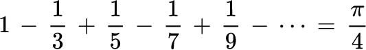
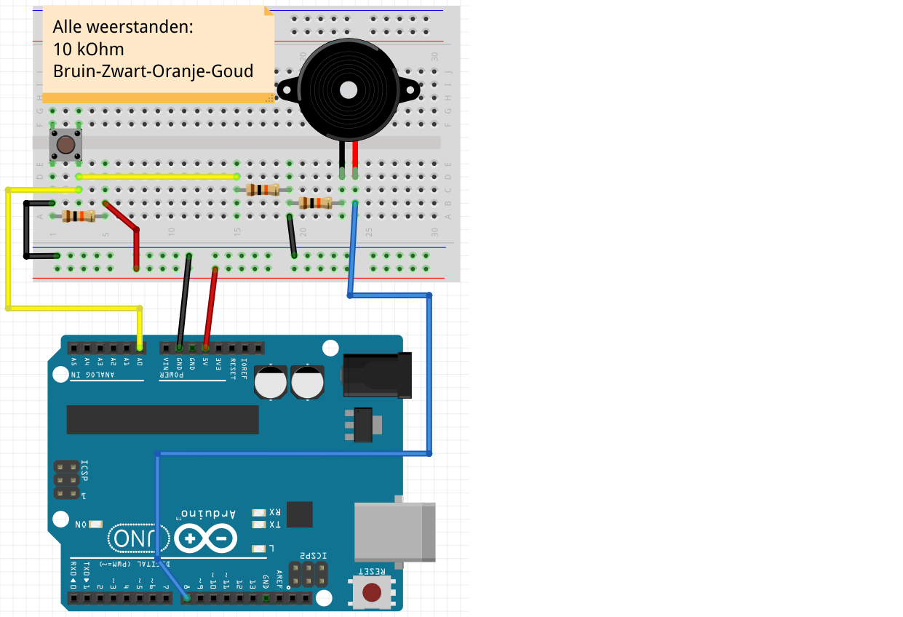
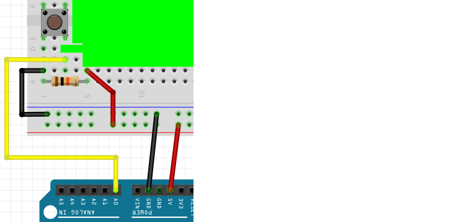
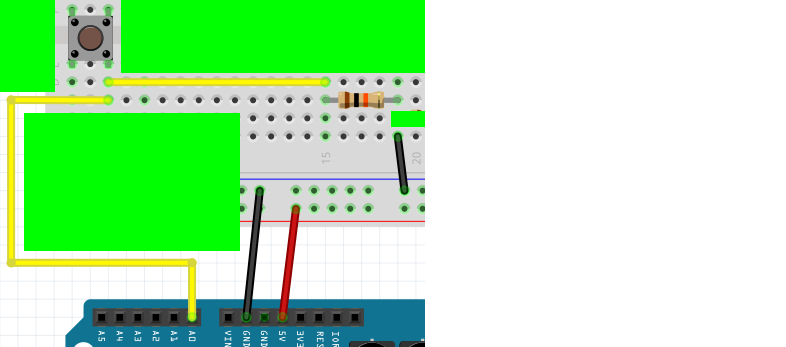
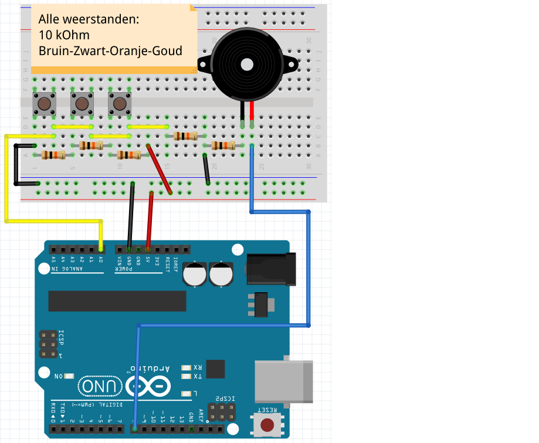
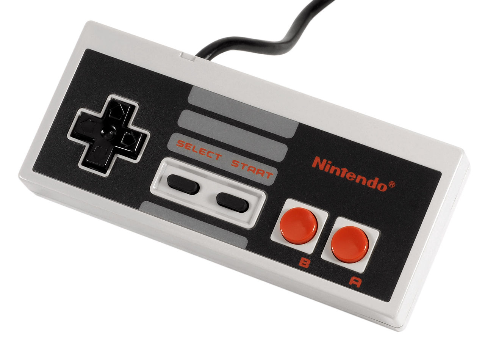
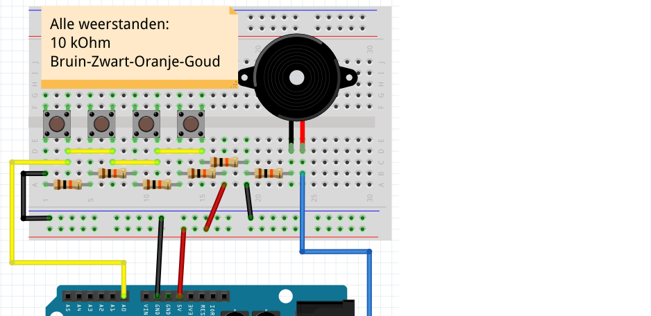

# Lektion 20: 1-pin-7-motstånd-i-serien-piano

I den här lektionen ska vi göra ett piano som bara behöver en stift och 8 motstånd.



 | pi är ett känt tal mellan tre och fyra
:-------------:|:----------------------------------------:

 | Det har inget med pianon att göra...
:-------------:|:----------------------------------------:

\pagebreak

## Lektion 20: 1-stift-7-motstånd-i-serien-piano: Uppgift 1

Bygg 'Uppdrag 1':



Sätt den här koden på din Arduino:

```c++
const int speaker_pin = 8;
const int piano_pin = A0;

void setup()
{
  Serial.begin(9600);  
  pinMode(A0, INPUT);
}

void loop()
{
  const int piano_waarde = analogRead(piano_pin);
  Serial.println(piano_waarde);
  delay(100);
}

```

* Vilket värde får Arduino när man trycker på knappen?
* Vilket värde får Arduino om knappen inte trycks in?

\pagebreak

## Lektion 20: 1-Pin-7-Resistors-I-Series-Piano: Lösning 1

När du trycker på knappen får du värdet 0.
Om knappen inte trycks in får du värdet 1023.



> När knappen trycks in



> Om knappen inte trycks in

\pagebreak

## Lektion 20: 1-Pin-7-Resistors-In-Series-Piano: Uppgift 2

När knappen trycks ned, gör piezopip i 250 millisekunder med en frekvens på 175 Hertz.
I slutet av "loop", låt Arduino vänta i 1 millisekund.

 | Om du inte kommer ihåg detta, kolla föregående lektion!
:-------------:|:----------------------------------------:

\pagebreak

## Lektion 20: 1-stift-7-motstånd-i-serien-piano: Lösning 2

```c++
const int speaker_pin = 8;
const int piano_pin = A0;

void setup()
{
  Serial.begin(9600);  
  pinMode(A0, INPUT);
}

void loop()
{
  const int piano_waarde = analogRead(piano_pin);
  Serial.println(piano_waarde);
  if (piano_waarde < 150)
  {
    tone(speaker_pin, 175, 250);
    delay(250);
  }
  delay(1);
}
```

 | Åh ja, det var så det fick bli!
:-------------:|:----------------------------------------:

\pagebreak

## Lektion 20: 1-Pin-7-Resistors-In-Series-Piano: Uppgift 3

Bygg följande:


Programmera den andra knappen för att skapa en 196 Hertz-ton.

\pagebreak

## Lektion 20: 1-Pin-7-Resistors-I-Series-Piano: Lösning 3

```c++
const int speaker_pin = 8;
const int piano_pin = A0;

void setup()
{
  Serial.begin(9600);  
  pinMode(A0, INPUT);
}

void loop()
{
  const int piano_waarde = analogRead(piano_pin);
  Serial.println(piano_waarde);
  if (piano_waarde < 150)
  {
    tone(speaker_pin, 175, 250);
    delay(250);
  }
  else if (piano_waarde < 300)
  {
    tone(speaker_pin, 196, 250);
    delay(250);
  }
  delay(1);
}
```

\pagebreak

## Lektion 20: 1-stift-7-motstånd-i-serien-piano: Uppgift 4

Bygg följande:



> Uppgift 4

Programmera den tredje knappen för att skapa en ton på 220 Hertz.

\pagebreak

## Lektion 20: 1-Pin-7-Resistors-I-Series-Piano: Lösning 4

```c++
const int speaker_pin = 8;
const int piano_pin = A0;

void setup()
{
  Serial.begin(9600);  
  pinMode(A0, INPUT);
}

void loop()
{
  const int piano_waarde = analogRead(piano_pin);
  Serial.println(piano_waarde);
  if (piano_waarde < 150)
  {
    tone(speaker_pin, 175, 250);
    delay(250);
  }
  else if (piano_waarde < 300)
  {
    tone(speaker_pin, 196, 250);
    delay(250);
  }
  else if (piano_waarde < 450)
  {
    tone(speaker_pin, 220, 250);
    delay(250);
  }
  delay(1);
}
```

\pagebreak

## Lektion 20: 1-Pin-7-Resistors-In-Series-Piano: Uppgift 5

Bygg nu en fjärde knapp själv.

Programmera den fjärde knappen för att skapa en ton på 247 Hertz.



> En NES-kontroller har också 4 knappar

\pagebreak

## Lektion 20: 1-stift-7-motstånd-i-serien-piano: Lösning 5



```c++
const int speaker_pin = 8;
const int piano_pin = A0;

void setup()
{
  Serial.begin(9600);  
  pinMode(A0, INPUT);
}

void loop()
{
  // ... vorige code hier
  else if (piano_waarde < 600)
  {
    tone(speaker_pin, 247, 250);
    delay(250);
  }
  delay(1);
}
```

\pagebreak

## Slutuppgift

Komplettera pianot med sju knappar.
De sista tonerna är 262, 294 och 330 Hertz.


> Amina Figarova behöver verkligen använder mer än sju fingrar
