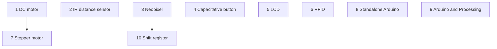

# Reflection 2025-12-20

The first 7 Arduino books are reasonably good. 
However, there are some problem, as pointed out by my studious learners:

I've created [an issue](https://github.com/richelbilderbeek/arduino_foer_ungdomar/issues/10)
for that.

Let's focus on the next booklets. These are the first seven that are done:

Kpt|Beskrivning
---|---------------------------------------------------------------
.  |**Bok 1**: lysdiod 1
.  |**Bok 2**: lysdiod 2
.  |**Bok 3**: knapp
.  |**Bok 4**: vridmotstånd
.  |**Bok 5**: joystick
.  |**Bok 6**: LDR
.  |**Bok 7**: servo

My favorite order:

Kpt|Beskrivning
---|---------------------------------------------------------------
.  |**Bok 8**: DC motor
.  |**Bok 9**: Infrared distance sensor
.  |**Bok 10**: Neo pixels
.  |**Bok 11**: Capacitative button
.  |**Bok 12**: LCD
.  |**Bok 13**: Stepper motor
.  |**Bok 14**: RFID

.  |**Bok X1**: Standalone/bare-bone Arduino
.  |**Bok X2**: Arduino and Processing
.  |**Bok X3**: Arduino som ISP
.  |**Bok X4**: Shift register

To add too:

Kpt|Beskrivning
---|---------------------------------------------------------------
.  |**Bok 0**: getting started

I am annoyed by plastic, i.e. I am annoyed that I need to by robot kits to
put things (e.g. DC motors) into a container.
Let's combine this with learning Blender at UMS.

Lesson                          |Electrokit component                                                                                                                                    |Price (SEK)|Verdict
--------------------------------|--------------------------------------------------------------------------------------------------------------------------------------------------------|-----------|-------
DC Motor                        |[DC-motor med kuggväxel 1:48 140rpm 5V 2-pack, art nr: 41013880](https://www.electrokit.com/dc-motor-med-kuggvaxel-1-48-140rpm-5v-2-pack)               |150        |Good
Breadboard power supply, battery|[Strömförsörjning för kopplingsdäck 3.3/5V 800mA, art nr: 41014833](https://www.electrokit.com/stromforsorjning-for-kopplingsdack-3.3/5v-800ma)|219        |Expensive
Breadboard power supply, USB    |[Strömförsörjning för kopplingsdäck 3.3/5V USB-C, art nr: 41024241](https://www.electrokit.com/stromforsorjning-for-kopplingsdack-3.3/5v-usb-c)|79         |Good

