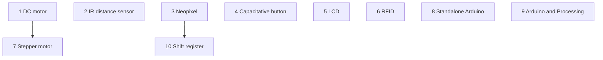

# Reflection 2025-12-20

The first 7 Arduino books are reasonably good. 
However, there are some problem, as pointed out by my studious learners:

- [ ] Add 'Download Processing' to book 1 (or 0?)
- [ ] 17.1 Fix
- [ ] 17.2 Fix
- [ ] 18.2 Fix
- [ ] 9.4 Inverse answer
- [ ] 21.2 'Sätter **på** servo'

Let's focus on the next booklets. These are the first seven that are done:

Kpt|Beskrivning
---|---------------------------------------------------------------
.  |**Bok 1**: lysdiod 1
.  |**Bok 2**: lysdiod 2
.  |**Bok 3**: knapp
.  |**Bok 4**: vridmotstånd
.  |**Bok 5**: joystick
.  |**Bok 6**: LDR
.  |**Bok 7**: servo

My favorite order:

Kpt|Beskrivning
---|---------------------------------------------------------------
.  |**Bok 8**: DC motor
.  |**Bok 9**: Infrared distance sensor
.  |**Bok 10**: Neo pixels
.  |**Bok 11**: Capacitative button
.  |**Bok 12**: LCD
.  |**Bok 13**: Stepper motor
.  |**Bok 14**: RFID
.  |**Bok X1**: Standalone/bare-bone Arduino
.  |**Bok X2**: Arduino and Processing
.  |**Bok X3**: Arduino som ISP
.  |**Bok X4**: Shift register

To add too:

Kpt|Beskrivning
---|---------------------------------------------------------------
.  |**Bok 0**: getting started

I am annoyed by plastic, i.e. I am annoyed that I need to by robot kits to
put things (e.g. DC motors) into a container.
Let's combine this with learning Blender at UMS.
