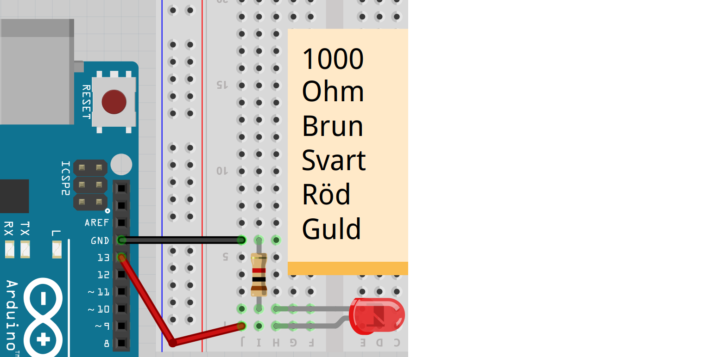
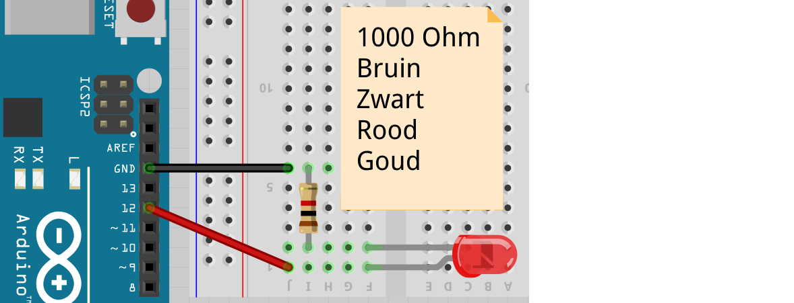

# Lektion 1: Blink

Under den här lektionen ska vi göra den enklaste kretsen som finns: Blink!

 | Vi börjar lätt!
:-------------:|:----------------------------------------: 

## 1.1 Blink: Ansluta en Arduino

Anslut en Arduino så här:


Anslut en USB-kabel till din Arduino och till din bärbara dator.

## 1.2 Blink: Uppgift 1

Koppla in Arduino.

 | Arduino har redan ett ljus som du kan programmera.
:-------------:|:----------------------------------------: 

\pagebreak

## 1.3 Blink: Startar Arduino IDE

 | Vi programmerar Arduino med Arduino IDE
:-------------:|:----------------------------------------: 

 | 'IDE' uttalas som 'ie-dee-ee'
:-------------:|:----------------------------------------: 

Starta Arduino IDE genom att:

 * Klicka på genvägen på skrivbordet
 * Tryck på Windows-tangenten (nedre till vänster, mellan `Ctrl` och `Alt`). Typ
   sedan `arduino` (små bokstäver) och sedan Enter


\pagebreak

Du ser nu Arduino IDE:


 | IDE betyder 'Integrated Development Environment', programmet du använder för att programmera.
:-------------:|:----------------------------------------: 

\pagebreak

## 1.4 Blink: vårt första program

Detta är (en version av) koden för `Blink`:

```c++
void setup() 
{
  pinMode(13, OUTPUT);
}

void loop() 
{
  digitalWrite(13, HIGH);
  delay(1000);
  digitalWrite(13, LOW);
  delay(1000);
}
```

 | 
:-------------:|:----------------------------------------: 
`void setup() { }`|'Kära dator, gör vad som än står inom måsvingarna'

 | 
:-------------:|:----------------------------------------: 
`void loop() { }`|'Kära dator, gör vad som än står inom måsvingarna hela tiden.'

Skriv in koden i Arduino IDE och klicka på 'Upload' ('Ladda up').


## 1.5 Blink: Uppgift 2

Få lysdioden att blinka 10 gånger så snabbt.

Tips: LED är nu 1000 millisekunder på och 1000 millisekunder av.

\pagebreak

## 1.6 Blink: lösning 2

```c++
void setup()
{
  // ...
}

void loop() 
{
  digitalWrite(13, HIGH);
  delay(100);
  digitalWrite(13, LOW);
  delay(100);
}
```

| `// ...` betyder 'koden du redan har där'
:-------------:|:----------------------------------------: 

 | 
:-------------:|:----------------------------------------: 
`pinMode(13, OUTPUT);`|'Se till att spänning kan komma ut ur stift 13'

 | 
:-------------:|:----------------------------------------: 
`digitalWrite(13, HIGH);`|'Sätt spänning på stift 13'

 | 
:-------------:|:----------------------------------------: 
`delay(1000);`|'Vänta 1000 millisekunder'

##1.7 Blink: Uppgift 3

Låt lysdioden blinka så snabbt du kan. Vad ser du?

\pagebreak

##1.8 Blink: Lösning 3

Det finns fler lösningar, det här är en:

```c++
void setup()
{
  // ...
}

void loop() 
{
  digitalWrite(13, HIGH);
  delay(1);
  digitalWrite(13, LOW);
  delay(1);
}
```

Du kommer inte längre att se lampan blinka.

 | Du kommer inte längre att se lampan blinka!
:-------------:|:----------------------------------------: 

 | Ljuset blinkar, men våra ögon kan inte titta tillräckligt snabbt för att se det.
:-------------:|:----------------------------------------: 

 | 
:-------------:|:----------------------------------------: 
`digitalWrite(13, LOW);`|'Koppla ur stift 13'

 | Också bra: `delay(0);` eller ta bort raderna med `delay` helt.
:-------------:|:----------------------------------------: 

\pagebreak

## 1.9 Blink: Anslut LED

Nu är det dags att ansluta Blink:



 * Koppla ur USB-kabeln från datorn, så att Arduino inte längre har ström
 * Anslut Blink enligt bilden
 * Sätt tillbaka strömmen till Arduino
 * Om allt är bra kommer nu den röda lysdioden att blinka tillsammans med lysdioden på Arduino.

 | Om lysdioden inte lyser, vänd på den
:-------------:|:----------------------------------------: 

## 1.10 Blink: Uppgift 4

Anslut nu din LED till stift 12.

 | Det är coolt att ta tag i stift 12 efter stift 13
:-------------:|:----------------------------------------: 

 | Detta beror också på att stift 0 och 1 är speciella
:-------------:|:----------------------------------------: 

\pagebreak

## 1.11 Blink: Lösning 4



## 1.12 Blink: Uppgift 5

Se nu till att lysdioden på stift 12 börjar blinka den andra.

 | LED är en förkortning av 'Light Emitting Diode'
:-------------:|:----------------------------------------: 

 | Bra sagt! Bättre sent än aldrig!
:-------------:|:----------------------------------------: 

 | LED menar på svensk: 'Ljus givande diod'
:-------------:|:----------------------------------------: 

\pagebreak

## 1.13 Blink: Lösning 5

```c++
void setup() 
{
  pinMode(12, OUTPUT);
}

void loop() 
{
  digitalWrite(12, HIGH);
  delay(100);
  digitalWrite(12, LOW);
  delay(100);
}
```

## 1.14 Blink: Slutuppgift

Anslut lysdioden till stift 11 och få den att blinka 2 gånger per sekund.

 | Framgång? Visa detta för en vuxen för initialer!
:-------------:|:----------------------------------------: 

