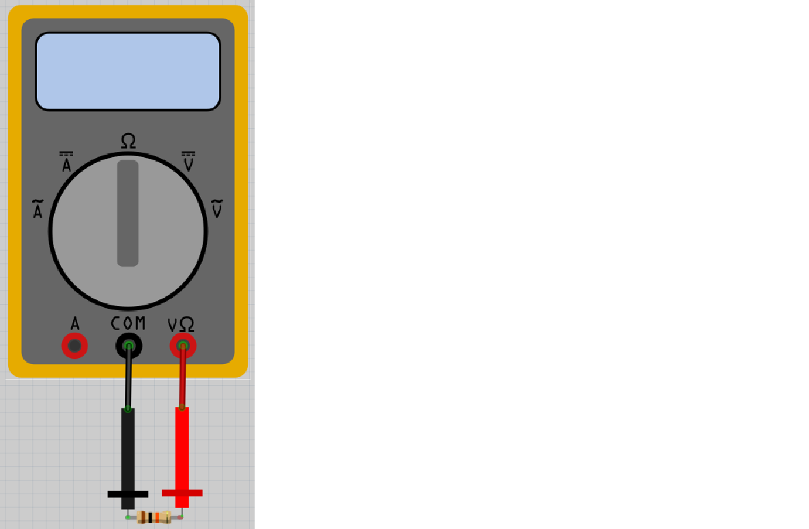

# Lektion 2: Användning av en multimeter

Under den här lektionen ska vi använda en multimeter.

 | Ingen spaning, ingen aning!
:-------------:|:----------------------------------------: 

## 2.1. Mätning av ingen motstånd

Leta efter en multimeter och två av sina mätkablar: en röda och en svarta.
Sätt knappen av multimetern till Ohm symbolen,
som ser ut som en luftballong eller en upp och nervänd vas.
Koppla in röda mätkabel i röda hål av multimetern som har en V och en
Ohm symbol ovanpå sig.
Koppla in svart mätkabel i svarta hål av multimetern som har ordet 'COM' ovanpå sig.

Sätt på multimetern och hålla röda mätaren till svarta mätaren.
Vad mäter du?

### Svaret

Skärmen skulle visar 0 Ohm motstånd.

0 Ohm motstånd betyder att det finns ingenting emellan mätaren.
Det stämmer: el kan gå från ena mätare till andra utan motstånd.

 | En motstånd åv 0 Ohm är också kallad kortslutning!
:-------------:|:----------------------------------------: 

## 2.2. Mätning av oäntligt motstånd

Sätt på multimetern och hålla röda mätaren långt bort från svarta mätaren.
Vad mäter du?

### Svaret

Skärmen skulle visar 'Inf'. 'Inf' är an förkortning av 'Infinity',
som är Engelska för oäntligt.

Det betyder att det finns oäntligt mycket motstånd emellan mätaren.
Det stämmer: el kan gå från ena mätare till andra med mycket motstånd!
Det är svårt för el att gå igenom luften!

 | Ett oäntligt motstånd är också kallad ingen förbindning
:-------------:|:----------------------------------------: 

## 2.3. Mätning av ett tusenohms motstånd

Leta efter en tusenohms motstånd.
Den har bänder brunt, svart, röd och guld, i den där ordning.

Sätt på multimetern och koppla:

 * röda mätare till motstånd, på sida med brunt bant 
 * svarat mätare till andra sida motstånd

Vad mäter du?

### Svaret

Varden skulle vara mellen 950 och 1050 Ohm!
Motstånder har ej sin egen värde perfecta, så det stämmer!

 | Motstånder har ej sin egen värde perfecta!
:-------------:|:----------------------------------------: 

## 2.4. Mätning av ett tusenohms motstånd i andra riktning

Vänd på motstånden och mät motstånden igen:

 * röda mätare till motstånd, på sida med guld bant 
 * svarat mätare till andra sida motstånd

Vad mäter du?

### Svaret

Värden skulle vara mellen 950 och 1050 Ohm!
Rikting av motståndet är oviktigt.

 | Rikting av motståndet är oviktigt!
:-------------:|:----------------------------------------: 

## 2.5. Mätning av ett tiotusenohms motstånd

Leta efter en **tio**-tusenohms motstånd.
Den har bänder brunt, svart, **orange** och guld, i den där ordning.

Sätt på multimetern och koppla:

 * röda mätare till motstånd, på sida med brunt bant 
 * svarat mätare till andra sida motstånd

Vad mäter du?

### Svaret

Värden skulle vara mellen 9500 och 10500 Ohm!
Motstånder är inte perfecta, så det stämmer!

 | Motstånder har ej sin egen värde perfecta!
:-------------:|:----------------------------------------: 

## 2.6. Mätning av ett tiotusenohms motstånd i andra riktning

Vänd på motstånden och mät motstånden igen:

 * röda mätare till motstånd, på sida med guld bant 
 * svarat mätare till andra sida motstånd

Vad mäter du?

### Svaret

Värden skulle vara mellen 9500 och 10500 Ohm!
Igen, rikting av motståndet är oviktigt.

 | Rikting av motståndet är oviktigt!
:-------------:|:----------------------------------------: 

## 2.7. Mätning av ett lysdiod

Leta efter en lysdiod.

Sätt på multimetern och koppla:

 * röda mätare till längre ben av lysdiod
 * svarat mätare till andra ben

Vad mäter du? Brinner lysdiod litegrann?

### Svaret

Värden skulle vara en värd, men ej oäntligt!
Det betyder at el kan gå igenom en lysdiod.

Det är möjligt att lysdiod brinner litegrann!

 | Exacta motståndet av en lysdiod är ej jätteviktigt
:-------------:|:----------------------------------------: 

## 2.8. Mätning av ett lysdiod i andra riktning

Vänd på lysdioden och mät motstånden igen:

 * röda mätare till kortare ben av lysdiod
 * svarat mätare till andra ben

Vad mäter du? Brinner lysdiod litegrann?

 | Riktning av en lysdiod är viktigt!
:-------------:|:----------------------------------------: 

### Svaret

Värden skulle vara oäntligt.
Det betyder at el kan gå ej igenom en lysdiod in den där riktning.
Lysdiod brinner ej.

## 2.9. Slutuppgift

Försammla:

 * 1 multimeter
 * 1 1.000 Ohm motstånd
 * 1 10.000 Ohm motstånd
 * 1 slumpmässtigt motstånd
 * 1 lysdiod

Läs slutuppgift först, för att du har 5 minuten.

1. Fråga någon för att examinera. Den där person får inte hjälpa dig,
bara fråga frågor.

Start en timer och gör följande:

2. Visa exacta motstånd av 1.000 Ohm motstånd

3. Visa exacta motstånd av 10.000 Ohm motstånd

4. Visa exacta motstånd av det slumpmässtigt motståndet

5. Bevisa att riktning av lysdiod är viktigt ja eller nej
