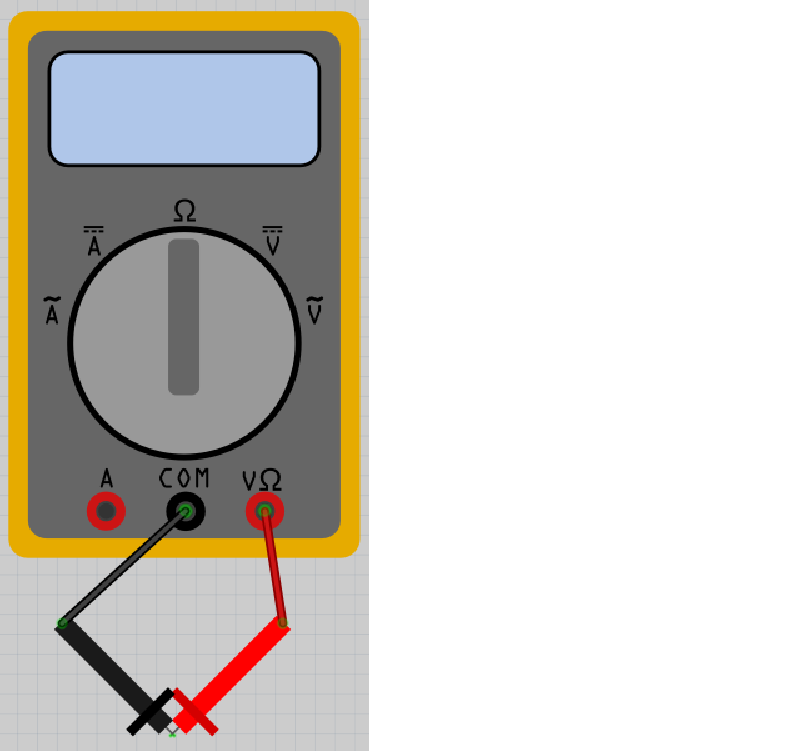
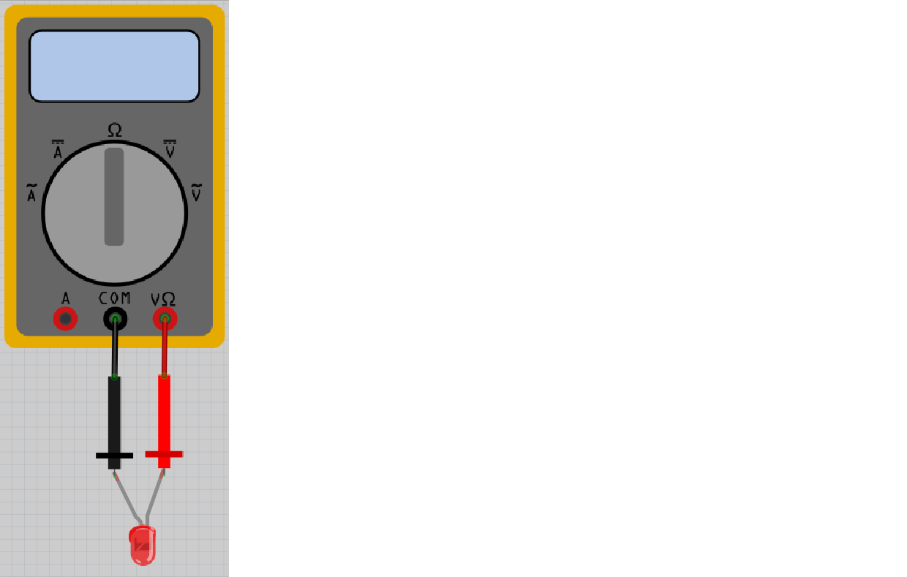

# Lektion 2: Användning av en multimeter

Under den här lektionen ska vi använda en multimeter.

 | Ingen spaning, ingen aning!
:-------------:|:----------------------------------------: 

## 2.1. Mätning av ingen motstånd

Leta efter en multimeter och två av sina mätkablar: en röd och en svart.
Vrid knappen på multimetern till Ohm symbolen (ser ut så här: Ω),
och om det står nummer så ska du ha 20K.
Koppla in den röda mätkabeln i det röda hålet på multimetern som har en V och en
Ohm symbol (Ω) ovanför sig.
Koppla in den svart mätkabeln i det svarta hålet på multimetern som har ordet 'COM' ovanpå sig.

Sätt på multimetern och håll röda mätaren ihop med svarta mätaren.
Vad mäter du?

### Svaret

Skärmen skulle visa 0 Ohm av motstånd.

0 Ohm av motstånd betyder att det finns ingenting emellan mätaren.
Det stämmer: el kan gå från ena mätare till andra utan motstånd.

 | En motstånd åv 0 Ohm är också kallad kortslutning!
:-------------:|:----------------------------------------: 

## 2.2. Mätning av oäntligt motstånd

Sätt på multimetern och håll den röda mätaren långt bort från den svarta mätaren.
Vad mäter du?

### Svaret

Skärmen skulle visat 'Inf' eller 'OL'. 'Inf' är an förkortning av 'Infinity',
som är Engelska för oäntligt.

Det betyder att det finns oäntligt mycket motstånd mellan mätarna.
Det stämmer: el kan gå från ena mätare till andra med mycket motstånd!
Det är svårt för el att gå igenom luften!

 | Ett oäntligt motstånd är också kallad ingen förbindning
:-------------:|:----------------------------------------: 

## 2.3. Mätning av ett tusenohms motstånd

Leta efter ett tusenohms motstånd.
Den har bänder brunt, svart, röd och guld, i den där ordning.

Sätt på multimetern och koppla:

 * röda mätare till motståndet på sidan med ett brunt bant 
 * svart mätare till andra sidan av motståndet

Vad mäter du?

### Svaret

Värden skulle vara mellen 950 och 1050 Ohm! (du måste multiplicera det multimetern visar med 1000 ibland)
Motstånder är inte perfekta, så det stämmer!

 | Motståndare är inte perfekta!
:-------------:|:----------------------------------------: 

## 2.4. Mätning av ett tusenohms motstånd i andra riktning

Vänd på motstånden och mät motstånden igen:

 * röda mätare på motstånd, på sida med guldigt band 
 * svart mätare till andra sidan av motståndet

Vad mäter du?

### Svaret

Värden skulle vara mellan 950 och 1050 Ohm!
Rikting av motståndet är oviktigt.

 | Rikting av motståndet är oviktigt!
:-------------:|:----------------------------------------: 

## 2.5. Mätning av ett tiotusenohms motstånd

Leta efter en **tio**-tusenohms motstånd.
Den har bänder brunt, svart, **orange** och guld, i den där ordning.

Sätt på multimetern och koppla:

 * röda mätaren till motståndet, på sida med brunt band 
 * svarta mätaren till andra sidan av motståndet

Vad mäter du?

### Svaret

Värden skulle vara mellen 9500 och 10500 Ohm!
Motstånd är inte perfekta, så det stämmer!

 | Motstånd är inte perfekta!
:-------------:|:----------------------------------------: 

## 2.6. Mätning av ett tiotusenohms motstånd i andra riktning

Vänd på motstånden och mät motstånden igen:

 * röda mätaren på motståndet, på sidan med guldigt band 
 * svarta mätare till andra sidan av motståndet

Vad mäter du?

### Svaret

Värden skulle vara mellen 9500 och 10500 Ohm!
Igen, riktingen av motståndet är oviktigt.

 | Rikting av motståndet är oviktigt!
:-------------:|:----------------------------------------: 

## 2.7. Mätning av en lysdiod

Leta efter en lysdiod.

Sätt på multimetern och koppla:

 * röda mätaren till det längre benet av lysdioden
 * svarta mätaren till det andra benet

Vad mäter du? Lyser lysdioden litegrann?

### Svaret

Värdet är inte oäntligt!
Det betyder at el kan gå igenom en lysdiod.

Det är möjligt att lysdiod lyser litegrann!

 | Exakta motståndet av en lysdiod är ej jätteviktigt
:-------------:|:----------------------------------------: 

## 2.8. Mätning av ett lysdiod i andra riktning

Vänd på lysdioden och mät motståndet igen:

 * röda mätaren till det kortare benet av lysdioden
 * svarta mätaren på det andra benet

Vad mäter du? Brinner lysdioden litegrann?

 | Riktningen av en lysdiod är viktigt!
:-------------:|:----------------------------------------: 

### Svaret

Värden skulle vara oäntligt.
Det betyder at el kan ej gå igenom en lysdiod i den där riktningen.
Lysdiod lyser ej.

## 2.9. Slutuppgift

Hämta:

 * 1 multimeter
 * 1 1.000 Ohm motstånd
 * 1 10.000 Ohm motstånd
 * 1 slumpmässtigt motstånd
 * 1 lysdiod

Läs slutuppgift först, för att du har 5 minuten.

1. Fråga någon för att examinera. Den där person får inte hjälpa dig,
bara fråga frågor.

Start en timer och gör följande:

2. Visa exakta motståndet av 1.000 Ohm motstånd

3. Visa exakta motståndet av 10.000 Ohm motstånd

4. Visa exakta motståndet av det slumpmässiga motståndet

5. Bevisa att riktning av en lysdiod är viktigt ja eller nej
