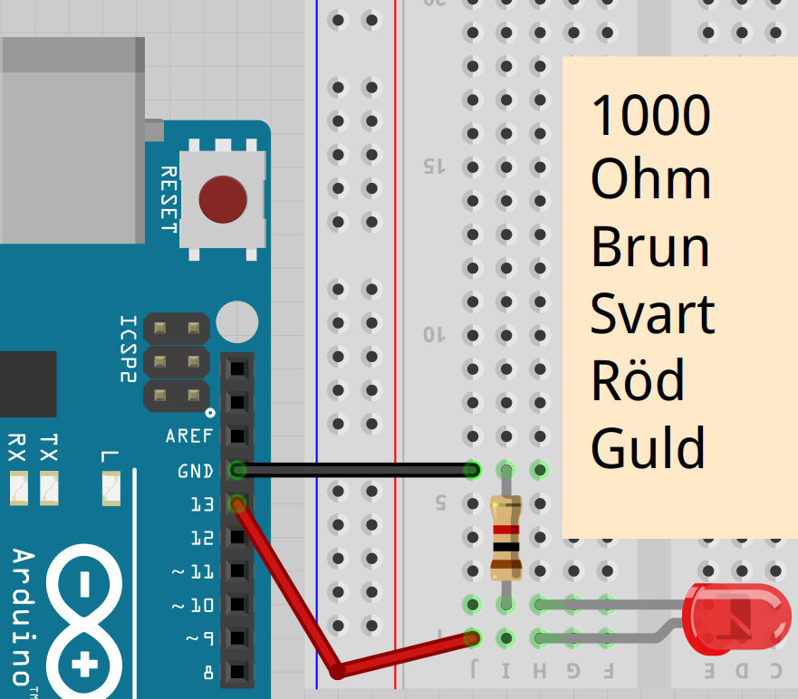
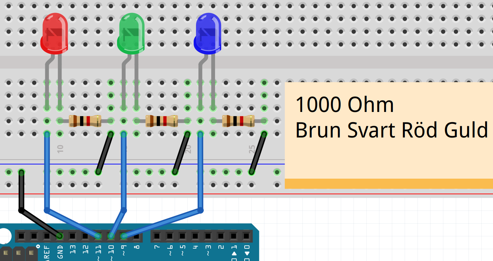

# Lektion 2: Blink Blink Blink

Den här lektionen kallas 'Blink Blink Blink', eftersom det är Blink lektionen, men med tre lampor.

## 2.1: Blink Blink Blink: Blink



Här är Blinks kod på ett annat sätt:

```c++
const int pin_led = 13;

void setup() 
{
  pinMode(pin_led, OUTPUT);
}

void loop() 
{
  digitalWrite(pin_led, HIGH);
  delay(1000);
  digitalWrite(pin_led, LOW);
  delay(1000);
}
```

`pin_led` kallas en variabel: en bit datorminne med ett namn.

 | 
:-------------:|:----------------------------------------: 
`const int pin_led = 13;`|'Bästa dator, kom ihåg ett heltal som heter `pin_led` med initialvärdet 13.'

## 2.2: Blink Blink Blink: Uppgift 1

Anslut lysdioden till stift 12 och ändra koden så att den blinkar.

\pagebreak

## 2.3: Blink Blink Blink: Lösning 1


Du behöver bara ändra en rad:

```c++
const int pin_led = 12;

void setup() 
{
  // ...
}

void loop() 
{
  // ...
}
```

## 2.4: Blink Blink Blink: Uppgift 2

Skapa en ny variabel som heter "väntetid" själv.
"väntetid" är ett heltal med initialt värde 1000.
Använd "väntetid" i raderna med "fördröjning".

 | Smart! Om du läser "väntetid" vet du vad det är till för. Vid `1000` vet du inte det
:-------------:|:----------------------------------------: 

\pagebreak

##2.5: Blink Blink Blink: Lösning 2

```c++
// ... [maak pin_led met waarde 12]
const int wachttijd = 1000;

void setup() 
{
  // ...
}

void loop() 
{
  // ... [zet spanning op pin_led]
  delay(wachttijd);
  // ... [geen spanning op pin_led af]
  delay(wachttijd);
}
```

| `// ... [vad]` betyder 'koden du redan har där som handlar om vad som står inom parentes'
:-------------:|:----------------------------------------: 

##2.6: Blink Blink Blink: Ansluter Blink Blink Blink

Nu är det dags att ansluta "Blink Blink Blink":



 * Koppla ur USB-kabeln från datorn, så att Arduino inte längre har ström
 * Anslut delarna enligt bilden

## 2.7: Blink Blink Blink: Uppgift 3

Koppla in 'Blink Blink Blink'. Byt namn på variabeln "pin_led" till "pin_led_1".
och se till att det har rätt startvärde.

\pagebreak

## Lösning 3

```c++
const int pin_led_1 = 11;
// ... [onthoud wachttijd]

void setup() 
{
  pinMode(pin_led_1, OUTPUT);
}

void loop() 
{
  digitalWrite(pin_led_1, HIGH);
  // [wacht wachttijd milliseconden]
  digitalWrite(pin_led_1, LOW);
  // [wacht wachttijd milliseconden]
}
```

 | Programmerare använder många variabler eftersom det gör koden lättare att förstå.
:-------------:|:----------------------------------------: 

##2.8: Blink Blink Blink: Uppgift 4

Skapa en ny variabel `pin_led_2`.
Låt först den första lysdioden tändas och släckas, låt sedan den andra lysdioden tändas och släckas.

 | Stavningen 'pin_led_2' kallas 'snake case': 'snake' är engelska för snake
:-------------:|:----------------------------------------: 

 | Skulle du skriva `pinLed2`, heter det 'camel case': 'camel' är engelska för camel
:-------------:|:----------------------------------------: 

 | Jag bryr mig inte om vilken du väljer
:-------------:|:----------------------------------------: 

\pagebreak

## 2.9: Blink Blink Blink: Lösning 4

```c++
const int pin_led_1 = 11;
const int pin_led_2 = 10;
// ...

void setup() 
{
  pinMode(pin_led_1, OUTPUT);
  pinMode(pin_led_2, OUTPUT);
}

void loop() 
{
  digitalWrite(pin_led_1, HIGH);
  // ... [wacht wachttijd milliseconden]
  digitalWrite(pin_led_1, LOW);
  // ... [wacht wachttijd milliseconden]
  digitalWrite(pin_led_2, HIGH);
  // ... [wacht wachttijd milliseconden]
  digitalWrite(pin_led_2, LOW);
  // ... [wacht wachttijd milliseconden]
}
```

## 2.10: Blink Blink Blink: Uppgift 5

Skapa en tredje variabel `pin_led_3`. Låt nu alla lampor blinka samtidigt: alla på, sedan alla av.

 | Det här är ganska mycket att skriva! Senare får du lära dig hur detta kan göras smartare
:-------------:|:----------------------------------------: 

 | Korrekt! Matriser låter dig lagra flera tal i en variabel
:-------------:|:----------------------------------------: 

\pagebreak

## 2.11: Blink Blink Blink: Lösning 5

```c++
// ... [maak wachttijd, pin_led_1 en pin_led_2]
const int pin_led_3 = 9;

void setup() 
{
  // ... [pin_led_1 en pin_led_2 geven spanning]
  pinMode(pin_led_3, OUTPUT);
}

void loop() 
{
  // ... [zet spanning op LED 1 en 2]
  digitalWrite(pin_led_3, HIGH);
  // ... [wacht wachttijd milliseconden]
  // ... [zet spanning op LED 1 en 2]
  digitalWrite(pin_led_3, LOW);
  // ... [wacht wachttijd milliseconden]
}
```

## 2.12: Blink Blink Blink: Final Assignment

Låt nu lamporna gå i ett 'Knight Rider-mönster': 1-2-3-2. Det måste alltid finnas exakt ett ljus.

 | Knight Rider var en TV-serie med en talande bil.
:-------------:|:----------------------------------------: 


