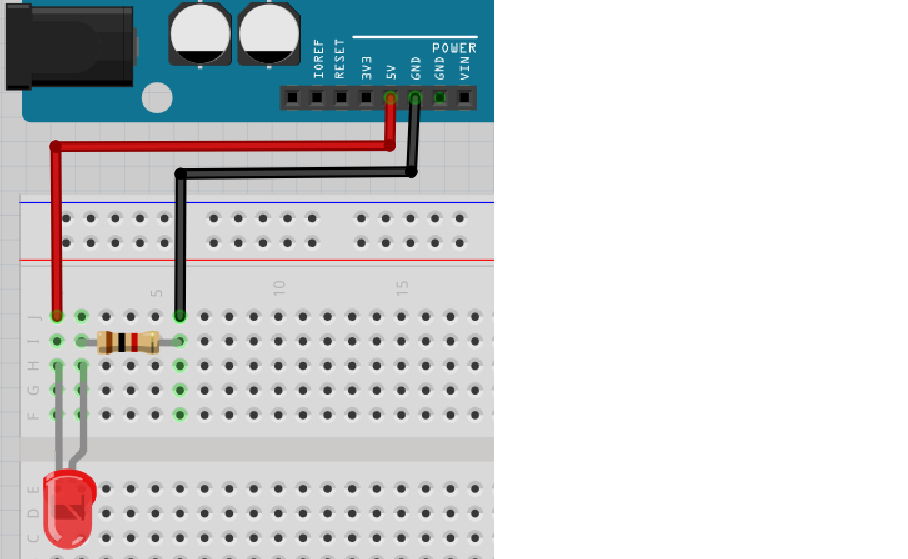
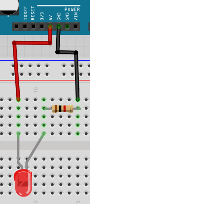
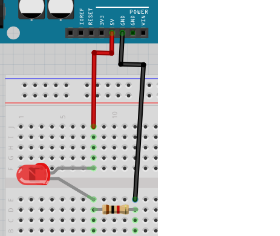
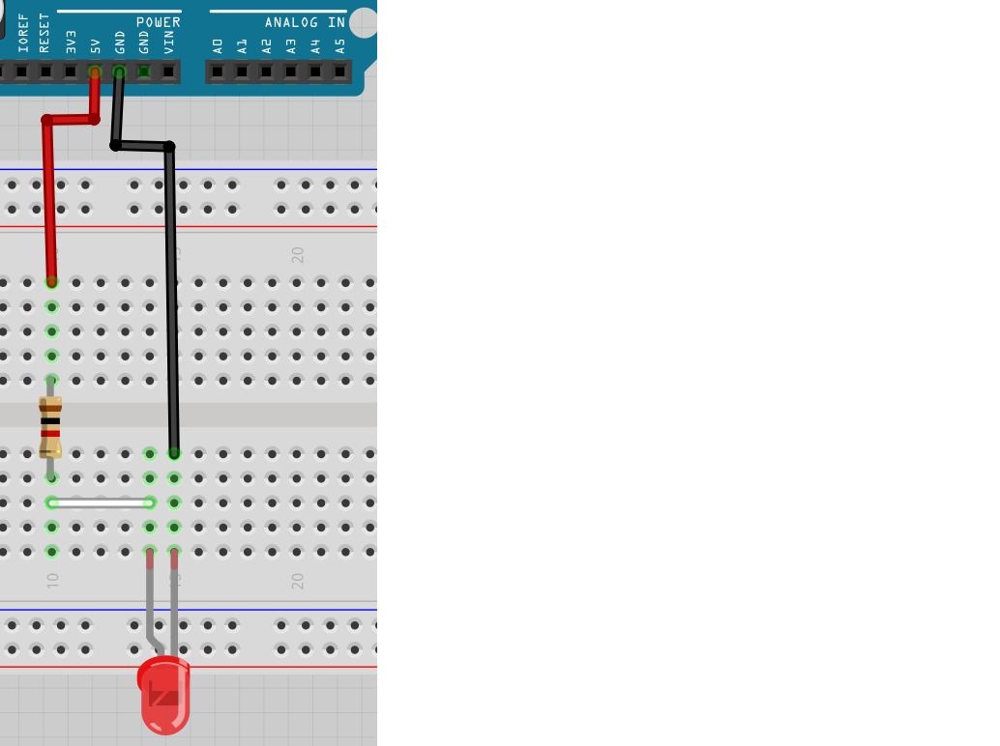
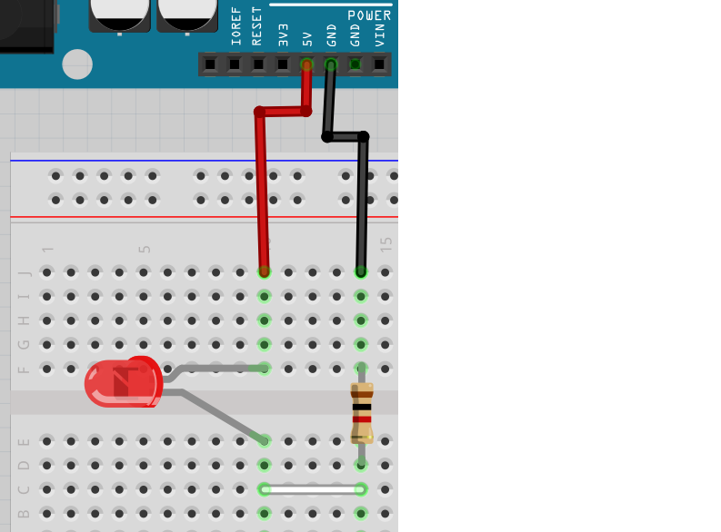

# Lektion 3: Anslutning av en lysdiod

Under den här lektionen ska vi ansluta en lysdiod till en Arduino!

## 3.1. Kopplingsdäcket

Vi använder ett kopplingsdäcket för att ansluta grejer till Arduino.

Här ser vi en:

Och här ar baksida av samma kopplingsdäcket:

Minn baksida av kopplingsdäcket och kolla här:

Vilken av den här hålar är förbundna?

### Svaret

 * 1 är förbunden med 2
 * 3 är förbunden med 4
 * 5 är ensamma

## 3.2. Anslut motstånden och lysdioden

Kolla på den här bilden:

Det finns sex färgarde hålar. Vilken av dem är förbundna?

### Svaret

 * röd är förbunden med orange
 * gult är förbunden med grönt
 * blå är förbunden med lila

## 3.3. Anslut motstånden och lysdioden

Nu är det dags att bygga kretsen på riktigt:

 * Koppla ur USB-kabeln från datorn, så att Arduino inte längre har ström
 * Montera kretsen enligt bild:
   * Koppla en röd sladd från 5V hålet till hålet helt på toppen-vänster 
     i kopplingsdäcket
   * Koppla långa ben av lysdioden nedåt **två** hål av röda sladd i kopplingsdäcket.
     Det skulle finnas en tomt hål mellan långa ben av lysdioden och 
     röda sladd i kopplingsdäcket.
   * Sätt korta ben av lysdioden i hålet åt höger av sin långa ben
   * Koppla sida med brun bant av en motstånd uppåt ett hål av korta ben av lysdioden
   * Koppla sida med guld bant av en motstånd fyra hål till höger än
     sida med brun bant.
     Det skulle finnas tre tomma hål mellan båda sidor av motståndet i kopplingsdäcket.
   * Koppla en svart sladd ett hål uppåt av sida med guld bant av motstånden
     till GND hål i Arduino
 * Montera tillbaka USB kabel till datorn
 * Om allt är bra kommer nu den röda LED att blinka tillsammans med LEDen på Arduinon.

 | Det böjda benet i ritningen betyder det längre benet av en lysdiod
:-------------:|:----------------------------------------: 

Brinner lysdioden?

### Svaret

Elen kan gå från `5V` till `GND` igenom lysdioden och motståndet!
Så ja, det funkar!

Om inte, fråga om hjälp!

\pagebreak

## 3.4. Krets 2

Kolla på den här kretsen:

Nu är lysdioden vridat tvärtom!

Tycker du om att lysdioden ska brinna? Varför?
Bygga upp kretsen och kontrolerar!

### Svaret

Lysdioden ska inte brinna, för att riktningen av lysdioden är fel.
Därför kan elen inte gå från `5V` till `GND` igenom lysdioden och motståndet.

Det långa benet av en lysdiod skull vara kopplat till 5V.

## 3.5. Krets 3

Kolla på den här kretsen:

Lysdioden är kopplat bra igen, men motståndet är vridat tvärtom!

Tycker du om att lysdioden ska brinna? Varför?
Bygga upp kretsen och kontrolerar!

### Svaret

Elen kan gå från `5V` till `GND` igenom lysdioden och motståndet!
Så ja, lysdioden ska brinna, för att riktningen av motståndt är inte viktigt.

## 3.6. Krets 4

Kolla på den här kretsen:

Nu är båda lysdioden och motståndet är vridat tvärtom!

Tycker du om att lysdioden ska brinna? Varför?
Bygga upp kretsen och kontrolerar!

### Svaret

Lysdioden ska inte brinna, för att riktningen av lysdioden är fel.
Därför kan elen inte gå från `5V` till `GND` igenom lysdioden och motståndet.

Det långa benet av en lysdiod skull vara kopplat till 5V.
Riktningen av motståndt är inte viktigt.

## 3.7. Krets 5

Kolla på den här kretsen:

Nu är alla komponenter på en sträck!

Tycker du om att lysdioden ska brinna? Varför?
Bygga upp kretsen och kontrolerar!

### Svaret

Lysdioden ska inte brinna, för el kann inte gå igenom lysdioden:
röda sladden är inte förbunden med lysdioden alls!

## 3.8. Krets 6

Kolla på den här kretsen:

Nu är alla komponenter som första krets, men alla är flyttad till höger.

Tycker du om att lysdioden ska brinna? Varför?
Bygga upp kretsen och kontrolerar!

### Svaret

Elen kan gå från `5V` till `GND` igenom lysdioden och motståndet!
Så ja, det skulle funkar! Det är inte viktigt hur mycket till höger/vänster
på kopplingsdäcket man jobbar.

## 3.9. Krets 7

Kolla på den här kretsen:

Nu finns det mer tomma hål mellan ben av lysdioden!

Tycker du om att lysdioden ska brinna? Varför?
Bygga upp kretsen och kontrolerar!

### Svaret

Elen kan gå från `5V` till `GND` igenom lysdioden och motståndet!
Så ja, dett skulle funkar! Det är inte viktigt hur många hål (eller ej) 
det finns mellan ben av lysdioden.

## 3.10. Krets 8

Kolla på den här kretsen:

Nu går lysdioden över mitt i kopplingsdäcket!

Tycker du om att lysdioden ska brinna? Varför?
Bygga upp kretsen och kontrolerar!

### Svaret

Elen kan gå från `5V` till `GND` igenom lysdioden och motståndet!
Så ja, det skulle funkar! Komponent får hoppa över översta och nedaste del
av en koppplingsdäck.

## 3.11. Krets 9

Kolla på den här kretsen:

Nu går lysdioden över mitt i kopplingsdäcket,
men korta benet.

Tycker du om att lysdioden ska brinna? Varför?
Bygga upp kretsen och kontrolerar!

### Svaret

Nej, det funkar inte. Elet går ej genom motståndet, men istället
går direct igenom motståndet. Stackars lysdioden!

## 3.12. Krets 10

Kolla på den här kretsen:

Tycker du om att lysdioden ska brinna? Varför?
Bygga upp kretsen och kontrolerar!

### Svaret

Lysdioden ska inte brinna, för att riktningen av lysdioden är fel.
Därför kan elen inte gå från `5V` till `GND` igenom lysdioden och motståndet.

Det långa benet av en lysdiod skull vara kopplat till 5V.

## 3.13. Krets 11

Kolla på den här kretsen:

Nu är motståndet kopplat före lysdioden! 

Tycker du om att lysdioden ska brinna? Varför?
Bygga upp kretsen och kontrolerar!

### Svaret

Lysdioden ska inte brinna, för att riktningen av lysdioden är fel.
Därför kan elen inte gå från `5V` till `GND` igenom lysdioden och motståndet.

Det långa benet av en lysdiod skull vara kopplat till 5V.

## 3.14. Krets 12

Kolla på den här kretsen:

Nu är motståndet kopplat före lysdioden! 

Tycker du om att lysdioden ska brinna? Varför?
Bygga upp kretsen och kontrolerar!

### Svaret

Lysdioden ska inte brinna, för att riktningen av lysdioden är fel.
Därför kan elen inte gå från `5V` till `GND` igenom lysdioden och motståndet.

Det långa benet av en lysdiod skull vara kopplat till 5V.

## 3.15. Krets 13

Kolla på den här kretsen:

Nu är motståndet kopplat före lysdioden! 

Tycker du om att lysdioden ska brinna? Varför?
Bygga upp kretsen och kontrolerar!

### Svaret

Elen kan gå från `5V` till `GND` igenom lysdioden och motståndet!
Så ja, den funkar!

## 3.16. Krets 14

Kolla på den här kretsen:

Nu är lysdioden och motståndet inte förbundna direct,
men är tillkoplat med en sladd!

Tycker du om att lysdioden ska brinna? Varför?
Bygga upp kretsen och kontrolerar!

### Svaret

Elen kan gå från `5V` till `GND` igenom lysdioden och motståndet!
Så ja, den funkar!

## 3.17. Krets 15

Kolla på den här kretsen:

Nu är lysdioden och motståndet inte förbundna direct,
men är tillkoplat med en sladd!

Tycker du om att lysdioden ska brinna? Varför?
Bygga upp kretsen och kontrolerar!

### Svaret

Lysdioden ska inte brinna, för att riktningen av lysdioden är fel.
Därför kan elen inte gå från `5V` till `GND` igenom lysdioden och motståndet.

Det långa benet av en lysdiod skull vara kopplat till 5V.

## 3.18. Slutuppgift

1. Fråga någon för att examinera. Den där person får inte hjälpa dig,
bara fråga frågor.

För fem gånger:

2. Examinerare väljer en ritning av den här lektionen och gömmer svaret.
   Han/hon frågar om du tänker om att kretsen ska funkar ja eller nej.
   Bygg upp kretsen för att kontrollera.

Om du har fyra av fem gånger rätt, har du klarat av slutuppgiften!

