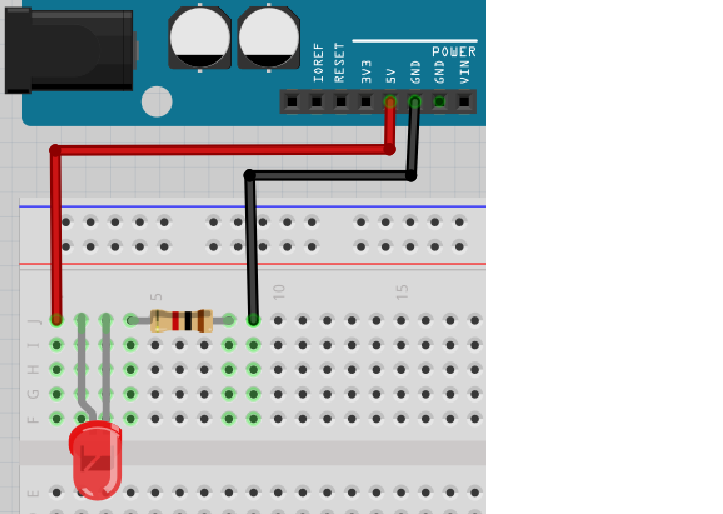
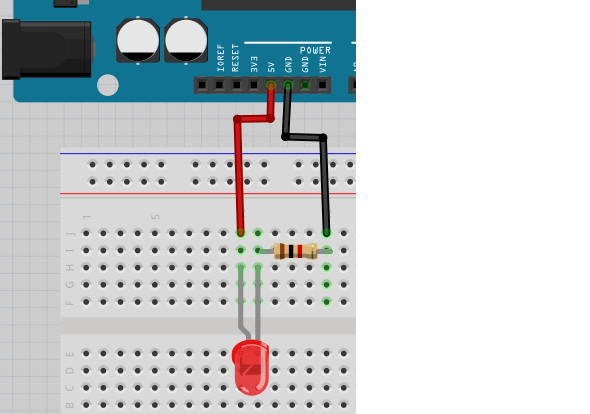
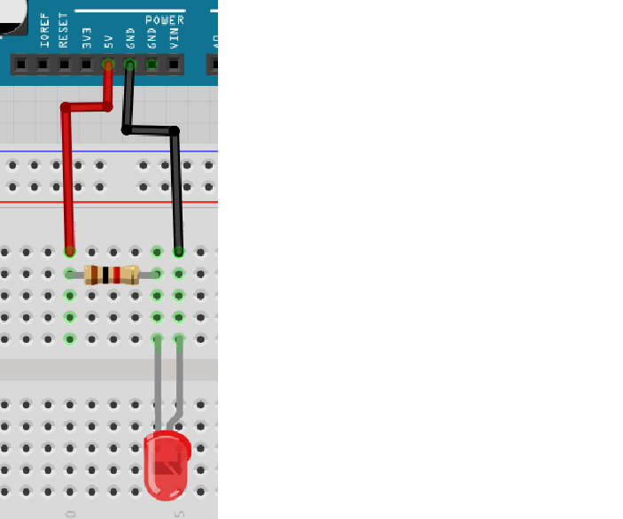
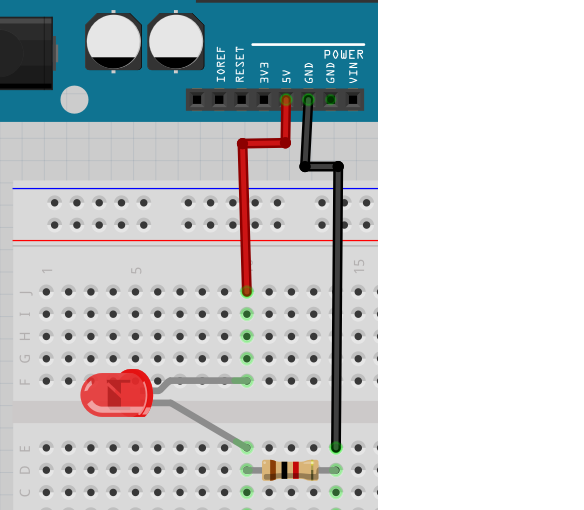

# Lektion 3: Ansluta en lysdiod

Under den här lektionen ska vi ansluta en lysdiod till en Arduino!

## 3.1. Kopplingsdäcket

Vi använder ett kopplingsdäck för att ansluta grejer till Arduino.

Här ser vi ett:

Och här är baksidan av samma kopplingsdäck:

Kom ihåg hur baksidan av kopplingsdäcket såg ut och titta på det här:

Vilka av hålen är sammanlänkade?

### Svaret

 * 1 är sammanlänkat med 2
 * 3 är sammanlänkat med 4
 * 5 är ensamt

## 3.2. Anslut motstånden och lysdioden

Kolla på den här bilden:

Det finns sex färgade hål. Vilka av dem är sammanlänkade?

### Svaret

 * rött är sammanlänkat med orange
 * gult är sammanlänkat med grönt
 * blått är sammanlänkat med lila

## 3.3. Anslut motstånden och lysdioden

Nu är det dags att bygga kretsen på riktigt:

 * Koppla ur USB-kabeln från datorn, så att Arduino inte längre har ström
 * Montera kretsen enligt bild:
   * Koppla en röd sladd från 5V-hålet till hålet högst upp till vänster 
     i kopplingsdäcket
   * Koppla in det långa benet på lysdioden **två** hål nedanför röda sladden i kopplingsdäcket.
     Det ska finnas en tomt hål mellan det långa benet på lysdioden och 
     den röda sladden i kopplingsdäcket.
   * Sätt det korta benet på lysdioden i hålet till höger om det långa benet
   * Koppla in sidan med brun rand på ett motstånd ett hål ovanför det korta benet på lysdioden
   * Koppla in sidan med guldig rand på ett motstånd fyra hål till höger om
     motståndet med brun rand.
     Det ska finnas tre tomma hål mellan båda sidorna av motstånden i kopplingsdäcket.
   * Koppla in en svart sladd ett hål ovanför sidan med guldig rand på motståndet
     till GND-hålet i Arduino
 * Sätt tillbaka USB-kabeln i datorn

 | Det böjda benet i ritningen symboliserar det längre benet på en lysdiod
:-------------:|:----------------------------------------: 

Lyser lysdioden?

### Svaret

Elen kan gå från `5V` till `GND` igenom lysdioden och motståndet!
Så ja, det funkar!

Om inte, fråga om hjälp!

\pagebreak

## 3.4. Krets 2

Kolla på den här kretsen:

Nu är lysdioden vriden tvärtom!

Tror du att lysdioden kommer att lysa? Varför?
Bygg ihop kretsen och kontrollera!

### Svaret

Lysdioden ska inte lysa, för att riktningen på lysdioden är fel.
Därför kan elen inte gå från `5V` till `GND` igenom lysdioden och motståndet.

Det långa benet på en lysdiod ska vara kopplat till 5V.

## 3.5. Krets 3

Kolla på den här kretsen:

Lysdioden är kopplad rätt igen, men motståndet är vridet tvärtom!

Tror du att lysdioden kommer att lysa? Varför?
Bygg ihop kretsen och kontrollera!

### Svaret

Elen kan gå från `5V` till `GND` igenom lysdioden och motståndet!
Så ja, lysdioden ska lysa, för att riktningen av motståndet inte spelar någon roll.

## 3.6. Krets 4

Kolla på den här kretsen:

Nu är både lysdioden och motståndet vridna tvärtom!

Tror du att lysdioden kommer att lysa? Varför?
Bygg ihop kretsen och kontrollera!

### Svaret

Lysdioden ska inte brinna, för att riktningen av lysdioden är fel.
Därför kan elen inte gå från `5V` till `GND` igenom lysdioden och motståndet.

Det långa benet av en lysdiod skull vara kopplat till 5V.
Riktningen av motståndt är inte viktigt.

## 3.7. Krets 5

Kolla på den här kretsen:

Nu är alla komponenter på en sträck!

Tycker du om att lysdioden ska brinna? Varför?
Bygga upp kretsen och kontrolerar!

### Svaret

Lysdioden ska inte brinna, för el kann inte gå igenom lysdioden:
röda sladden är inte förbunden med lysdioden alls!

## 3.8. Krets 6

Kolla på den här kretsen:

Nu är alla komponenter som första krets, men alla är flyttad till höger.

Tycker du om att lysdioden ska brinna? Varför?
Bygga upp kretsen och kontrolerar!

### Svaret

Elen kan gå från `5V` till `GND` igenom lysdioden och motståndet!
Så ja, det skulle funkar! Det är inte viktigt hur mycket till höger/vänster
på kopplingsdäcket man jobbar.

## 3.9. Krets 7

Kolla på den här kretsen:

Nu finns det mer tomma hål mellan ben av lysdioden!

Tycker du om att lysdioden ska brinna? Varför?
Bygga upp kretsen och kontrolerar!

### Svaret

Elen kan gå från `5V` till `GND` igenom lysdioden och motståndet!
Så ja, dett skulle funkar! Det är inte viktigt hur många hål (eller ej) 
det finns mellan ben av lysdioden.

## 3.10. Krets 8

Kolla på den här kretsen:

Nu går lysdioden över mitt i kopplingsdäcket!

Tycker du om att lysdioden ska brinna? Varför?
Bygga upp kretsen och kontrolerar!

### Svaret

Elen kan gå från `5V` till `GND` igenom lysdioden och motståndet!
Så ja, det skulle funkar! Komponent får hoppa över översta och nedaste del
av en koppplingsdäck.

## 3.11. Krets 9

Kolla på den här kretsen:

Nu går lysdioden över mitt i kopplingsdäcket,
men korta benet.

Tycker du om att lysdioden ska brinna? Varför?
Bygga upp kretsen och kontrolerar!

### Svaret

Nej, det funkar inte. Elet går ej genom motståndet, men istället
går direct igenom motståndet. Stackars lysdioden!

## 3.12. Krets 10

Kolla på den här kretsen:

Tycker du om att lysdioden ska brinna? Varför?
Bygga upp kretsen och kontrolerar!

### Svaret

Lysdioden ska inte brinna, för att riktningen av lysdioden är fel.
Därför kan elen inte gå från `5V` till `GND` igenom lysdioden och motståndet.

Det långa benet av en lysdiod skull vara kopplat till 5V.

## 3.13. Krets 11

Kolla på den här kretsen:

Nu är motståndet kopplat före lysdioden! 

Tycker du om att lysdioden ska brinna? Varför?
Bygga upp kretsen och kontrolerar!

### Svaret

Lysdioden ska inte brinna, för att riktningen av lysdioden är fel.
Därför kan elen inte gå från `5V` till `GND` igenom lysdioden och motståndet.

Det långa benet av en lysdiod skull vara kopplat till 5V.

## 3.14. Krets 12

Kolla på den här kretsen:

Nu är motståndet kopplat före lysdioden! 

Tycker du om att lysdioden ska brinna? Varför?
Bygga upp kretsen och kontrolerar!

### Svaret

Lysdioden ska inte brinna, för att riktningen av lysdioden är fel.
Därför kan elen inte gå från `5V` till `GND` igenom lysdioden och motståndet.

Det långa benet av en lysdiod skull vara kopplat till 5V.

## 3.15. Krets 13

Kolla på den här kretsen:

Nu är motståndet kopplat före lysdioden! 

Tycker du om att lysdioden ska brinna? Varför?
Bygga upp kretsen och kontrolerar!

### Svaret

Elen kan gå från `5V` till `GND` igenom lysdioden och motståndet!
Så ja, den funkar!

## 3.16. Krets 14

Kolla på den här kretsen:

Nu är lysdioden och motståndet inte förbundna direct,
men är tillkoplat med en sladd!

Tycker du om att lysdioden ska brinna? Varför?
Bygga upp kretsen och kontrolerar!

### Svaret

Elen kan gå från `5V` till `GND` igenom lysdioden och motståndet!
Så ja, den funkar!

## 3.17. Krets 15

Kolla på den här kretsen:

Nu är lysdioden och motståndet inte förbundna direct,
men är tillkoplat med en sladd!

Tycker du om att lysdioden ska brinna? Varför?
Bygga upp kretsen och kontrolerar!

### Svaret

Lysdioden ska inte brinna, för att riktningen av lysdioden är fel.
Därför kan elen inte gå från `5V` till `GND` igenom lysdioden och motståndet.

Det långa benet av en lysdiod skull vara kopplat till 5V.

## 3.18. Slutuppgift

1. Fråga någon för att examinera. Den där person får inte hjälpa dig,
bara fråga frågor.

För fem gånger:

2. Examinerare väljer en ritning av den här lektionen och gömmer svaret.
   Han/hon frågar om du tänker om att kretsen ska funkar ja eller nej.
   Bygg upp kretsen för att kontrollera.

Om du har fyra av fem gånger rätt, har du klarat av slutuppgiften!

