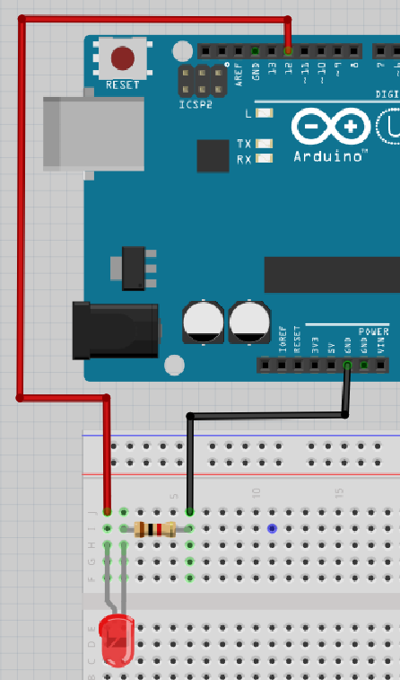

# Lektion 4: Programmering av en lysdiod

Under den här lektionen ska vi programmera en lysdiod med en Arduino!

## 4.1. Anslutning på 5V

Anslut en Arduino, lysdiod och motstånd så här:


Avänd 5V hålet av Arduino. Funkar detta?

### Svar

Absolut skulle det funka! 
Glöm inte att det längre benet av lysdioden ska vara
kopplat till `5V` hålet på Arduino.

Om det inte funkar än, fråga om hjälp!

## 4.2. Anslutning till hål 13

Arduinohålet kallat `5V` är alltid igång: den ger alltid en fem volt spänning.
Vad som är coolt med Arduino är att det är möjligt att programmera dem.
Här ska vi använda hål `13` som vi kan programmera att ge spännning eller ej.

Anslut en Arduino, lysdiod och motstånd så här:


Nu är lysdioden kopplad till hålet `13` på Arduino.

Funkar detta?

### Svar

Det vet vi inte än! Det beror på om det finns ett program i Arduinon som använder hålet `13`. Bara fortsätt!

\pagebreak

## 4.4. Vårt första program

Starta Arduino IDEn och använd dig av denna kod:

```c++
void setup() 
{
  pinMode(13, OUTPUT);
}

void loop() 
{
  digitalWrite(13, HIGH);
  delay(1000);
  digitalWrite(13, LOW);
  delay(1000);
}
```

 | 
:-------------:|:----------------------------------------: 
`void setup() { }`|'Kära dator, gör allt skrivet inom måsvingarna i början av programmet'

 | 
:-------------:|:----------------------------------------: 
`void loop() { }`|'Kära dator, gör allt skrivet inom måsvingarna hela tiden.'

 | 
:-------------:|:----------------------------------------: 
`pinMode(13, OUTPUT);`|'Se till att spänning kan komma ut ur stift 13'

 | 
:-------------:|:----------------------------------------: 
`digitalWrite(13, HIGH);`|'Sätt spänning på stift 13'

 | 
:-------------:|:----------------------------------------: 
`delay(1000);`|'Vänta i 1000 millisekunder'

Skriv in koden i Arduino IDE och klicka på 'Upload' ('Ladda up').

Funkar det? Vad gör lysdioden? Vad gör den inbyggda lysdioden?

### Lösning

Det ska absolut funka! Både lysdioden och den inbyggda lysdioden ska lysa
samtidigt. Båda ska slås av och på varje sekund.

\pagebreak

## 4.5. Uppgift 2

Få LEDen att blinka snabbt 10 gånger.

Tips: LED är nu 1000 millisekunder (1 sekund) på och 1000 millisekunder (1 sekund) av.

\pagebreak

## 4.6. Lösning 2

```c++
void setup()
{
  pinMode(13, OUTPUT);
}

void loop() 
{
  digitalWrite(13, HIGH);
  delay(100);
  digitalWrite(13, LOW);
  delay(100);
}
```

## 4.7. Uppgift 3

Få LEDen att blinka så snabbt du kan. Vad ser du?

 | Det blir antagligen nåt du inte förväntade dig!
:-------------:|:----------------------------------------: 

\pagebreak

## 4.8. Lösning 3

Det finns fler lösningar, det här är en:

```c++
void setup()
{
  pinMode(13, OUTPUT);
}

void loop() 
{
  digitalWrite(13, HIGH);
  delay(1);
  digitalWrite(13, LOW);
  delay(1);
}
```

Du kommer inte längre att se lampan blinka.

 | Du kommer inte längre att se lampan blinka!
:-------------:|:----------------------------------------: 

\pagebreak

 | Ljuset blinkar, men det blinkar för fort för att våra ögon ska kunna uppfatta det.
:-------------:|:----------------------------------------: 

 | 
:-------------:|:----------------------------------------: 
`digitalWrite(13, LOW);`|'Ingen spänning på stift 13'

 | Också bra: `delay(0);` eller ta bort raderna med `delay` helt.
:-------------:|:----------------------------------------: 

\pagebreak

## 4.10. Uppgift 4

Anslut nu lysdioden till Arduino stift `12`.



 | Det är en bra ide att använda stift 12 eller stift 13
:-------------:|:----------------------------------------: 

 | Använd inte stift 0 och 1 då de är speciella
:-------------:|:----------------------------------------: 

Vad gör lysdioden? Vad gör den inbyggda lysdioden?

### Svar

Lysdioden gör (antagligen!) ingenting,
för det finns inte spänning på stift 12!
Den inbyggda lysdioden blinkar som vanligt.

\pagebreak

## 4.12. Uppgift 5

Ändra programmet så att lysdioden på stift 12 används.
Tip: ändra `13` till `12` för tre gånger.

### Svar

```c++
void setup() 
{
  pinMode(12, OUTPUT);
}

void loop() 
{
  digitalWrite(12, HIGH);
  delay(1000);
  digitalWrite(12, LOW);
  delay(1000);
}
```

## 4.12. Uppgift 5

Se nu till att lysdioden på stift 12 börjar blinka dubbelt så fort.

\pagebreak

## 4.13. Lösning 5

```c++
void setup() 
{
  pinMode(12, OUTPUT);
}

void loop() 
{
  digitalWrite(12, HIGH);
  delay(100);
  digitalWrite(12, LOW);
  delay(100);
}
```

## 4.14. Slutuppgift

Material som krävs:

 * 1 dator
 * 1 Arduino
 * 1 USB sladd
 * 1 kopplingsdäck
 * 1 1.000 Ohm motstånd
 * 1 lysdiod
 * 3 sladdar

På dator: har koden redo!

Läs hela slutuppgiften noga först, efter det har du 5 minuter.

1. Be någon om hjälp för att examinera. 

Starta en timer med 5 min och gör följande:

2. Få lysdioden att lysa på `5V` hålet

3. Examinerare väljer ett slumpmässigt hål med nummer mellan 2 och 11 
   (så 2 och 11 är också tilllåtna).
   Du ska få lysdioden att blinka vid det valda hålet.

