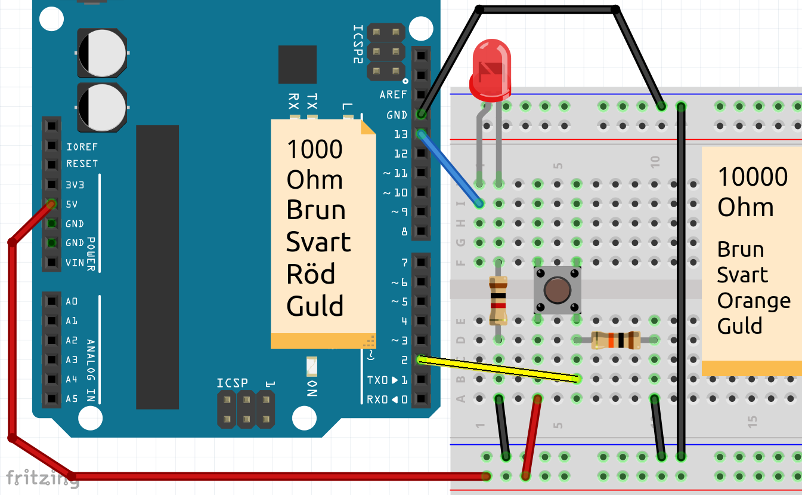
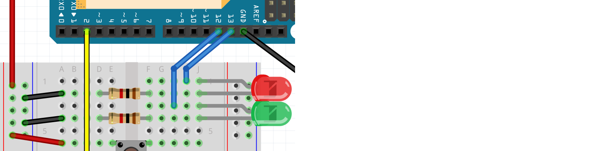

# Lektion 4: Knapp flip

I den här lektionen kommer vi att lära oss hur man använder en variabel.

 | Lektionen kallas 'knappflip' eftersom du programmerar med en flip-flop
:-------------:|:----------------------------------------:

## 4.1. Knapp flip: Intro

Vi börjar med denna krets:



 | Hej, jag känner igen den här kretsen!
:-------------:|:----------------------------------------:

\pagebreak

Och vi använder den här koden:

```c++
const int led_stift = 13;
const int knapp_stift = 2;

void setup() 
{
  pinMode(led_stift, OUTPUT);
  pinMode(knapp_stift, INPUT);
}

void loop()
{
  if (digitalRead(knapp_stift) == HIGH)
  {
    digitalWrite(led_stift, HIGH);
  }
  else
  {
    digitalWrite(led_stift, LOW);
  }
}
```

 | Hej, jag känner igen den här koden!
:-------------:|:----------------------------------------: 

## 4.2. Knapp flip: Button forever on: uppgift 1

Överst i koden, ovanför `setup`, lägg:

```c++
boolean ar_pa = false;
```

I början av `loop`, använd ett `if` för att se om knappen är det
nedtryckt. Om så är fallet, ställ in `ar_pa` till `true`:

```c++
if (/* knappen är druckit */)
{
  ar_pa = true;
}
``` 

Efter det första `if` i `loop`, använd ett `if` för att se om `ar_pa`
är lika med `true`. Om ja, slå på LEDen. Om inte, stäng av LEDen.

```c++
if (ar_pa == true)
{
  // slå på LEDen
}
else
{
  // stäng av LEDen
}
```

Vad ser du?

\pagebreak

## 4.3. Knapp flip: Button forever on: lösning 2


```c++
// ...
boolean ar_pa = false;

// ...

void loop()
{
  if (digitalRead(knapp_stift) == HIGH)
  {
    ar_pa = true;
  }

  if (ar_pa == true)
  {
    digitalWrite(led_stift, HIGH);
  }
  else
  {
    digitalWrite(led_stift, LOW);
  }
}
```

När du trycker på knappen lyser LEDen för evig.

## 4.4. Knapp flip: lyser LEDen för evig: uppgift 2

Vi ska nu säga:
  
 * När du trycker på knappen tänds LEDen och förblir tänd
 * När du sedan trycker på knappen igen kommer LEDen att släckas och förbli släckt
 * När du sedan trycker på knappen igen kommer LEDen att tändas och förbli tänd
 * Och så vidare

Justera `if` som kontrollerar om knappen trycks ned:

```c++
if (digitalRead(knapp_stift) == HIGH)
{
  if (ar_pa == true)
  {
    ar_pa = false;
  }
  else
  {
    ar_pa = true;
  }
}
```

Ladda upp koden. Vad ser du? Om du ser något konstigt så stämmer det!

 | Vad ser du?| | Om du ser något konstigt så stämmer det!
:-------------:|:----------------:|:-------------:|:----------------------------------------: 

\pagebreak

## 4.5. Knapp flip: lyser LEDen för evig: lösning 2

```c++
// ...

void loop()
{
  if (digitalRead(knapp_stift) == HIGH)
  {
    if (ar_pa == true)
    {
      ar_pa = false;
    }
    else
    {
      ar_pa = true;
    }
  }

  // ...

}
```

 | När du trycker på knappen dimmer LEDen. När du släpper knappen kommer LEDen antingen att vara tänd eller släckt för alltid
:-------------:|:----------------------------------------: 

 | Detta beror på att Arduino snabbt och ofta tänder och släcker ljuset
:-------------:|:----------------------------------------: 

## 4.6. Knapp flip: Knappen på för alltid med finkontroll: uppgift 2

Låt oss göra knappen mer lyhörd:
släpp Arduino när knappen trycks ned
200 millisekunders väntan.

\pagebreak

## 4.7. Knapp flip: Knappen på för alltid med finkontroll: lösning 2

I `if` när knappen trycks ned, lägg till
en `delay(200);`-regel. Detta kan göras före eller efter `if`-satserna
med `är_på`.

```c++
// ...

void loop()
{
  if (digitalRead(knapp_stift) == HIGH)
  {
    // ... [if (ar_pa == true) ...]

    delay(200);

    // ... [if (ar_pa == true) ...]
  }

  // ...

}
```

## 4.8. Knapp flip: styr två LEDer: uppgift

Vi kommer att ansluta en andra LED. Du kan byta genom att trycka på knappen
mellan LEDer.

 * Anslut en andra grön LED till stift 12
 * I koden, ändra längst upp:

```c++
// led_stift gaat weg
const int led_stift_rod = /* stift numret */;
const int led_stift_gron = /* stift numret */;
// ... [knapp_stift stanner samma]
// ar_pa är tappat bort
int vilken_led_pa = 1;
```

 * Se till att de två LEDerna och knappen hittas i koden, i `setup`.
 * I koden, i `loop`, reagera annorlunda på knappen:

```c++
if (/* knappen är druckit */)
{
  vilken_led_pa = vilken_led_pa + 1;
  if (vilken_led_pa == 3)
  {
    vilken_led_pa = 1;
  }

  // ... [vänta 200 millisecond]
}
```
 * I koden, i `loop`, reagerar nu på 'vilken_led_pa':

```c++
if (vilken_led_pa == 1)
{
  // Tänder på röd LEDen, släcker av gron LEDen
}
if (vilken_led_pa == 2)
{
  // Släcker av röd LEDen, tänder på gron LEDen, 
}
```

\pagebreak

## 4.9. Knapp flip: styr två LEDer: lösning




```c++
const int led_stift_rod = 13;
const int led_stift_gron = 12;
const int knapp_stift = 2;
int vilken_led_pa = 1;

void setup() 
{
  pinMode(led_stift_rod, OUTPUT);
  pinMode(led_stift_gron, OUTPUT);
  pinMode(knapp_stift, INPUT);
}

void loop()
{
  if (/* knappen är druckit */)
  {
    vilken_led_pa = vilken_led_pa + 1;
    if (vilken_led_pa == 3)
    {
      vilken_led_pa = 1;
    }

    // ... [vänta 200 millisecond]
  }
  
  if (vilken_led_pa == 1)
  {
    digitalWrite(led_stift_rod, HIGH);
    digitalWrite(led_stift_gron, LOW);
  }
  if (vilken_led_pa == 2)
  {
    digitalWrite(led_stift_rod, LOW);
    digitalWrite(led_stift_gron, HIGH);
  }
}
```

## 4.10. Knapp flip: avsluta uppgift

Vi kommer att ansluta en tredje LED. Du kan byta genom att trycka på knappen
från första, till andra, till tredje LED.

