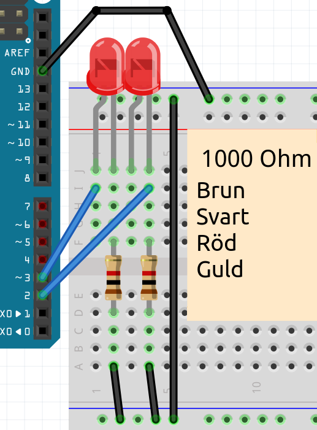

# Les 5: Blink 4

I dessa läs använder vi 4 lysdioder och funktioner

## 5.1 Blink 6: Uppdrag

 * Gör en koppling med 2 lysdioder, el med en motståndsbil 1000 Ohm i serie
 * Slut de 1e LED på stift 2
 * Slut de 2e LED på stift 3
 * Ladda upp denna kod:

```c++
const int pin_led_1 = 2;
const int pin_led_2 = 3;
const int wachttid = 1000;

void setup()
{
  pinMode(pin_led_1, OUTPUT);
  pinMode(pin_led_2, OUTPUT);
}

void loop()
{
  digitalWrite(pin_led_1, HIGH);
  digitalWrite(pin_led_2, LOW);
  delay(wachttid);
  digitalWrite(pin_led_1, LOW);
  digitalWrite(pin_led_2, HIGH);
  delay(wachttid);
}
```

## 5.2 Blink 6: Oplossing



## 5.3 Blink 6: `effe_wachten`, uppdrag

Vi skriver vår första funktion!

 * Lägg till en kod tå, ovan `loop`:

```c++
void effe_wachten()
{
  fördröjning (vakttid);
}
```

 * I `loop`, ersätt två gånger `delay(wachttid);` genom `effe_wachten();`

## 5.4 Blink 6: `effe_wachten`, lösning

```c++
// ...

void setup()
{
  // ...
}

void effe_wachten()
{
  delay(wachttid);
}

void loop()
{
  // ... [sätt bara LED 1 till]
  effe_wachten();
  // ... [zet bara LED 2 till]
  effe_wachten();
}
```

## 5.5 Blink 6: `zet_alleen_led_1_aan`, uppdrag

 * Skriv en funktion, `zet_alleen_led_1_aan`,
   för att säkerställa att enbart LED 1 märket (ofta:
   LED 2 måste ut)
 * Använd `zet_alleen_led_1_aan` i `loop`

## 5.6 Blink 6: `zet_alleen_led_1_aan`, lösning

```c++
void zet_alleen_led_1_aan()
{
  digitalWrite(pin_led_1, HIGH);
  digitalWrite(pin_led_2, LOW);
}

void loop()
{
  zet_alleen_led_1_aan();
  // ...
}
```

## 5.7 Blink 6: `zet_alleen_led_2_aan`, uppdrag

 * Skriv en funktion, `zet_alleen_led_2_aan`,
   för att säkerställa att enbart LED 2 märket (ofta:
   LED 1 måste ut)
 * Använd `zet_alleen_led_2_aan` i `loop`

## 5.8 Blink 6: `zet_alleen_led_2_aan`, lösning

```c++
void zet_alleen_led_2_aan()
{
  digitalWrite(pin_led_1, LOW);
  digitalWrite(pin_led_2, HIGH);
}

void loop()
{
  // ...
  zet_alleen_led_2_aan();
}
```

## 5.7 Blink 6: `zet_alleen_led_3_aan`, uppdrag

 * Stäng en tredje LED-lampa på stift 4
 * Gör en ny variabel `pin_led_3` för denna LED
 * Skriv en funktion, `zet_alleen_led_3_aan`,
   för att säkerställa att enbart LED 3 märket (ofta:
   Lysdioder 1 och 2 måste ut)
 * Använd `zet_alleen_led_3_aan` i `loop`
 * I `loop`, låt först enbart LED 1 branden, wacht effe,
   låt först bara LED 2 branden, vänta effektivt,
   låt först bara LED 3 branden, vänta effektivt


## 5.8 Blink 6: `zet_alleen_led_3_aan`, lösning

```c++
// ...
const int pin_led_3 = 4;

void setup()
{
  // ...
  pinMode(pin_led_3, OUTPUT);
}

void zet_alleen_led_1_aan()
{
  // ...
  digitalWrite(pin_led_3, LOW);
}

void zet_alleen_led_2_aan()
{
  // ...
  digitalWrite(pin_led_3, LOW);
}

void zet_alleen_led_3_aan()
{
  digitalWrite(pin_led_1, LOW);
  digitalWrite(pin_led_2, LOW);
  digitalWrite(pin_led_3, HIGH);
}

void loop()
{
  // ...
  zet_alleen_led_3_aan();
  effe_wachten();
}
```

## 5.9 Blink 6: eindopdracht

 * Slut en fyra LEDje till, på stift 5
 * Gör en ny variabel `pin_led_4` för denna LED
 * Skriv en funktion, `zet_alleen_led_4_aan`,
   för att säkerställa att enbart LED 4 märket (ofta:
   Lysdioder 1 och 2 och 3 måste ut)
 * Använd `zet_alleen_led_4_aan` i `loop`
 * I `loop`, gör ett Nightrider-mönster: laat omstebeurt branden
   Lysdioder 1, 2, 3, 4, 3, 2, 1. Steeds ertussen väntar även
