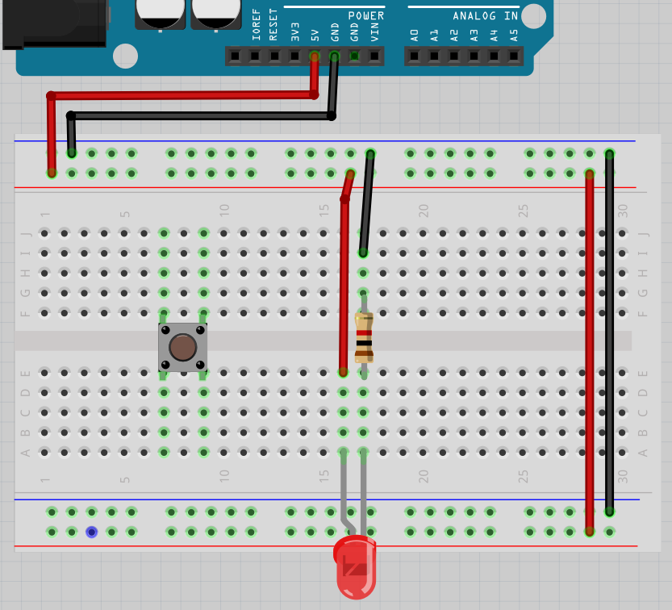
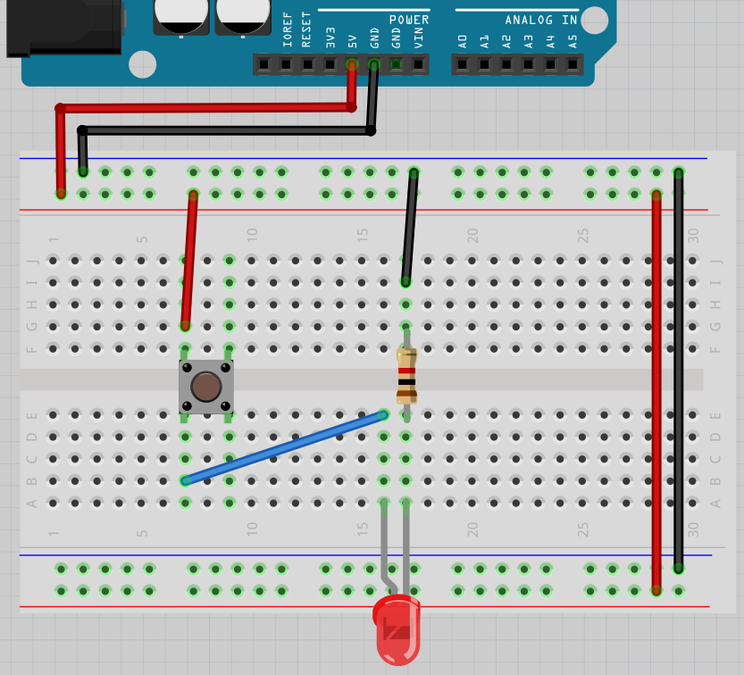
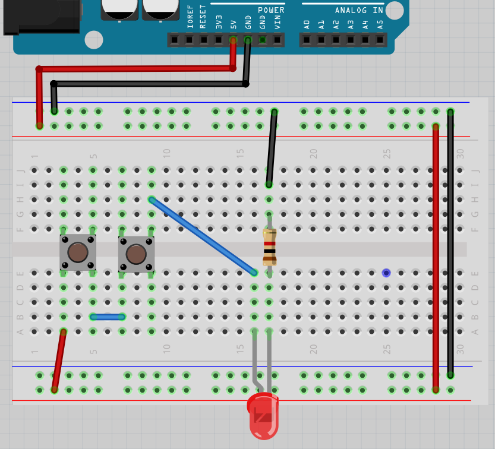
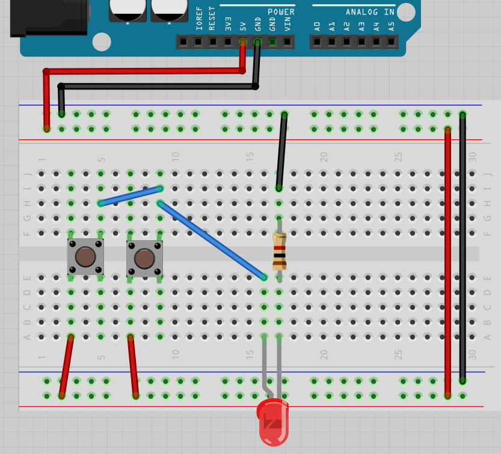

# Lektion 7: Anslutning av en knapp

Under den här lektionen ska vi ansluta en knapp till en Arduino!

## 7.1. Anslut lysdioden och knapp

Bygg den här kretsen:

 * Koppla ur USB-kabeln från datorn, så att Arduino inte längre har ström
 * Montera kretsen enligt bild
 * Sätt tillbaka USB-kabeln i datorn

 | Det böjda benet i ritningen symboliserar det längre benet på en lysdiod
:-------------:|:----------------------------------------: 

Lyser lysdioden? Går knappen nåt? Varför tror du det?

Bygg ihop kretsen och kontrollera!

### Svar

Elen kan gå från `5V` till 5 voltskraftrems, igenom lysdioden och motståndet,
till jordenskraftrems och till `GND`.

Så ja, lysdioden lyser! Om inte, fråga om hjälp!

Knappen, dock, gör ingenting: om du trycker den eller inte gör det ingen skillnad.

\pagebreak

## 7.2. Krets 2

Kolla på den här kretsen:

Nu är knappen användt! 

Lyser lysdioden? Går knappen nåt? Varför tror du det?

Bygg ihop kretsen och kontrollera!

### Svar

Lysdioder kommer alltid att lysa: den vänstra ben av knappen är sammanlänkat!

Så ja, det funkar! Om inte, fråga om hjälp!

## 7.3. Krets 3

Kolla på den här kretsen:

Nu är sladden mellan lysdioden och knappen sammanlänkat på höger-nedåt ställe av knappen. 

Lyser lysdioden? Går knappen nåt? Varför tror du det?

Bygg ihop kretsen och kontrollera!

### Svar

Nu funkar knappen bra: lysdioder kommer att lysa om du trycker knappen.

Så ja, det funkar! Om inte, fråga om hjälp!

## 7.4. Krets 4

Kolla på den här kretsen:

Nu är sladden mellan lysdioden och knappen sammanlänkat på höger-uppåt ställe av knappen. 

Lyser lysdioden? Går knappen nåt? Varför tror du det?

Bygg ihop kretsen och kontrollera!

### Svar

Knappen funkar fortfarande bra: lysdioder kommer att lysa om du trycker knappen.

Så ja, det funkar! Om inte, fråga om hjälp!

## 7.5. Krets 5

Kolla på den här kretsen:

Nu är sladden mellan 5V kraftremsen och knappen sammanlänkat på vänster-nedåt ställe av knappen. 

Lyser lysdioden? Går knappen nåt? Varför tror du det?

Bygg ihop kretsen och kontrollera!

### Svar

Knappen funkar fortfarande bra: lysdioder kommer att lysa om du trycker knappen.

Så ja, det funkar! Om inte, fråga om hjälp!

## 7.6. Krets 6

Kolla på den här kretsen:

Nu finns det två knappor!
 
Lyser lysdioden? Går knapporna nåt? Varför tror du det?

Bygg ihop kretsen och kontrollera!

### Svar

Knappen funkar så dem skulle: om du trycker på båda
kommer lysdioden att lysa.

Så ja, det funkar! Om inte, fråga om hjälp!

## 7.7. Krets 7

Kolla på den här kretsen:

Nu finns det två knappor med en annat sammanlänkning.
 
Lyser lysdioden? Går knapporna nåt? Varför tror du det?

Bygg ihop kretsen och kontrollera!

### Svar

Knapporna funkar så dem skulle: om du trycker **en av båda**
kommer lysdioden att lysa.

Så ja, det funkar! Om inte, fråga om hjälp!

## 7.8. Krets 8

Kolla på den här kretsen:

Nu finns det två lysdioder till!.

Kann du förutspå när vilken lysdioder lyser? 
Varför tror du det?

Bygg ihop kretsen och kontrollera!

### Svar

Om du trycker en knapp, kommer alltid två lysdioden att lysa.

## 7.9. Slutuppgift

Försammla:

 * 1 dator
 * 1 Arduino
 * 1 USB sladd
 * 1 kopplingsdäck
 * 2 knapp
 * 3 1.000 Ohm motstånd
 * 3 lysdiod
 * tillräckligt mycket sladdar

1. Fråga någon för att examinera. Den där person får inte hjälpa dig.

Start en timer på 10 minuten och gör följande:

2. Bygga up sista krets från början. Om du trycker en knapp, kommer alltid två lysdioden att lysa.
