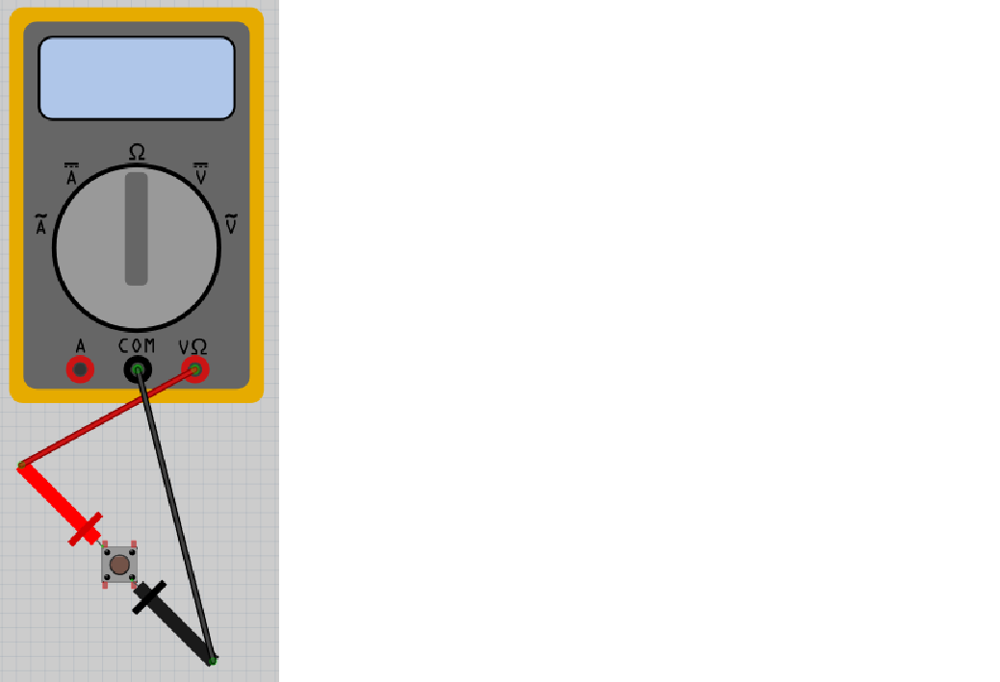

# Lektion 7: Mätning av en knapp

Under den här lektionen ska vi mäta en knapp!

## 7.1. Att mäta en knapp 1

Vrid knappen på multimetern till Ohm symbolen.
Sätt på multimetern och koppla:

 * röda mätpinnen på den toppen-vänstra benen av knappen
 * svarta mätpinnen på den toppen-högra benen av knappen

Vad visar mätningen? Och om du trycker på knappen?

### Svar

När du inte trycker på knappen skulle skärmen visar 'Inf' eller 'OL'. 'Inf' är an förkortning av 'Infinity', som är engelska för oändligt.

När du trycker på knappen skulle skärmen visar ett motstånd på 0 Ohm.
Ett motstånd på 0 Ohm betyder att det inte finns någonting emellan mätpunkterna.

Det betyder att en knapp är inget problem för el att gå igenom om knappen
är tryckt. Men om knappen är inte tryckt, kan ingen el gå igenom den.
Smart!

## 7.2. Att mäta en knapp 2

Vrid knappen på multimetern till Ohm symbolen.
Sätt på multimetern och koppla:

 * röda mätpinnen på den toppen-vänstra benen av knappen
 * svarta mätpinnen på den nere-högra benen av knappen

Vad visar mätningen? Och om du trycker på knappen?

### Svar

När du inte trycker på knappen skulle skärmen visar 'Inf' eller 'OL'.

När du trycker på knappen skulle skärmen visar ett motstånd på 0 Ohm.

Det är samma beteede än före gång.

## 7.3. Att mäta en knapp 3

Vrid knappen på multimetern till Ohm symbolen.
Sätt på multimetern och koppla:

 * röda mätpinnen på den toppen-vänstra benen av knappen
 * svarta mätpinnen på den nere-vänstra benen av knappen

Vad visar mätningen? Och om du trycker på knappen?

### Svar

Skärmen visar alltid ett motstånd på 0 Ohm.
Det betyder att vänstra ben är alltid sammanlänkat.
Man skulle inte koppla en knapp på den här vis.

## 7.4. Att mäta en knapp 4

Vrid knappen på multimetern till Ohm symbolen.
Sätt på multimetern och koppla:

 * röda mätpinnen på den nere-vänstra benen av knappen
 * svarta mätpinnen på den toppen-högra benen av knappen

Vad visar mätningen? Och om du trycker på knappen?

### Svar

När du inte trycker på knappen skulle skärmen visar 'Inf' eller 'OL'. 'Inf' är an förkortning av 'Infinity', som är engelska för oändligt.

När du trycker på knappen skulle skärmen visar ett motstånd på 0 Ohm.
Ett motstånd på 0 Ohm betyder att det inte finns någonting emellan mätpunkterna.

Det betyder att en knapp är inget problem för el att gå igenom om knappen
är tryckt. Men om knappen är inte tryckt, kan ingen el gå igenom den.
Smart!

## 7.5. Att mäta en knapp 5

Vrid knappen på multimetern till Ohm symbolen.
Sätt på multimetern och koppla:

 * röda mätpinnen på den nere-vänstra benen av knappen
 * svarta mätpinnen på den nere-högra benen av knappen

Vad visar mätningen? Och om du trycker på knappen?

### Svar

När du inte trycker på knappen skulle skärmen visar 'Inf' eller 'OL'.

När du trycker på knappen skulle skärmen visar ett motstånd på 0 Ohm.

Det är samma beteede än före gång.

## 7.6. Att mäta en knapp 6

Vrid knappen på multimetern till Ohm symbolen.
Sätt på multimetern och koppla:

 * röda mätpinnen på den nere-vänstra benen av knappen
 * svarta mätpinnen på den toppen-vänstra benen av knappen

Vad visar mätningen? Och om du trycker på knappen?

### Svar

Skärmen visar alltid ett motstånd på 0 Ohm.
Det betyder att vänstra ben är alltid sammanlänkat.
Man skulle inte koppla en knapp på den här vis.

## 7.7. Slutuppgift

Hämta:

 * 1 st multimeter
 * 1 st knapp

Läs igenom slutuppgiften först, för du har 5 minuter på dig.

1. Fråga någon för att få göra provet. Den personen får inte hjälpa dig.

Starta en timer och gör följande:

2. Visar när knappen funkar bra

2. Visar när knappen är användt på fel sätt
