# Lektion 10: Mätning av en joystick

Under den här lektionen ska vi mäta en joystick med en oscilloskop!

## 10.1. Att koppla en joystick till en skop

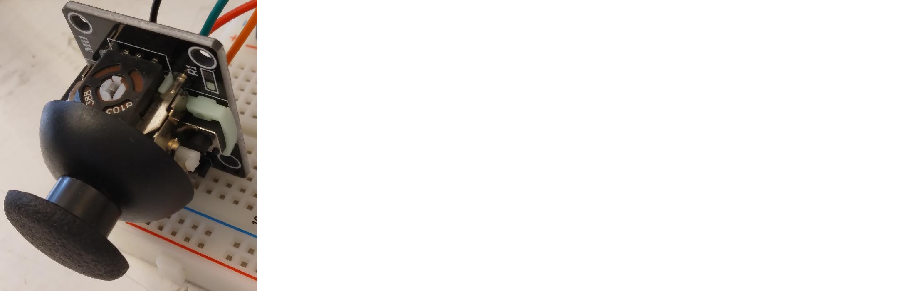

> en joystick

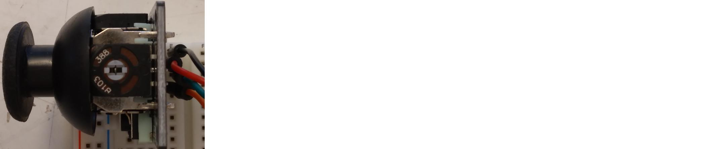

> en joystick i en kopplingsdäck

> en oscilloskop

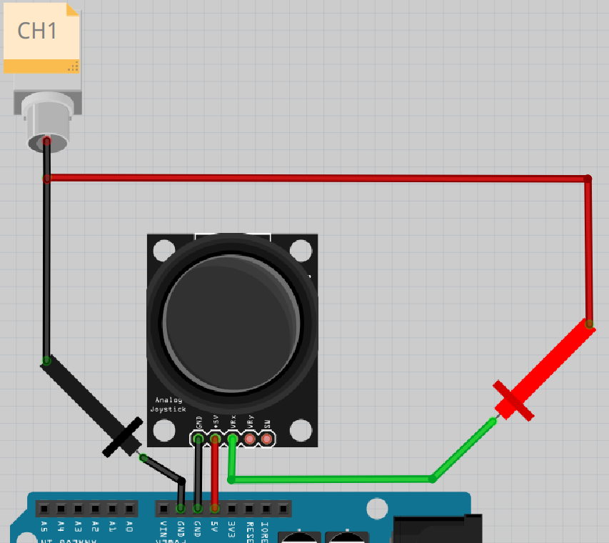

> Schemat av kopplingen

Kopplar tillsammans:

- Arduino USB till en dator
- Arduino 5V till joystick 5V
- Arduino GND till joystick GND
- Arduino GND till svart prob
- Joystick VRx till röd prob

Startar skopen. Trycker på knapp 'CH1' av 'Vertical' till den lyser:

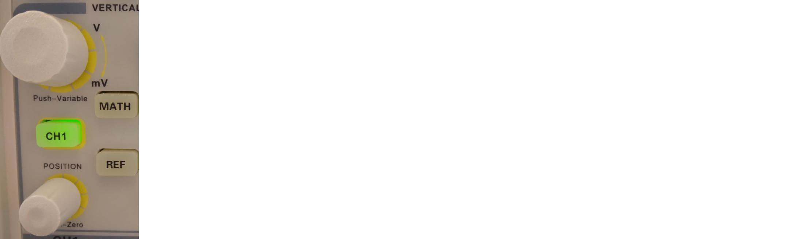

Vad visar skopen? Vad händer om du vrider joysticken?

### Svar

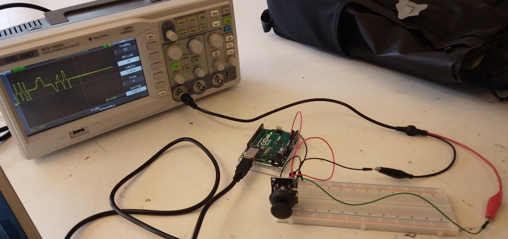

> hur det ska ser ut

Vad skopen visar är svårt att förutspå.
Antagligen ska du ser ett gult horisontellt linje,
kanske som här:

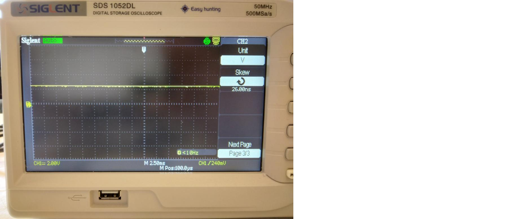

Om du vrider joysticken in rätt riktning, om du har tur, 
flyttas linje uppåt och nedåt.

## 10.2. Att välja tidskalan av skopen

Vad du än ser beror på tidskalan av skopen.

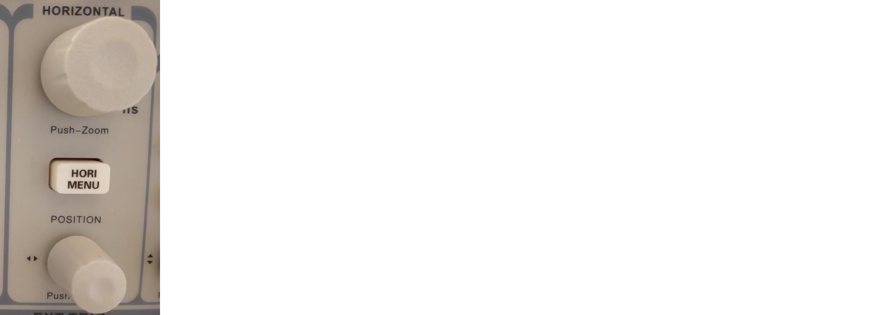

Om du vridar den högre knapp av 'Horizontal' ändrar du tidskalan.
Du kann också ser det på skärmen av skopen:
om du vridar knappen änder sig vita text på nedåt av skärmen.

Vridar den högre knapp av 'Horizontal' tills att den visar 'M 1.00s'.
Hur ser gula linje ut?

### Svar

Så här kann det ser ut:

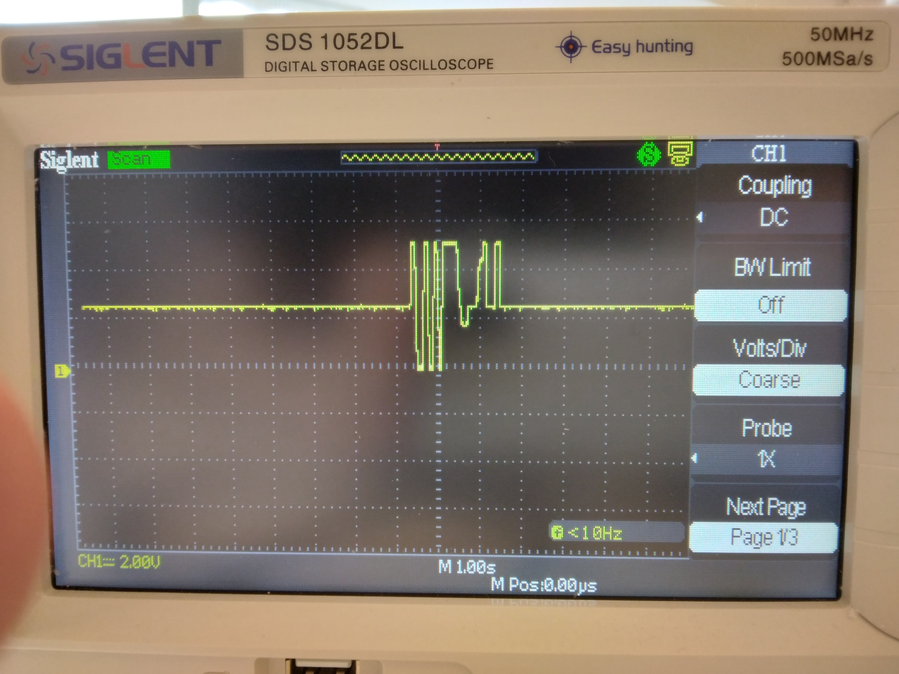

Akta den text 'M 1.00s', som betyder att varje ruta horisontellt
är ett sekund. Du kann ser att den gula linje långsamt rör sig.

## 10.3. Att välja spänningskalan av skopen

Vad du än ser nu beror på spänningskalan av skopen också.

Om du vridar den högre knapp av 'Vertical' på vänstra sida
ändrar du spänningsskalan.
Du kann också ser det på skärmen av skopen:
om du vridar knappen änder sig gula text på nedåt av skärmen.

Vridar den vänstra-högre knapp av 'Vertical' tills att den visar 'CH1 2.00V'.
Hur ser gula linje ut? Vridar också joysticken för att ser nåt cool!

### Svar

Så här kann det ser ut:

Akta den text 'CH1 2.00V', som betyder att varje ruta horisontellt
är två volt spänning.

När du vrider joysticken i rätt riktning gå gula linje uppåt och nedåt.

## 10.4. Att koppla joysticken igen till skopen

Nu ska vi kopplar en stift till av joysticken till skopen:

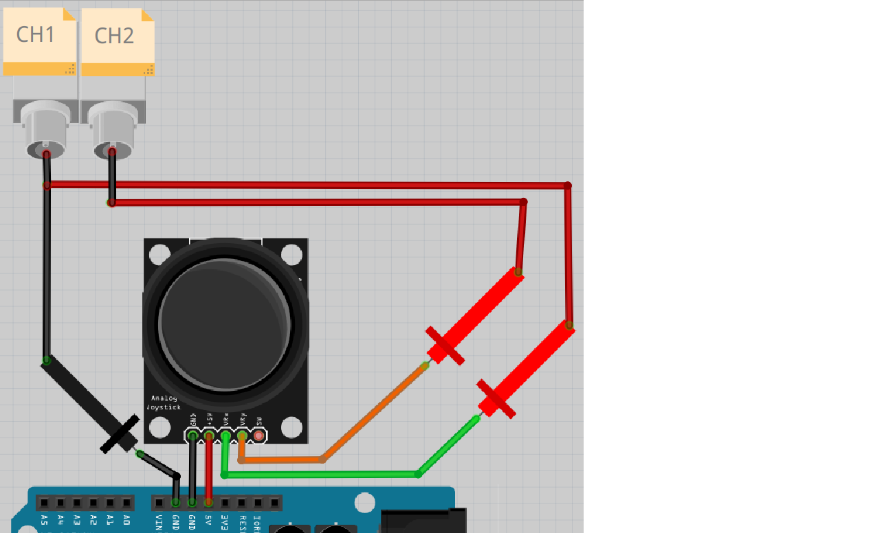

> Schemat av kopplingen

Letar eften en prob till.

Kopplar till:

- Joystick VRy till röda klamme av andra proben
- Ingenting till svarta klamme av andra proben

Startar skopen. 

Trycker på knapp 'CH2' av 'Vertical' till den lyser.
Vridar den högra-högre knapp av 'Vertical' tills att den visar 'CH2 2.00V'.

Vad visar skopen? Vad händer om du vrider joysticken?

### Svar

Så här kann det ser ut:

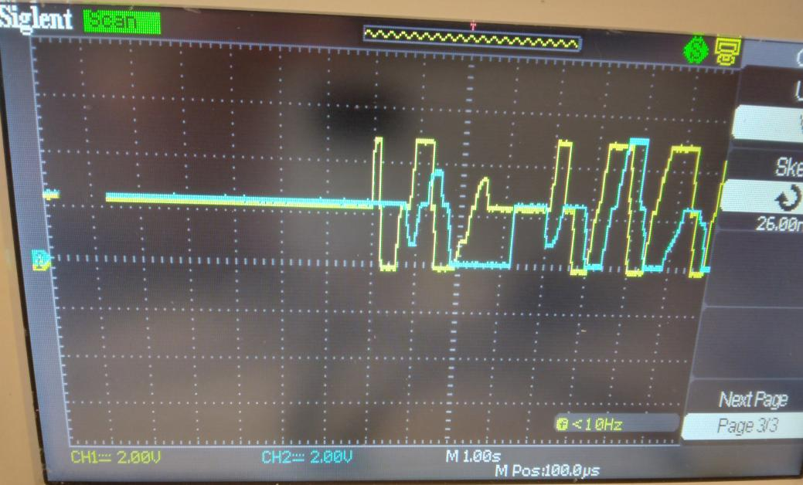

Akta den text 'CH1 2.00V', som betyder att varje ruta horisontellt
är två volt spänning.

När du vrider joysticken ser du gula och blåa linjer gå uppåt och nedåt.

## 10.5. Slutuppgift

Ta bort alla sladdar.

Läs igenom slutuppgiften först, för du har 10 minuter på dig.

1. Fråga någon för att få göra provet. Den personen får inte hjälpa dig.
1. Den person vridar eller trycker fler gånger på alla den här fem knappar:

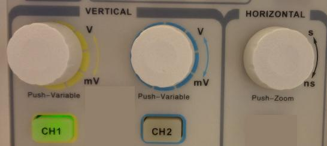

Starta en timer och gör följande:

1. Koppla allt tillsammans igen
1. Mät joysticksen VRx och VRy samtidigt igen
