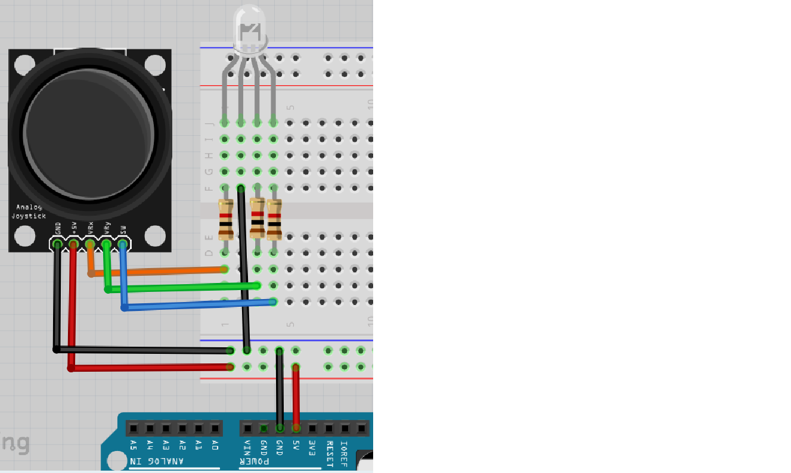
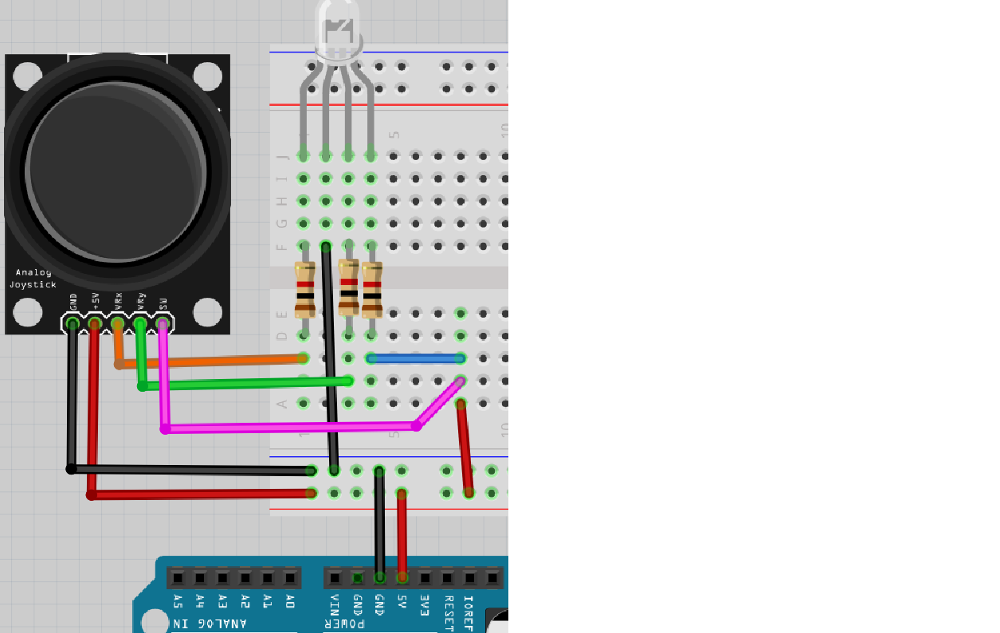
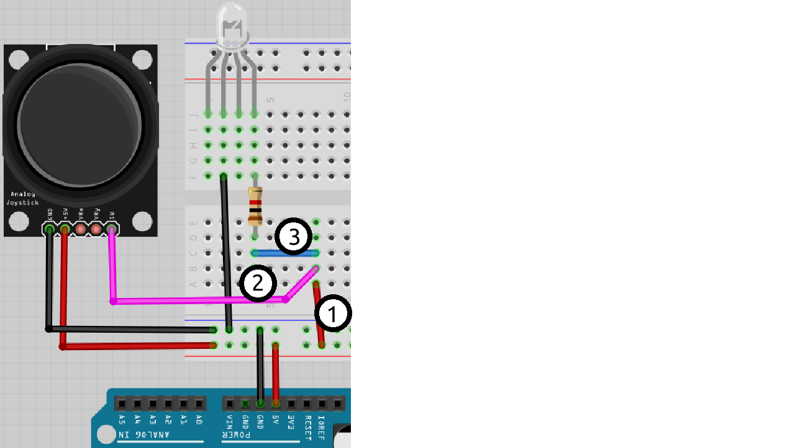

# Lektion 14: Anslutning av en joystick

Under den här lektionen ska vi ansluta en joystick!

## 14.1. Att koppla en joystick till en RGB ljusdiod

> Schemat av kopplingen

Koppla tillsammans som schemat och förbind Arduino till en dator.
Det er den långsta ben av RGB ljusdiod som skulle kopplades till GND.

- Vad tycker du ska hända?
- Om du använder joysticken, vad händer på verkligheten?
- Funkar vridningen av joysticken?
- Funkar knappen av joysticken?

### Svar

Vridningen av joysick gör van mesta tänkar sig:
du ska ser att ljusdioder ger röd, grönt eller en
blanding av båda.

Om du trycker på joysticken händer ingenting.
Det är för att knappen i joysticken funkar annorlunda
än mesta tänker sig.

## 14.2. Att koppla en joystick till en RGB ljusdiod igen

Vad du än ser beror på tidskalan av skopen.

Förändrar elkretsen till den här bilden.

Funkar knappen av joysticken nu?

### Svar

Japp, nu funkar knappen av joysticken.

## 14.3. Hur funkar knappen av joysticken?

Kolla på den här bild:

> Allt el kommer igenom sladd 1. 
> Där väljer den den väg med lågsta motstånd.
> Om knapper är tryckt, sladd 2 har lågsta motstånd.
> Om knapper är inte tryckt, sladd 3 har lågsta motstånd.

Här kann du ser motstånd mellan SW (av joysticken) 
och GND (av joysticken), beroende om joysticken är tryckt:

Tryckt?|Motstånd mellan GND och SW
-------|--------------------------
Nej    |Stor
Ja     |Låg

El föredra vägen med minsta motstånd.
Om knappen är tryckt, är vägen med minsta motstånd igenom ljusdioden.
Om knappen är ej tryckt, är vägen med minsta motstånd igenom joysticken.

Gör:

- Tar ur joystick (eller tar en andra)
- kontrollera den här berättelse med en multimeter

### Svar

Om du mäter motståndet mellan GND (av joysticken) och SW (av joysticken),
mäter du:

- om knapper är tryckt: en lite värd, typ 0,5 Ohm
- om knapper är ej tryckt: 'Inf' eller en hög värd

## 14.5. Slutuppgift

Ta bort alla sladdar.

Läs igenom slutuppgiften först, för du har 10 minuter på dig.

1. Fråga någon för att få göra provet. Den personen får inte hjälpa dig.

Starta en timer och gör följande:

1. Koppla allt tillsammans igen
1. Visar att joystick funkar: båda om du vrider och om du trycker på knappen
1. Berätta hur elen gå igenom kretsen om du trycker knappen eller ej

