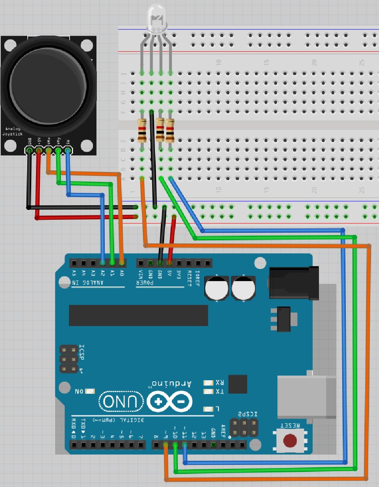

# Lektion 15: Användning av en joystick

Under den här lektionen ska vi använda en joystick!

## 15.1. Att förbereda



> Schemat av kopplingen

Koppla tillsammans som schemat och förbind Arduino till en dator.
Det er den långsta ben av RGB ljusdiod som skulle kopplades till GND.

\pagebreak

Ladda upp den här koden:

```
const int pin_joy_x{A0};
const int pin_joy_y{A1};
const int pin_joy_sw{A2};
const int pin_led_r{9};
const int pin_led_g{10};
const int pin_led_b{11};


void setup() {
  pinMode(pin_joy_x, INPUT);
  pinMode(pin_joy_y, INPUT);
  pinMode(pin_joy_sw, INPUT);
  pinMode(pin_led_r, OUTPUT);
  pinMode(pin_led_g, OUTPUT);
  pinMode(pin_led_b, OUTPUT);
}

void loop() {
  const int joy_x{analogRead(pin_joy_x)};
  const int joy_y{analogRead(pin_joy_y)};
  const int joy_sw{analogRead(pin_joy_sw)};
  const int ljus_styrka_r{joy_x / 4};
  const int ljus_styrka_g{joy_y / 4};
  const int ljus_styrka_b{joy_sw / 4};
  analogWrite(pin_led_r, ljus_styrka_r);
  analogWrite(pin_led_g, ljus_styrka_g);
  analogWrite(pin_led_b, ljus_styrka_b);
}
```

Kör koden och rör joysticken. Vad ser du?

### Svar

Om du inte rör joysticken är färgen ljusgrönblå

Om du rör joysticken ändrar färgerna sig till röd eller grön eller släckar.

Om du tryck joysticken är grönt bort.

HIERO

## 14.2. Att koppla en joystick till en RGB ljusdiod igen

Vad du än ser beror på tidskalan av skopen.


Förändrar elkretsen till den här bilden.

Funkar knappen av joysticken nu?

### Svar

Japp, nu funkar knappen av joysticken.

## 14.3. Hur funkar knappen av joysticken?

Kolla på den här bild:


> Allt el kommer igenom sladd 1. 
> Där väljer den den väg med lågsta motstånd.
> Om knapper är tryckt, sladd 2 har lågsta motstånd.
> Om knapper är inte tryckt, sladd 3 har lågsta motstånd.

Här kann du ser motstånd mellan SW (av joysticken) 
och GND (av joysticken), beroende om joysticken är tryckt:

Tryckt?|Motstånd mellan GND och SW
-------|--------------------------
Nej    |Stor
Ja     |Låg

El föredra vägen med minsta motstånd.
Om knappen är tryckt, är vägen med minsta motstånd igenom ljusdioden.
Om knappen är ej tryckt, är vägen med minsta motstånd igenom joysticken.

Gör:

- Tar ur joystick (eller tar en andra)
- kontrollera den här berättelse med en multimeter

### Svar

Om du mäter motståndet mellan GND (av joysticken) och SW (av joysticken),
mäter du:

- om knapper är tryckt: en lite värd, typ 0,5 Ohm
- om knapper är ej tryckt: 'Inf' eller en hög värd

## 14.5. Slutuppgift

Ta bort alla sladdar.

Läs igenom slutuppgiften först, för du har 10 minuter på dig.

1. Fråga någon för att få göra provet. Den personen får inte hjälpa dig.

Starta en timer och gör följande:

1. Koppla allt tillsammans igen
1. Visar att joystick funkar: båda om du vrider och om du trycker på knappen
1. Berätta hur elen gå igenom kretsen om du trycker knappen eller ej


