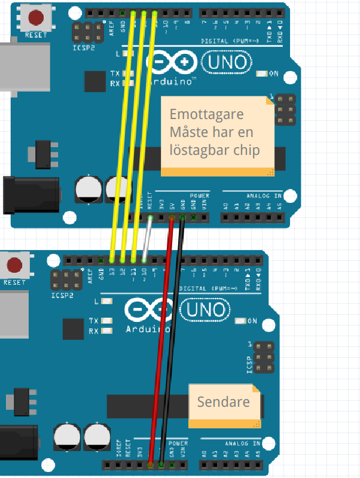

# ArduinoISP

Brand een bootloader op een Arduino chip.

## Anslutning

> Den hela stromkrets

> Förstörning av den emottagare

> Förstörning av den sendare

## Code

## Länker

 * [https://docs.arduino.cc/built-in-examples/arduino-isp/ArduinoISP](https://docs.arduino.cc/built-in-examples/arduino-isp/ArduinoISP)
