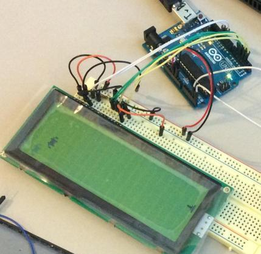

# LCD-lektion 3

Du kan göra många saker med LCD-skärmar. I den här lektionen kommer vi att programmera.



## Program 1: Programmera en smiley

```
#include <LiquidCrystal.h>

LiquidCrystal lcd(12, 11, 5, 4, 3, 2);

byte smiley[8] = {
 0b00000,
 0b00000,
 0b01010,
 0b00000,
 0b00000,
 0b10001,
 0b01110,
 0b00000
};

int kolumn = 0;
int rad = 0;

void setup() {
 lcd.begin(16, 2);
 lcd.createChar(1, smiley);
}

void loop() {
 lcd.setCursor(rad, kolumn);
 lcd.write(1);
 fördröjning(1000);
}
```

### Uppdrag

 * Anslut en LCD-skärm, som i föregående lektion
 * Ange koden ovan.
 * Vad ser du?
 * Vad betyder `#include <LiquidCrystal.h>`? Tips: ta bort den här raden
 * Vad betyder 'byte'? Tips: vad är lite? Vad kallar du åtta bitar?
 * Från `byte smiley[8]`, vad betyder `[8]`? Tips: hur många rader kommer efter?
 * Från "byte smiley[8]", vad betyder "smiley"? Tips: kan du ändra detta till "docka"?
 * Vad betyder `0b` i `0b00000`? Tips: efter 'b', vilka siffror ser du och vilka ser du inte?
 * Vad betyder dessa rader med `0b01010`? Tips: ändra några nollor till ettor och vice versa
 * Vad betyder "LiquidCrystal lcd(12, 11, 5, 4, 3, 2)"? Tips: vilka stift går ledningarna till?
 * Vad betyder `lcd.begin(16, 2)`? Tips: hur många tecken kan visas på din LCD-skärm?
 * Vad betyder `lcd.createChar(1, smiley)`? Tips: var annars förekommer siffran '1'?
 * Vad betyder `lcd.write(1)`? Tips: var ser du siffran "1" oftare?
 * Vad betyder `delay(1000)`? Tips: se första lektionen!
 * Vad betyder 'int kolumn = 0'? Hur läser du detta? Tips: det börjar med "kära dator", och ett "int" betyder "hela nummer"
 * Vad betyder 'int rad = 0'? Hur läser du detta?
 * Vad betyder `lcd.setCursor(rad, kolumn)`? Vad anger datorn i "rad" och "kolumn"? Tips: ändra siffrorna för "kolumn" och "rad"


## Program 2: Programmera en rörlig smiley

```
#include <LiquidCrystal.h>

LiquidCrystal lcd(12, 11, 5, 4, 3, 2);

byte smiley[8] = {
 0b00000,
 0b00000,
 0b01010,
 0b00000,
 0b00000,
 0b10001,
 0b01110,
 0b00000
};

int kolumn = 0;
int rad = 0;

void setup() {
 lcd.begin(16, 2);
 lcd.createChar(1, smiley);
}

void loop() {
 ++kolumn;
 if (kolumn == 17) kolumn = 0;
 lcd.clear();
 lcd.setCursor(rad, kolumn);
 lcd.write(1);
 fördröjning(1000);
}
```

### Uppdrag

 * Anslut en LCD-skärm, som i föregående lektion
 * Ladda upp koden ovan
 * Vad ser du?
 * Vad betyder "++kolumn"? Tips: ta bort den här raden
 * Vad betyder "om (kolumn == 17) kolumn = 0"? Tips: ta bort den här raden
 * Vad betyder `lcd.clear()`? Tips 1: ta bort den här raden. Tips 2: Vad betyder det engelska ordet "clear"?
 * Vad händer om jag ändrar `if (kolumn == 17) kolumn = 0` till `if (kolumn == 9) kolumn = 0`? Göra!
 * Vad händer om jag ändrar `if (kolumn == 17) kolumn = 0` till `if (kolumn == 17) kolumn = 9`? Göra!
 * Flytta nu smileyen åt höger och ner! Detta ser likadant ut som att X går upp och ner på en skärm med två rader

```
1*3*5*7*9*1*3*
*2*4*6*8*0*2*5
```

