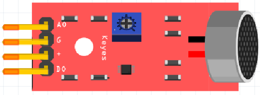
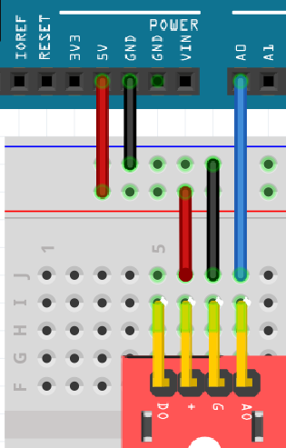
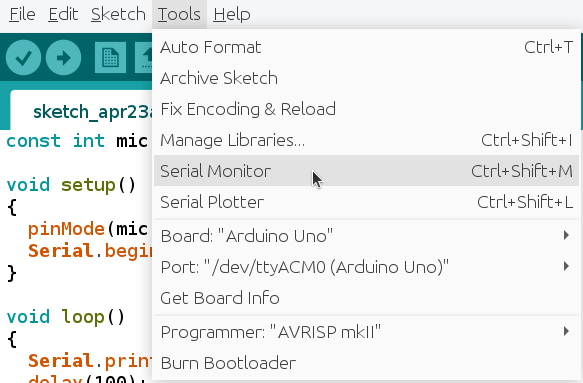
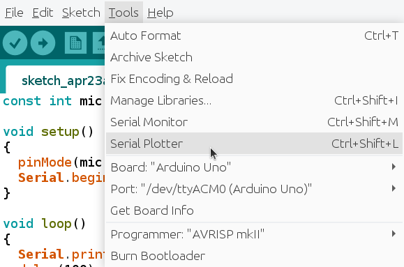
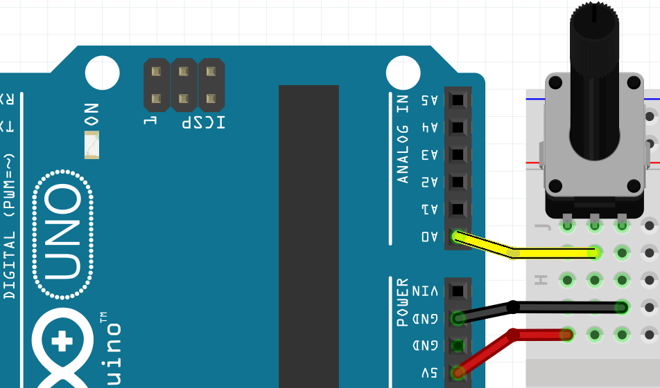
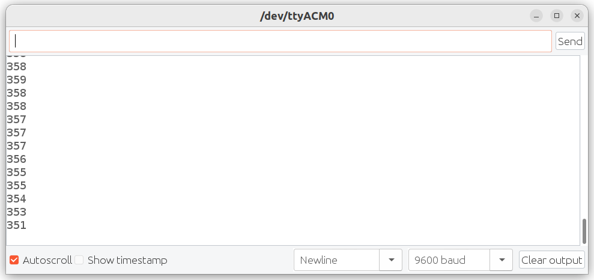
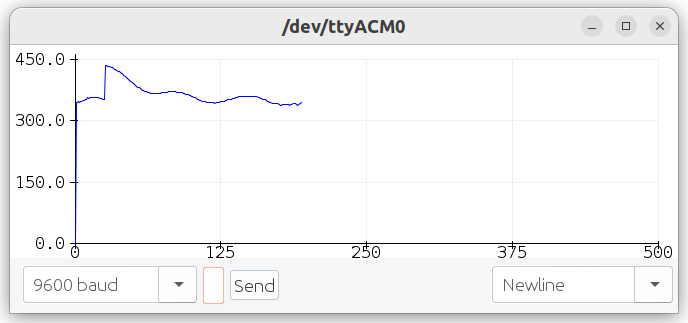
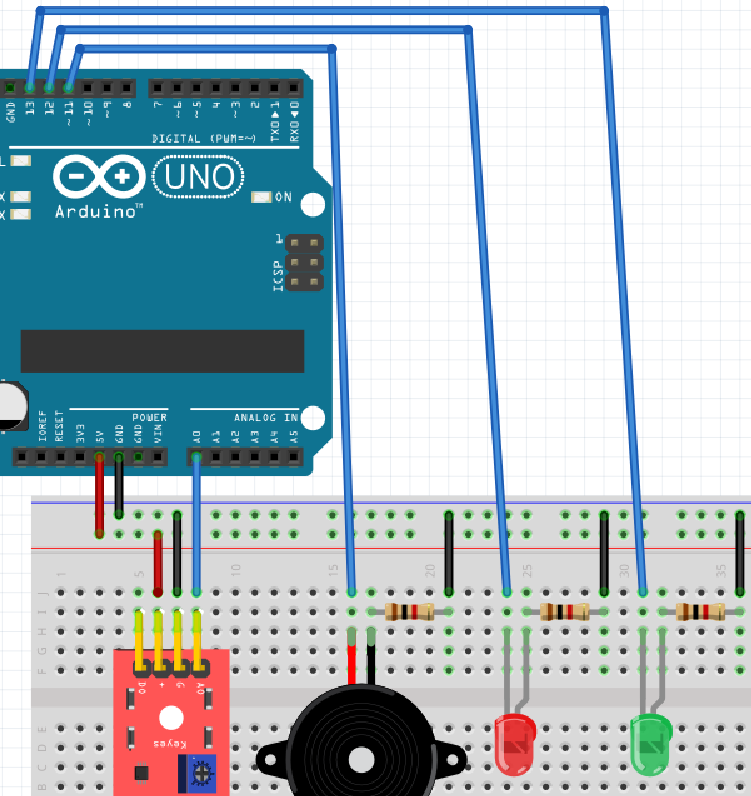

# KY-038 microfon

Under den här lektionen använder vi en KY-038 microfon.



## X.1 Uppgift

Bygg up den här kretsen:



Programmerar:

 * en `const` variabel `microfon_stift` på riktigt stift
 * att få värd av potmetern med `analogRead`
 * att skrivar värd av potmetern till Serial Monitor
 * vänta 100 millisecond varje `loop`

Kollar på Serial Monitor eller Serial Plotter:



> Serial Monitor är här



> Serial Plotter är här

\pagebreak

## X.2 Lösning



```c++
const int microfon_stift = A0;

void setup() 
{
  pinMode(microfon_stift, INPUT);
  Serial.begin(9600);
}

void loop() 
{
  Serial.println(analogRead(microfon_stift));
  delay(100);  
}
```

Nadåt ser du en exempel hur Serial Monitor ser ut. 
Dina värd är annorlunda:



Nadåt ser du en exempel hur Serial Plotter ser ut. 
Din ritning är annorlunda:



\pagebreak

## X.3 Uppgift: ändra känslan

Vi ska ändra känsligt av KY-038 microfon.

Det finns en skruv på den KY-038 microfon.
Hittar en skruvmejsel.
Kör Serial Monitor eller Serial Plotter.
Vridar skruven till värdet ar typ 512.
Nu har microfonen en bra känslan!

## X.4 Uppgifft: är det tyst?

Nu ska vi reagera på ljudnivå.

Andra din kod till följande:

```c++
// ...

void setup() 
{
  // ...
}

void loop()
{
  const int vard = analogRead(microfon_stift)
  Serial.print(vard);
  if (vard < 512) 
  {
    Serial.println(", saa det aer tyst");
  }
  else
  {
    Serial.println(", saa et aer inte tyst");
  }
  delay(100);  
}
```

Ändra numret `512`, så att microfon mäter bra om det är tyst eller inte.


## Ansluter LED

```
const int microfon_stift = A0;
const int led_stift = 13;

void setup() 
{
  pinMode(microfon_stift, INPUT);
  pinMode(led_stift, OUTPUT);
  Serial.begin(9600);
}

void loop()
{
  const int vard = analogRead(microfon_stift);
  Serial.print(vard);
  if (vard < 512) 
  {
    digitalWrite(led_stift, LOW);
  }
  else
  {
    digitalWrite(led_stift, HIGH);
  }
  delay(100);  
}
```

## Ansluter LEDs


```
const int microfon_stift = A0;
const int led_stift_roed = 13;
const int led_stift_groen = 12;

void setup() 
{
  pinMode(microfon_stift, INPUT);
  pinMode(led_stift_roed, OUTPUT);
  pinMode(led_stift_groen, OUTPUT);
  Serial.begin(9600);
}

void loop()
{
  const int vard = analogRead(microfon_stift);
  Serial.print(vard);
  if (vard < 512) 
  {
    digitalWrite(led_stift_groen, LOW);
    digitalWrite(led_stift_roed, LOW);
  }
  else if (vard < 514)
  {
    digitalWrite(led_stift_groen, HIGH);
    digitalWrite(led_stift_roed, LOW);
  }
  else
  {
    digitalWrite(led_stift_groen, HIGH);
    digitalWrite(led_stift_roed, HIGH);
  }
  delay(100);  
}
```

## Ansluter piezo

```
const int microfon_stift = A0;
const int piezo_stift = 11;

void setup() 
{
  pinMode(microfon_stift, INPUT);
  pinMode(piezo_stift, OUTPUT);
  Serial.begin(9600);
}

void loop()
{
  const int vard = analogRead(microfon_stift);
  tone(11, vard);
  delay(100);
}
```


## Hela stromkrets


