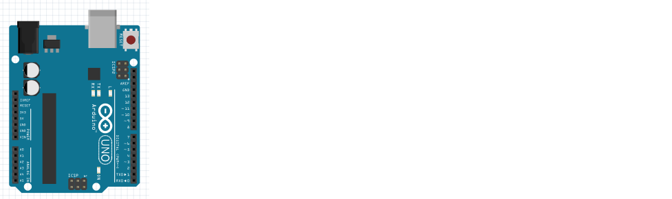
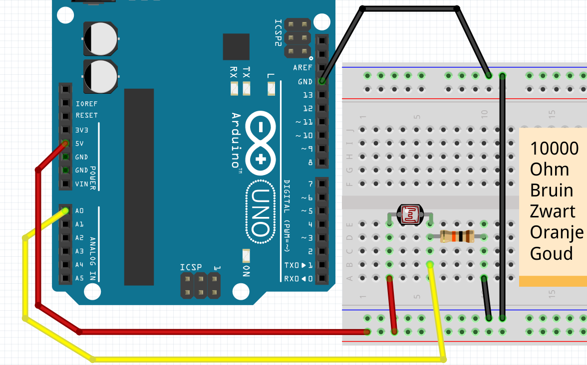
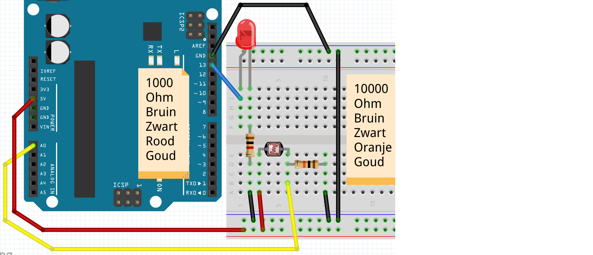
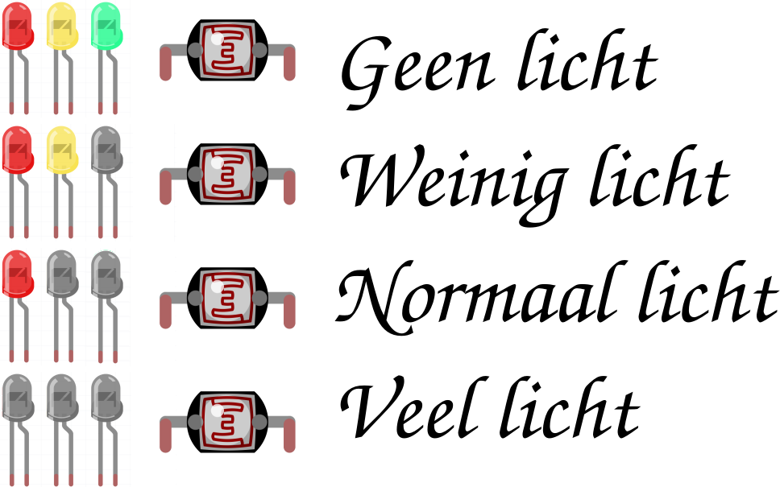

# 12. LDR

## 12.1 Anslut endast Arduino

Först ansluter vi bara en Arduino:



Jag tycker att det här borde fungera :-)

## 12.2 Kod: Serial Monitor

```c++
void setup() 
{
  Serial.begin(9600);
}

void loop()
{
  Serial.println("Hallo");
  delay(1000);
}
```

 | Har du glömt vad det här är? Gå till lektion 4 'FSR'
:-------------:|:----------------------------------------: 

### 12.3 Kommandon 1

 1. Ladda upp programmet. I Arduino IDE, klicka på "Serial Monitor" uppe till höger. Vad ser du?
 2. Kan du ändra texten till "Hej Richel" (eller ditt eget namn?)
 3. Ändra `Serial.println` till `Serial.print`. Vad ser du?
 4. Ändra texten `Serial.begin(9600)` till `Serial.begin(4800)`. Vad ser du? Varför?

\pagebreak

### 12.4 Lösningar 1

 1. Den seriella monitorn visar en extra rad varje sekund, med texten "Hej"
 2. Ändra raden `Serial.println("Hello");` till `Serial.println("Hello Ledge");`
 3. Orden kommer en efter en, istället för en efter en
 4. Nu visar den seriella monitorn oläsbar text. Detta beror på att Arduino är långsammare att texta
      skicka till din dator (4800), sedan läser din dator texten (9600)

## 12.5 Ansluter LDR utan LED

 | LDR betyder "Ljusberoende motstånd"
:-------------:|:----------------------------------------: 

Först ansluter vi bara en LDR:



\pagebreak

### 12.6 Kod: Läs FSR med seriell monitor

Med den här koden mäter vi värdet på LDR:

```c++
void setup() 
{
  pinMode(A0, INPUT);
  Serial.begin(9600);
}

void loop()
{
  Serial.println(analogRead(A0));
  delay(100);
}
```

 | Har du glömt vad det här är? Gå till lektion 4 'FSR'
:-------------:|:----------------------------------------: 

### 12.7 Uppdrag 2

 1. Ladda upp programmet. I Arduino IDE, klicka på "Serial Monitor" uppe till höger. Vad ser du?
 2. Håll fingret över LDR medan du tittar på den seriella monitorn. Vad ser du?
 3. Ändra `Serial.println` till `Serial.print`. Vad ser du?
 4. Ändra texten `Serial.begin(9600)` till `Serial.begin(4800)`. Vad ser du? Varför?
 5. Ta bort kabeln till `A0`. Ja, ta bort kabeln mellan `A0` och LDR.
      Titta på den seriella monitorn. Vad ser du?

\pagebreak

### 12.8 Lösningar 2

 1. Du kommer att se ett tal från noll till 1024, beroende på värdet på LDR
 2. Du ändrar siffrorna
 3. Alla nummer kommer efter varandra
 4. Nu visar den seriella monitorn oläsbar text. Detta beror på att Arduino är långsammare att texta
    skicka till din dator (4800), sedan läser din dator texten (9600)
 5. Nu kommer du att se siffran ändras slumpmässigt. Detta kallas en flytande ingång

 | Har du en flytande ingång? Då har man ofta kopplat något fel
:-------------:|:----------------------------------------: 

## 12.9 Ansluter LDR med LED

 | "Ljusberoende motstånd" betyder "ljusberoende motstånd"
:-------------:|:----------------------------------------: 

Nu ansluter vi även en LED:



\pagebreak

### 12.10 Svar till LDR

Nu ska vi få lysdioden att reagera på LDR:

```c++
void setup() 
{
  pinMode(A0, INPUT);
  pinMode(13, OUTPUT);
}

void loop()
{
  if (analogRead(A0) < 512)
  {
    digitalWrite(13, HIGH);
  }
  else
  {
    digitalWrite(13, LOW);
  }
  delay(100);
}
```

 | Har du glömt vad det här är? Gå till lektion 4 'FSR'
:-------------:|:----------------------------------------: 

### 12.11 Uppgift 3

 1. Vad händer om du ökar `512`? Vad händer om du sänker `512`?
 2. Se till att den seriella monitorn också mäter och visar "A0". Vilket nummer mäter FSR?
    i fred?
 3. Se till att den seriella monitorn visar ordet "ON" när lysdioden tänds, och att
    ordet "OFF" när lysdioden är avstängd

\pagebreak

### 12.12 Lösningar 3

 1. Om `512` ändras till en siffra som är för hög, kommer lampan alltid att lysa oavsett hur hårt/mjukt du trycker.
    Om `512` ändras till ett för högt nummer kommer lampan alltid att vara släckt, oavsett hur hårt/mjukt du trycker
 2. För detta använd koden från föregående kommando: lägg till i `setup`-funktionen `Serial.begin(9600);`,
    i `loop`-funktionen lägg till `Serial.println(analogRead(A0));`. Värdet du kommer att se är
    beroende på resistans, LDR och ljusmängd
 3. Detta kan göras genom att sätta `Serial.println("ON");` i den första delen av `if`-satsen.
    Sätt `Serial.println("OFF");` i den andra delen av `if`-satsen.

```c++
void setup() 
{
  pinMode(A0, INPUT);
  pinMode(13, OUTPUT);
  Serial.begin(9600);
}

void loop()
{
  Serial.println(analogRead(A0));
  if (analogRead(A0) < 512)
  {
    digitalWrite(13, HIGH);
    Serial.println("AAN");
  }
  else
  {
    digitalWrite(13, LOW);
    Serial.println("UIT");
  }
  delay(100);
}
```

### 12.13 Uppgift 4

Anslut en extra LED. Om LDR är i normalt ljus bör ingen lysdiod lysa.Om du gör LDR lite mörkare med handen kommer en lysdiod att tändas.
Om du gör LDR helt mörk två.

 | Tips: använd två "om"-satser
:-------------:|:----------------------------------------: 

\pagebreak

### 12.14 Lösning 4

Siffrorna i `if`-satsen måste vara korrekt inställda.

```c++
void setup() 
{
  pinMode(A0, INPUT);
  pinMode(12, OUTPUT);
  pinMode(13, OUTPUT);
  Serial.begin(9600);
}

void loop()
{
  Serial.println(analogRead(A0));
  if (analogRead(A0) < 256)
  {
    digitalWrite(13, HIGH);
  }
  if (analogRead(A0) < 512)
  {
    digitalWrite(12, HIGH);
  }
  delay(100);
}
```

\pagebreak

## 12.15 Slutuppgift

 * Anslut tre lysdioder: en röd, gul och grön
 * När LDR är i ljuset ska ingen lysdiod lysa.
 * Om du mörkar LDR en aning kommer den gröna lysdioden att lysa
 * Om du gör LDR mörkare mer kommer de gröna och gula lysdioderna att lysa
 * Om du gör LDR helt mörkare kommer alla lysdioder att lysa



 | Tips: använd `if` tre eller fyra gånger
:-------------:|:----------------------------------------: 

