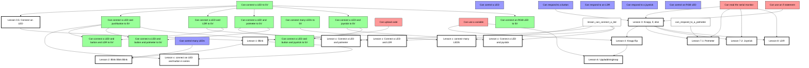

# Learning line

How the topics relate

```mermaid
flowchart TD

    %% Give a white background, instead of a transparent one
    classDef node fill:#fff,color:#000,stroke:#000
    classDef electronics_skill_node fill:#9f9,color:#000,stroke:#000
    classDef arduino_skill_node fill:#99f,color:#000,stroke:#000
    classDef programming_skill_node fill:#f99,color:#000,stroke:#000
    classDef lesson_node fill:#fff,color:#000,stroke:#000,stroke-width:3px

    can_connect_a_led_to_5v[Can connect a LED to 5V]:::electronics_skill_node
    can_connect_a_led_and_button_to_5v[Can connect a LED and pushbutton to 5V]:::electronics_skill_node
    can_connect_a_led_and_ldr_to_5v[Can connect a LED and LDR to 5V]:::electronics_skill_node
    can_connect_a_led_and_potmeter_to_5v[Can connect a LED and potmeter to 5V]:::electronics_skill_node
    can_connect_a_led_and_joystick_to_5v[Can connect a LED and joystick to 5V]:::electronics_skill_node
    can_connect_a_led_and_button_and_ldr_to_5v[Can connect a LED and button and LDR to 5V]:::electronics_skill_node
    can_connect_a_led_and_button_and_potmeter_to_5v[Can connect a LED and button and potmeter to 5V]:::electronics_skill_node
    can_connect_a_led_and_button_and_joystick_to_5v[Can connect a LED and button and joystick to 5V]:::electronics_skill_node
    can_connect_a_many_leds_to_5v[Can connect many LEDs to 5V]:::electronics_skill_node
    can_connect_an_rgb_led_to_5v[Can connect an RGB LED to 5V]:::electronics_skill_node

    can_control_a_led[Can control a LED]:::arduino_skill_node
    can_respond_to_a_button[Can respond to a button]:::arduino_skill_node
    can_respond_to_an_ldr[Can respond to an LDR]:::arduino_skill_node
    can_respond_to_a_joystick[Can respond to a joystick]:::arduino_skill_node
    can_control_many_leds[Can control many LEDs]:::arduino_skill_node
    can_control_an_rgb_led[Can control an RGB LED]:::arduino_skill_node

    can_upload_code[Can upload code]:::programming_skill_node
    can_use_the_serial_monitor[Can read the serial monitor]:::programming_skill_node
    can_use_an_if_statement[Can use an if statement]:::programming_skill_node
    can_use_a_variable[Can use a variable]:::programming_skill_node

    %% Lessons, and their requirents
    lesson_can_connect_a_led_to_5v[Lesson 0.5: Connect an LED]:::lesson_node
    can_connect_a_led_to_5v --> lesson_can_connect_a_led_to_5v

    lesson_can_control_a_led[Lesson 1: Blink]:::lesson_node
    lesson_can_connect_a_led_to_5v --> lesson_can_control_a_led
    can_upload_code --> lesson_can_control_a_led

    lesson_can_connect_many_leds[Lesson x: connect many LEDS]:::lesson_node
    lesson_can_connect_a_led --> lesson_can_connect_many_leds
    can_connect_a_many_leds_to_5v --> lesson_can_connect_many_leds

    lesson_can_control_many_leds[Lesson 2: Blink Blink Blink]:::lesson_node
    lesson_can_control_a_led --> lesson_can_control_many_leds
    can_control_many_leds --> lesson_can_control_many_leds

    lesson_can_connect_a_led_and_button[Lesson x: connect an LED and button in series]:::lesson_node
    lesson_can_control_a_led --> lesson_can_connect_a_led_and_button
    can_connect_a_led_and_button_to_5v --> lesson_can_connect_a_led_and_button

    lesson_can_respond_to_a_button[Lesson 3: Knapp, if, else]:::lesson_node
    can_respond_to_a_button --> lesson_can_respond_to_a_button
    can_use_an_if_statement --> lesson_can_respond_to_a_button
    can_use_the_serial_monitor --> lesson_can_respond_to_a_button
    
    lesson_can_respond_to_a_button_on_action[Lesson 4: Knapp flip]:::lesson_node
    lesson_can_respond_to_a_button --> lesson_can_respond_to_a_button_on_action
    can_use_a_variable --> lesson_can_respond_to_a_button_on_action

    lesson_can_respond_to_a_button_in_time[Lesson 6: Uppladdningknap]:::lesson_node
    lesson_can_respond_to_a_button_on_action --> lesson_can_respond_to_a_button_in_time
    can_use_a_variable --> lesson_can_respond_to_a_button_in_time

    lesson_can_connect_a_led_and_potmeter_in_series[Lesson x: Connect a LED and potmeter]:::lesson_node
    lesson_can_connect_a_led --> lesson_can_connect_a_led_and_potmeter_in_series
    can_connect_a_led_and_potmeter_to_5v --> lesson_can_connect_a_led_and_potmeter_in_series

    lesson_can_respond_to_a_potmeter[Lesson 7.1: Potmeter]:::lesson_node
    lesson_can_respond_to_a_button --> lesson_can_respond_to_a_potmeter
    can_use_the_serial_monitor --> lesson_can_respond_to_a_potmeter
    can_respond_to_a_potmeter --> lesson_can_respond_to_a_potmeter

    lesson_can_connect_a_led_and_joystick_in_series[Lesson x: Connect a LED and joystick]:::lesson_node
    lesson_can_connect_a_led --> lesson_can_connect_a_led_and_joystick_in_series
    can_connect_a_led_and_joystick_to_5v --> lesson_can_connect_a_led_and_joystick_in_series

    lesson_can_respond_to_a_joystick[Lesson 7.2: Joystick]:::lesson_node
    lesson_can_respond_to_a_button --> lesson_can_respond_to_a_joystick
    can_use_the_serial_monitor --> lesson_can_respond_to_a_joystick

    lesson_can_connect_a_led_and_ldr_in_series[Lesson x: Connect a LED and LDR]:::lesson_node
    lesson_can_connect_a_led --> lesson_can_connect_a_led_and_ldr_in_series
    can_connect_a_led_and_ldr_to_5v --> lesson_can_connect_a_led_and_ldr_in_series

    lesson_can_respond_to_an_LDR[Lesson 8: LDR]:::lesson_node
    lesson_can_respond_to_a_button --> lesson_can_respond_to_an_LDR
    can_use_the_serial_monitor --> lesson_can_respond_to_an_LDR

    %% Electronics
    can_connect_a_led_to_5v --> can_connect_a_led_and_button_to_5v
    can_connect_a_led_to_5v --> can_connect_a_led_and_ldr_to_5v
    can_connect_a_led_to_5v --> can_connect_a_led_and_potmeter_to_5v
    can_connect_a_led_to_5v --> can_connect_a_led_and_joystick_to_5v
    can_connect_a_led_and_button_to_5v --> can_connect_a_led_and_button_and_ldr_to_5v
    can_connect_a_led_and_ldr_to_5v --> can_connect_a_led_and_button_and_ldr_to_5v
    can_connect_a_led_and_button_to_5v --> can_connect_a_led_and_button_and_potmeter_to_5v
    can_connect_a_led_and_potmeter_to_5v --> can_connect_a_led_and_button_and_potmeter_to_5v
    can_connect_a_led_and_button_to_5v --> can_connect_a_led_and_button_and_joystick_to_5v
    can_connect_a_led_and_joystick_to_5v --> can_connect_a_led_and_button_and_joystick_to_5v
    can_connect_a_led_to_5v --> can_connect_an_rgb_led_to_5v
```
